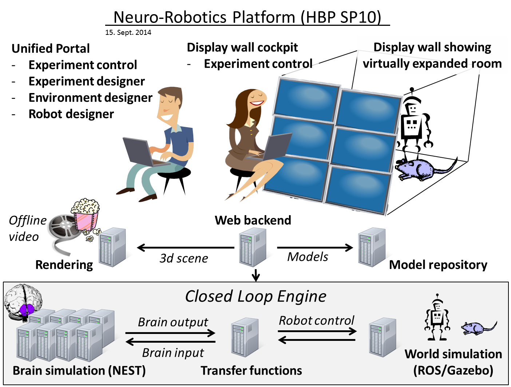
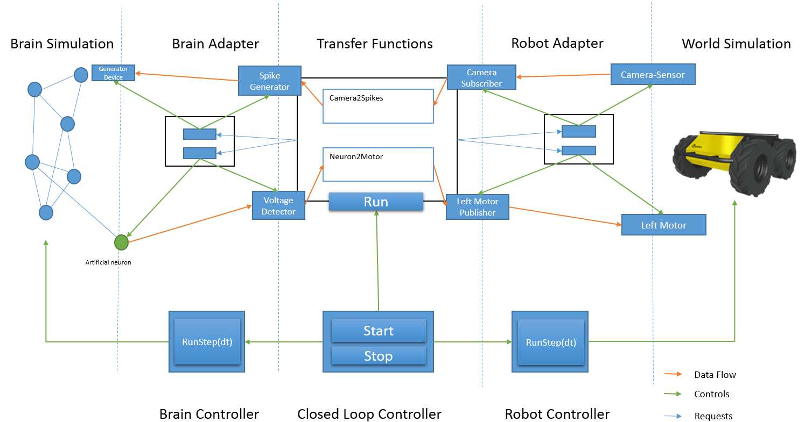

===============================
Closed Loop Engine Architecture
===============================

Purpose
-------

The Closed Loop Engine (CLE) is responsible for transferring data between the neuronal brain
simulator and the world simulation engine (WSE). This includes the synchronization of the
simulations and the coordination of the data transfer.

.. _architecture-overview:

   Overview of HBP SP10

:numref:`architecture-overview` shows the overview of the Neurorobotics subproject SP10 of the
Human Brain Project (HBP). The Closed Loop Engine (CLE) is the mediator between the world simulation
and the brain simulation. The CLE is highlighted in the figure. The architecture of this component
is the purpose of this document.

Functional Requirements
-----------------------------

The goal of the CLE is to couple a brain simulation to a world simulation (robot simulation), such
that the brain simulation can control the robots behavior. The transmission of the sensor data to
the brain and in the other way from the neurons spikes to actual robot commands is done through
communication components called transfer functions. These transfer functions are written by the users
of the platform (neuroscientists).

Transferring data in one direction, i.e. either from the world simulation to the brain or vice
versa, is referred to as an open loop. The management of both directions is called a closed loop as
it enables information to loop through the system.

The CLE controls the following:

* when to transfer data (done by the Closed Loop Controller)
* which data to transfer (done by the TF manager)
* when to trigger simulation steps (done by the Closed Loop Controller).

All of these requirements must be fulfilled independently from the brain simulation and robot
simulation.

Technical Requirements
----------------------

The world simulation currently runs on a middleware called the Robot Operating System (ROS). ROS is
primarily designed for the Ubuntu operating system although it does run on other Linux systems.
We are using NEST for our brain simulation. NEST can be installed on most Linux systems and can be
controlled remotely using a Python module called PyNN.

Transfer functions have the strict requirement that they must be written in Python
or in an XML syntax. The latter is described in the :doc:`../../specifications/bibi_configuration`.

Overall, it should be possible to run the CLE in real-time mode, such that the simulated time does
not differ too much from the real time. This can be achieved by adjusting the time-step in which the simulation is run.
This is possible for all models that do not contain too many neurons nor an overly complicated robot.

Architecture of the CLE
-----------------------

.. _architecture-components:
.. figure:: img/architecture_components.png
   :align: center

   Component Diagram of the Closed Loop Engine

:numref:`architecture-components` shows the architecture of the CLE in a UML component diagram.
The data transfer is managed from the world simulation (currently Gazebo and unlikely to change) to
the neuronal brain simulator (currently NEST, but in the future we will support other simulators such as
SpiNNaker). The CLE basically consists of two lanes. The upper lane consisting of the ROS Adapter,
the Transfer Functions and the PyNN Adapter is responsible for the data transfer, whereas the lower
lane consisting of ROS Controller, Closed Loop Controller and PyNN Controller is responsible for
the control management.

The ROS Adapter and ROS Controller communicate with Gazebo through ROS topics, whereas the PyNN Adapter
and the PyNN Controller communicate with NEST via the PyNN interface, which allows us to switch from
NEST to other neuronal simulators such as Neuron or SpiNNaker. The interfaces between the components
of the CLE are manifested in abstract python classes. The communication between these components is
done by using in-process communication. Although the architecture allows the possibility to distribute
the system at a later stage.

.. _architecture-interfaces:
.. figure:: img/architecture_interfaces.png
   :align: center

   Interfaces of the Closed Loop Engine

The interfaces relevant for the above architecture of the CLE are shown in
:numref:`architecture-interfaces`. The transfer functions provide three methods that initialize
them and call the transfer functions in either direction.

.. _architecture-interactions:

   Interactions within the CLE

The interaction of the components within the CLE are shown in
:numref:`architecture-interactions`. The data transfer is handled in the upper lane, whereas the
control of the simulation is done in the lower lane. The dotted lines mark the component boundaries
within the lanes. Objects drawn on the dotted lines are interfaces between the components.

The center of the upper lane is the Transfer Functions Manager (TF manager) which organizes the data
transfer. It consists of a set of transfer functions and knows which transfer functions require
which communication objects to send or receive data. It requests these communication objects from
the respective communication adapters (robot communication adapter or brain communication adapter).
These adapters then map these communication objects to artifacts in the simulation or instrument the
simulation with new artifacts. In Fig.4, the Camera Sensor and the Left Motor exist and just need to
be connected by the Robot Adapter. The artificial neuron implementing the voltmeter requested by the
transfer functions is injected to the brain simulation by the brain adapter. Similar, devices such
as the spike generator are implemented by an instrumentation of the neuronal simulation. This is done
by the brain adapter. The Transfer Function Manager connects these communication objects to the
transfer functions that need them. This way, the transfer functions have a uniform programming model
to access a device or robot topic independently from the concrete simulation.

Details on the TF framework architecture can be found here: :doc:`transfer_functions`.

The main work for the TF manager is completed after the initialization, when all transfer functions
are connected to appropriate communication objects. The communication during the simulation (indicated
in Fig.4 with the orange arrows) is then only done between the communication adapters, which forward
or receive data from the technical objects realizing their functionality.

The need for the TF manager to run its transfer functions is determined by the Closed Loop Controller
that is responsible to orchestrate the closed loop, including both world simulation and brain
simulation.

The data flow in Fig.4 is as follows: The camera sensor data is exposed through a ROS topic. The
robot control adapter has created a ROS Subscriber as the Transfer Functions has informed it that it
will need the camera topic. The robot adapter fetches the data and provides it via a communication
object.

During a simulation, a concrete TF takes data from input communication objects e.g. a TF could request
the current voltage from a voltmeter device. This data is processed and the TF reconfigures the output
communication objects such as spike generators accordingly. This communication object is already
specific to a concrete neuronal or robot simulation and knows what exactly to do.

Meanwhile the organization of the data flow is done by the TF manager, the orchestration, i.e.
controlling when the data is actually transferred, is handled by the Closed Loop Controller (CLC).

The CLC or more generally an implementation of the *IClosedLoopControl* interface is responsible for
the control of the synchronization as well as for orchestration of the data exchange among the
Simulations and the Transfer Functions. This is done through the interfaces defined in Fig.3
(IRobotControlAdapter,IBrainControlAdapter) which allow a complete control of the simulations in
terms of execution of a step. The simulations of the brain and the world/robot are executed for
the same amount of simulated time (runStep(dt)). The simulations are typically started by the CLC.
The purpose of the CLC is not only to guarantee that both the simulations start and run for the same
timestep, but also to orchestrate the TF manager, i.e. tell the TF manager when to execute transfer
functions. After Gazebo and NEST have completed their execution, the TFs receive and process data
from the simulations and produce an output which is the input for the next execution. At each timestep,
the CLC can check for the status of the simulations through an attribute( IsAlive:Boolean).

In :numref:`architecture-interactions`, the following objects correspond to the following interfaces:

*    Closed Loop Controller: IClosedLoopControl
*    Brain Controller: IBrainControlAdapter
*    Robot Controller: IRobotControlAdapter
*    Transfer Functions: ITransferFunctionsNode
*    Brain Adapter: IBrainCommunicationAdapter
*    Robot Adapter: IRobotCommunicationAdapter
*    Spike Generator: ISpikeGenerator. The exact interface is determined by the spike generation device type
*    Voltage Detector: ISpikeDetector. The exact interface is determined by the spike detector type
*    Camera Subscriber: IRobotSubscriber
*    Left Motor Publisher: IRobotPublisher

The implementations of these artifacts are contained in the CLE repository, although the implementations
may forward requests to other libraries such as PyNN. For all of these interfaces, mock
implementations are also available. They can be used either to unit test parts of the architecture in
isolation but also for the neuroscience user to unit test their transfer function.

The following other objects do not belong to the CLE:

*   Generator device: This is a PyNN device that the communication object for the generator is referencing.
*   Artificial neuron: Since there is no special voltmeter in PyNN, we simply add a new neuron to the neuronal net and query its membrane voltage.
*   Camera-Sensor: The camera sensor is the virtual camera sensor of the simulated robot, in Fig.4 a husky robot.
*   Left Motor: Same as before, this is an existing sensor of the virtual robot.
