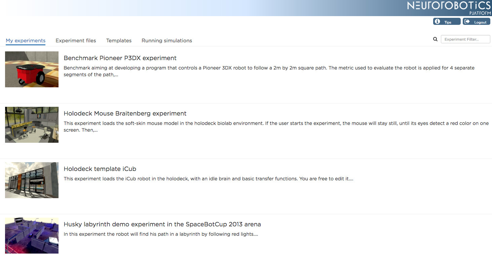

======================
Neurorobotics Platform
======================

The Neurorobotics Platform consists of a web "cockpit", 
embedded experiment editors and a separate desktop robot designer application. 
This covers exactly what you need to set-up and run a successful in-silico experiment.

.. toctree::
   :maxdepth: 1

   user_manual/index
   tutorials/index
..    developer_manual/index
   specifications/index

