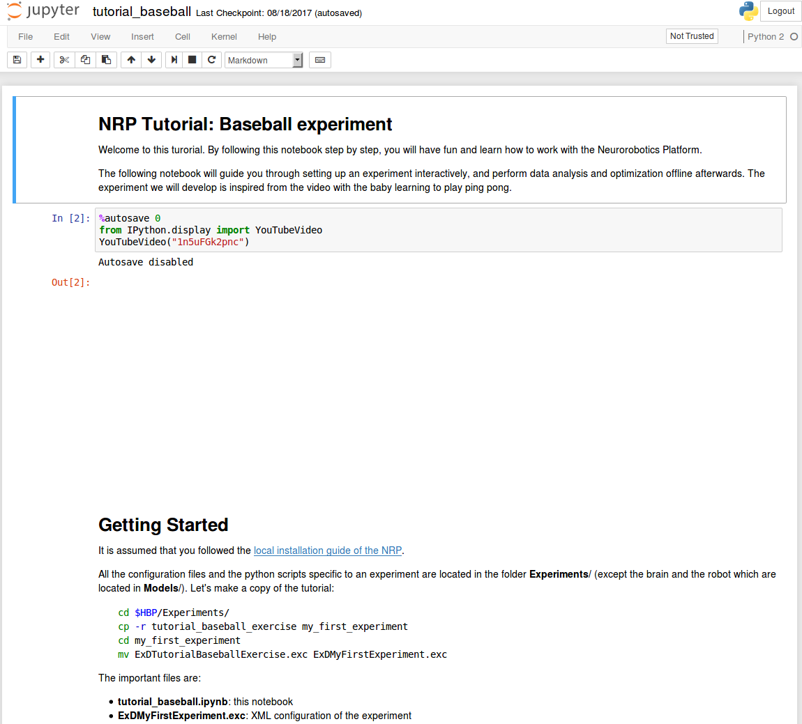

======================
Scope of this tutorial
======================

This tutorial will teach you how to set an experiment and how to use iPythonNotebook to post-process it with the Virtual Coach.

1. Create the basic setup of the experiment
2. Launch the Platform, tune rendering quality
3. Discover the brain editor
4. Automate throwing balls at the robot using State Machines
5. Implement robot vision and action in Transfer Functions
6. Monitor and debug the simulation
7. Edit the environment
8. Save all your work

===========
Get started
===========

This tutorial is actually documented in an iPython Notebook script. Let us first get it running.

Be sure to have an up-to-date Platform

.. code-block:: bash

    cd $HBP/user-scripts
    ./update_nrp update all

It is assumed that you have a `source installation`_ of the NRP. Unfortunately, this tutorial will not work yet from "local" docker installations since iPythonNotebook would not work.
All the configuration files and the python scripts specific to an experiment are located in the Experiments folder (except the brain and the robot which are located in Models).
Let's make a copy of the tutorial:

.. code-block:: bash

    cd $HBP/Experiments/
    cp -r tutorial_baseball_exercise my_first_experiment
    cd my_first_experiment
    mv ExDTutorialBaseballExercise.exc ExDMyFirstExperiment.exc

The important files are:

    - tutorial_baseball.ipynb: this notebook
    - ExDMyFirstExperiment.exc: XML configuration of the experiment
    - tutorial_baseball.bibi: XML configuration of the brain/body interaction
    - throw_ball.exd: A state machine referenced in the .exc
    - \*.py: Transfer functions referenced in the .bibi

Let's edit the **ExDMyFirstExperiment.exc** to change the name of the experiment:

.. code-block:: bash

    sed -i "s/<name>.*<\/name>/<name>My First Experiment<\/name>/g" ExDMyFirstExperiment.exc

.. note::

    In the following exercises, we will edit the transfer functions and state machine through the Neurorobotics Platform editors. If you want to save your edits, make sure to download your modified code to the respective files in the my_first_experiment/ folder.

- Go to your new experiment folder and run the script

.. code-block:: bash

    cd $HBP/Experiments/my_first_experiment
    cle-virtual-coach ipython notebook tutorial_baseball.ipynb

- If you miss ipython notebook, install it

.. code-block:: bash

    sudo apt-get install ipython-notebook

You should have now a new browser window with the following view

The tutorial continues in this window. Have fun!

.. _`source installation`: https://bitbucket.org/hbpneurorobotics/neurorobotics-platform
