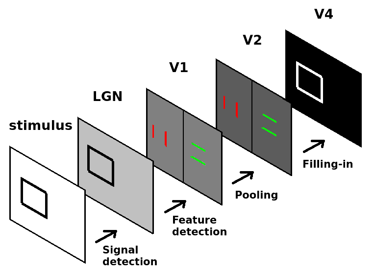

Step 2: fixing transfer function errors
=======================================

Context
^^^^^^^

At this point, you can see something moving in front of the robot, thanks to the state machine that you just uploaded (you can close the editor now). What we want now is to see the reaction to this stimulus in the robot's brain.

The brain visualizer
^^^^^^^^^^^^^^^^^^^^

To see the robot's brain spiking, open the brain visualizer by clicking on the blue brain-shaped button on the left. A new window appears and displays all the neurons that are being simulated. The brain of the robot if constituted of only one neuron. That's just an idle brain that we will change right away.

To change the brain of the robot, open the brain editor by clicking on the green brain-shaped button. As you can see, the definition of the brain is quite simple. Let us upload a nicer brain, composed of the first steps of the visual system (see figure below).

    Schematic structure of the visual system defined by the new brain file. The first layer (LGN) encodes the light coming to the visual system in terms of spiking rates (1 neuron per pixel). Then, V1 and V2 detect local oriented edges (1 neuron per orientation and pixel). Finally, V4 encodes surface signals that spread from the egdes signals (surface filling-in).

Upload the new brain by clicking on the "upload" button in the brain editor. You can choose the file number 2 (2_brain.py). After the brain has been loaded (this might take a few seconds), many neurons are displayed in the brain visualizer. If you look in the brain file, you can see how it is structured. First the parameters of the network are defined. Then, all the layers of the network are declared as nest populations and finally, the connection patterns are defined.

In the brain visualizer, you can choose how to display the different neurons (each population displayed as a cube, a cloud, etc.). However, if you move the "spike contrast" cursor to a different value, you cannot see any spike. That's normal: before we see the spikes, we need to feed the model with the visual input, using a transfer function. Also, we need to record the spikes. This happens at step 3.
