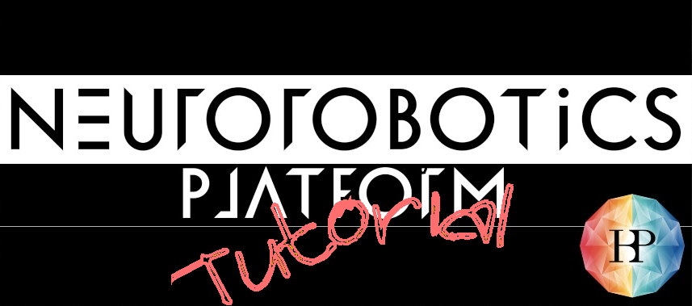

Tutorials
=========

The following tutorials demonstrate beginner's or original use cases given simple examples.

.. toctree::
    :maxdepth: 1

    baseball/index
    tensorflow/index
    virtual_coach/index
    multiple_robots/index
    transfer_function/index
    experiment/index
    spinnaker/index
    debugging/index
    opensim_muscles/index
    tutorial_visualizer/index
    brain_visualizer/index
