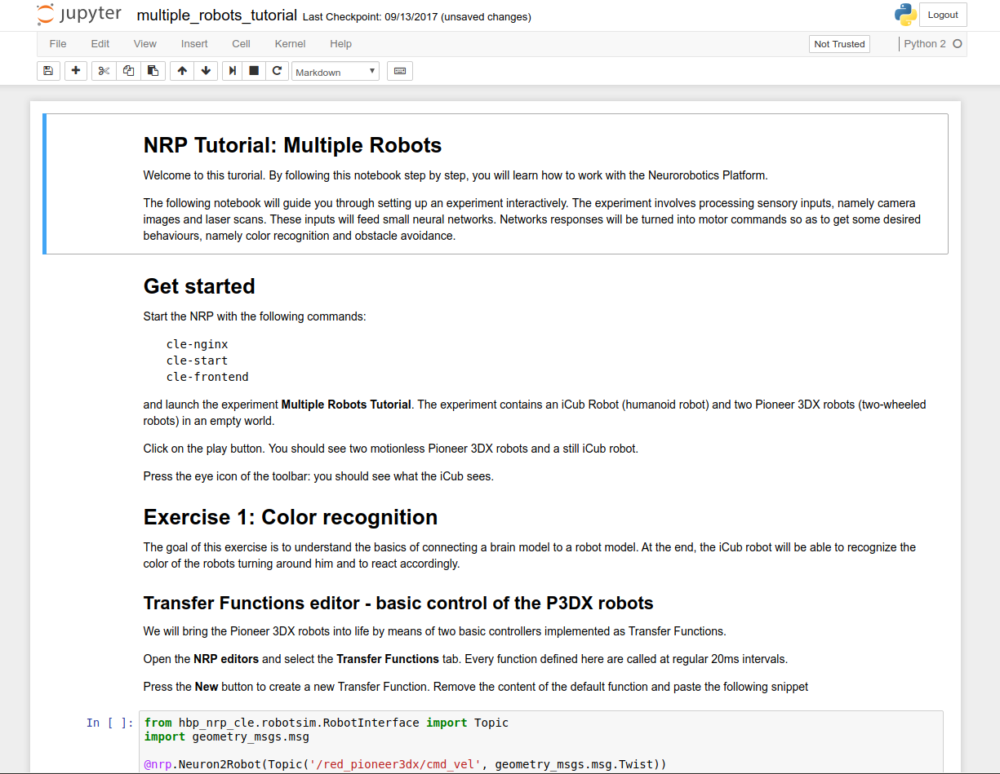

======================
Scope of this tutorial
======================

This tutorial will teach you how to include and simulate two brain-controlled robots.
You will implement two basic behaviors; namely, color recognition and obstacle avoidance.

1. Launch the Platform.
2. Learn how to connect brains and bodies: live edits in Brain and Transfer Function Editor
3. Do it yourself: design the control of a 3rd robot in the scene

===========
Get started
===========

This tutorial is actually documented in an iPython Notebook script. Let us first get it running.

Be sure to have an up-to-date Platform

.. code-block:: bash

    cd $HBP/user-scripts
    ./update_nrp update all

==============================================
Open the notebook multi_robots_tutorial.ipynb 
==============================================

- Go to your experiment folder and run the script

.. code-block:: bash

    cd $HBP/Experiments/multiple_robots_tutorial
    ipython notebook multiple_robots_tutorial.ipynb

- If you miss ipython notebook, install it

.. code-block:: bash

    sudo apt-get install ipython-notebook

You should have now a new browser window with the following view

The tutorial continues in this window. Have fun!
