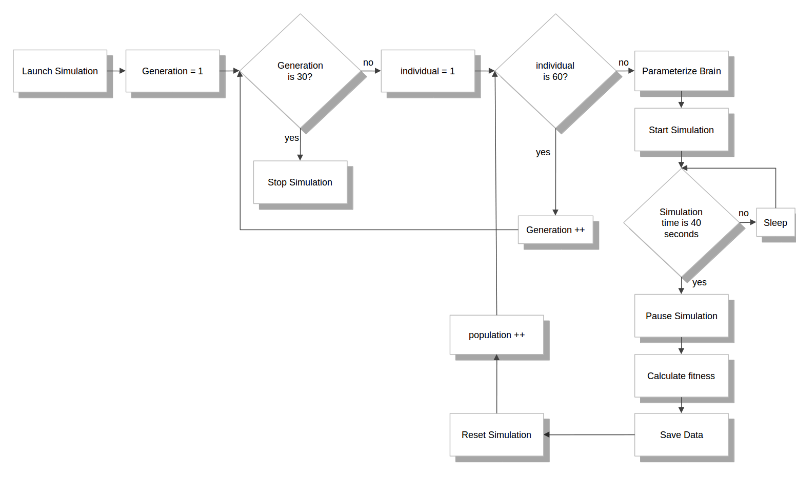

Tutorial: Running Batch Simulations with the Virtual Coach
==========================================================

Scope of this tutorial
^^^^^^^^^^^^^^^^^^^^^^
In this tutorial we will go through running an evolutionary experiment in the NRP through the Virtual Coach. Evolutionary experiments are a perfect use case for the Virtual Coach as they require running the same experiment over and over again with different parameters and then assessing the success of each run.
The experiment we will be going through in this tutorial has been done physically and is described in detail in this paper: Floreano, Dario, and Claudio Mattiussi. "Evolution of spiking neural controllers for autonomous vision-based robots." Evolutionary Robotics. From Intelligent Robotics to Artificial Life (2001): 38-61.

We will briefly go through the transfer functions and the brain script that make this experiment possible. However, we will not dive into the detials of the implementation. If you want to learn more about implementing transfer functions there's a dedicated :ref:`transfer_functions`.

Create the basic setup
^^^^^^^^^^^^^^^^^^^^^^

In this experiment we have a small neural network comprised of 28 spiking neurons interfaced to a robot. Only four of these neurons drive the robot, two controlling the left wheel and two controlling the right wheel. To connect the four neurons to the robot's wheels we define a Brain2Motor Transfer Function:

.. code-block:: python

	import hbp_nrp_cle.tf_framework as nrp
	from hbp_nrp_cle.robotsim.RobotInterface import Topic
	import gazebo_msgs.msg

	@nrp.MapSpikeSink("left_wheel_forward_neuron", nrp.brain.actors[0], nrp.population_rate)
	@nrp.MapSpikeSink("left_wheel_back_neuron", nrp.brain.actors[1], nrp.population_rate)
	@nrp.MapSpikeSink("right_wheel_forward_neuron", nrp.brain.actors[2], nrp.population_rate)
	@nrp.MapSpikeSink("right_wheel_back_neuron", nrp.brain.actors[3], nrp.population_rate)

	@nrp.MapVariable("ideal_wheel_speed", global_key="ideal_wheel_speed", initial_value=[0.0,0.0], scope=nrp.GLOBAL)

	@nrp.Neuron2Robot(Topic('/husky/wheel_speeds', gazebo_msgs.msg.WheelSpeeds))
	def Brain2Motor(t, ideal_wheel_speed, left_wheel_forward_neuron, left_wheel_back_neuron, right_wheel_forward_neuron, right_wheel_back_neuron):
    	"""
    	The transfer function which calculates the linear twist of the husky robot based on the
    	voltage of left and right wheel neurons.
    	:param t: the current simulation time
    	:param left_wheel_forward_neuron: the left wheel forward neuron device
    	:param left_wheel_back_neuron: the left wheel back neuron device
    	:param right_wheel_forward_neuron: the right wheel forward neuron device
    	:param right_wheel_back_neuron: the right wheel back neuron device
    	:return: a gazebo_msgs/WheelSpeeds setting the speeds of the left and right pair of wheels of the husky robot for movement.
    	"""

    	left_wheel = 0.002*(left_wheel_forward_neuron.rate - left_wheel_back_neuron.rate)
    	right_wheel = 0.002*(right_wheel_forward_neuron.rate - right_wheel_back_neuron.rate)

    	clientLogger.info(left_wheel, right_wheel)

    	ideal_wheel_speed.value = [left_wheel, right_wheel]

    	return gazebo_msgs.msg.WheelSpeeds(left_wheel, right_wheel, left_wheel, right_wheel)

Similarly, we have 16 neurons that take input from the camera mounted on the robot. To establish this connection, we define a Sensor2Brain Transfer Function:

.. code-block:: python

	import numpy as np
	import cv2

	@nrp.MapRobotSubscriber("camera", Topic('/husky/camera', sensor_msgs.msg.Image))
	@nrp.MapSpikeSource("pixel0", nrp.brain.sensors[0], nrp.poisson)
	@nrp.MapSpikeSource("pixel1", nrp.brain.sensors[1], nrp.poisson)
	@nrp.MapSpikeSource("pixel2", nrp.brain.sensors[2], nrp.poisson)
	@nrp.MapSpikeSource("pixel3", nrp.brain.sensors[3], nrp.poisson)
	@nrp.MapSpikeSource("pixel4", nrp.brain.sensors[4], nrp.poisson)
	@nrp.MapSpikeSource("pixel5", nrp.brain.sensors[5], nrp.poisson)
	@nrp.MapSpikeSource("pixel6", nrp.brain.sensors[6], nrp.poisson)
	@nrp.MapSpikeSource("pixel7", nrp.brain.sensors[7], nrp.poisson)
	@nrp.MapSpikeSource("pixel8", nrp.brain.sensors[8], nrp.poisson)
	@nrp.MapSpikeSource("pixel9", nrp.brain.sensors[9], nrp.poisson)
	@nrp.MapSpikeSource("pixel10", nrp.brain.sensors[10], nrp.poisson)
	@nrp.MapSpikeSource("pixel11", nrp.brain.sensors[11], nrp.poisson)
	@nrp.MapSpikeSource("pixel12", nrp.brain.sensors[12], nrp.poisson)
	@nrp.MapSpikeSource("pixel13", nrp.brain.sensors[13], nrp.poisson)
	@nrp.MapSpikeSource("pixel14", nrp.brain.sensors[14], nrp.poisson)
	@nrp.MapSpikeSource("pixel15", nrp.brain.sensors[15], nrp.poisson)
	@nrp.MapSpikeSource("left_wheel_speed_error", nrp.brain.sensors[16], nrp.poisson)
	@nrp.MapSpikeSource("right_wheel_speed_error", nrp.brain.sensors[17], nrp.poisson)

	@nrp.MapVariable("ideal_wheel_speed", global_key="ideal_wheel_speed", initial_value=[0.0,0.0], scope=nrp.GLOBAL)
	@nrp.MapVariable("real_wheel_speed", global_key="real_wheel_speed", initial_value=[0.0,0.0], scope=nrp.GLOBAL)

	@nrp.Robot2Neuron()

	def Sensor2Brain(t, ideal_wheel_speed, real_wheel_speed, left_wheel_speed_error, right_wheel_speed_error,camera, pixel0, pixel1, pixel2, pixel3, pixel4, pixel5, pixel6, pixel7, pixel8, pixel9, pixel10, pixel11, pixel12, pixel13, pixel14, pixel15):
    	"""
    	This transfer function uses OpenCV to compute the grayscale values of the camera pixels. Then, it maps these values to the neural network's first 16 sensory neurons using a Poisson generator.
    	"""
    	neurons = np.array([pixel0, pixel1, pixel2, pixel3, pixel4, pixel5, pixel6, pixel7, pixel8, pixel9, pixel10, pixel11, pixel12, pixel13, pixel14, pixel15])
    	bridge = CvBridge()

    	if not isinstance(camera.value, type(None)):

        	# Get an OpenCV image converted to a 8-bit greyscale image and to a binary black and white image.
        	(thresh, im_bw) = cv2.threshold(bridge.imgmsg_to_cv2(camera.value, "mono8"), 128, 255, cv2.THRESH_BINARY | cv2.THRESH_OTSU)

        	# Fold the image to get a 16 values used to set the firing rates. 4 pixels are collapsed into one value with a weighted sum (center pixels have double weights)
        	for n in range(16):
            	r = (im_bw.item(n)/6.0) + (im_bw.item(n+1)/3.0) + (im_bw.item(n+2)/3.0) + (im_bw.item(n+3)/6.0)
            	neurons.item(n).rate = r

    	iws = ideal_wheel_speed.value
    	rws = real_wheel_speed.value
    	left_wheel_speed_error.rate = np.absolute(100.0*iws[0]-rws[0])
    	right_wheel_speed_error.rate = np.absolute(100.0*iws[1]-rws[1])

The connections between these neurons are encoded in a binary genetic string. We will instantiate a random population containing 60 of those binary strings and evolve them for 30 generations. Each genetic string will be tested for 40 seconds, and the fitness function that will govern the evolution will sum the speeds of both wheels in all timesteps. According to this function, the most successful individual will let the robot drive collision free.

We will store the brain script in a variable as a string, to be able to parameterize it before each run with a new individual from our population pool. The brain script is defined as follows:

.. code-block:: python

	from hbp_nrp_cle.brainsim import simulator as sim
	import numpy as np
	import logging

	logger = logging.getLogger(__name__)

	def create_brain():

	    dna = np.array([int(x) for x in '%s'.split(',')]).reshape(10, 29)

	    SENSORPARAMS = {'v_rest': 0.0,
	                    'tau_m': 4.0,
	                    'tau_refrac': 1.0,
	                    'tau_syn_E': 10.0,
	                    'tau_syn_I': 10.0,
	                    'v_thresh': 0.1,
	                    'v_reset': 0.0}

	    BRAINPARAMS = {'v_rest': 0.0,
	                    'tau_m': 4.0,
	                    'tau_refrac': 1.0,
	                    'tau_syn_E': 10,
	                    'tau_syn_I': 10,
	                    'v_thresh': 0.1,
	                    'v_reset': 0.0}

	    SYNAPSE_PARAMS = {"weight": 1,
	                      "delay": 2.0}

	    population = sim.Population(28, sim.IF_curr_alpha())
	    population[0:18].set(**SENSORPARAMS)
	    population[18:28].set(**BRAINPARAMS)

	    # Connect neurons
	    CIRCUIT = population

	    SYN = sim.TsodyksMarkramSynapse(**SYNAPSE_PARAMS)

	    row_counter=0
	    for row in dna:
	        logger.info(row)
	        n = np.array(row)
	        r_type = 'excitatory'
	        for i in range(1,19):
	            if n[i]==1:
	                logger.info(str(i-1)+' '+str(18+row_counter)+' '+r_type)
	                sim.Projection(presynaptic_population=CIRCUIT[i-1:i], postsynaptic_population=CIRCUIT[18+row_counter:19+row_counter], connector=sim.OneToOneConnector(), synapse_type=SYN, receptor_type=r_type)
	        if n[0]==0:
	            r_type = 'inhibitory'
	        for i in range(19,29):
	            if n[i]==1:
	                logger.info(str(18+row_counter)+' '+str(i-1)+' '+r_type)

	                temp = 2*np.random.random()

	                SYNAPSE_PARAMS_2 = {"weight": temp,
	                      "delay": 2.0}

	                SYN2 = sim.StaticSynapse(**SYNAPSE_PARAMS_2)

	                sim.Projection(presynaptic_population=CIRCUIT[18+row_counter:19+row_counter], postsynaptic_population=CIRCUIT[i-1:i], connector=sim.OneToOneConnector(), synapse_type=SYN2, receptor_type=r_type)

	        row_counter+=1

	    sim.initialize(population, v=population.get('v_rest'))

	    logger.debug("Circuit description: " + str(population.describe()))

	    return population

	circuit = create_brain()

Please note that the above script is stored as a string, and that this line:

.. code-block:: python

	dna = np.array([int(x) for x in '%s'.split(',')]).reshape(10, 29)

is formatted each run with a new individual to define the connections.

Running Batch Simulations
^^^^^^^^^^^^^^^^^^^^^^^^^
As mentioned before, we want to evolve the experiment for 30 generations, and that each generation consists of 60 individuals. The entire experiment workflow can be seen in the diagram in :numref:`experiment-workflow`. After we reach 40 seconds of simulation time, we pause the simulation, save the relevant data (the robot positions and wheel speeds in this case) and then move on to test the next individual.

After we make it through one population, we sort the individuals according to the fitness scores they obtained and apply the evolutionary algorithms to get a new population. The evolutionary approaches done here are one-point cross over, bit mutation and elitism.

.. _experiment-workflow:

    The Experiment Workflow

The following code snippet is how run the entire experiment from the Virtual Coach using nested loops. This is basically how the workflow shown in :numref:`experiment-workflow` is implemented in code.

.. code-block:: python

	def run_experiment(self):
        try:
            self.sim = vc.launch_experiment('floreano')
        except:
            time.sleep(1)
        self.sim.register_status_callback(self.on_status)
        plt.ion()
        for i in range(self.generations):
            self.sim_data.append([])
            for j in range(len(self.population)):
                print "generation %d, individual %d" % (i, j)
                genetic_string = ','.join(str(x) for x in population[j].ravel())
                self.sim.edit_brain(brain % genetic_string)
                self.sim.add_transfer_function(display_trial_tf % "Generation {}, Population {}".format(i, j) )
                self.sim.start()
                # run simulation for 40 seconds
                self.wait_condition(1000, lambda x: x['simulationTime'] == 40)
                self.sim.pause()
                self.save_simulation_data(i)
                fig, axes = plt.subplots(1, 2)
                plot_individual_data(self.sim_data[i][j], fig, axes)
                self.sim.reset('full')
                self.wait_condition(100, lambda x: x['state'] == 'paused' and x['simulationTime'] == 0)
            self.fitness_log = [result['fitness'] for result in floreano_experiment.sim_data[i]]
            self.top_performers = get_top_performers(self.population, list(self.fitness_log))
            self.population = evolve_new_generation(self.top_performers)
