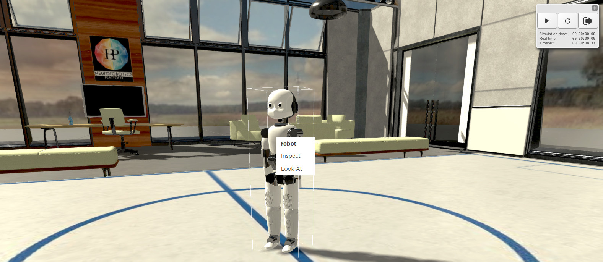
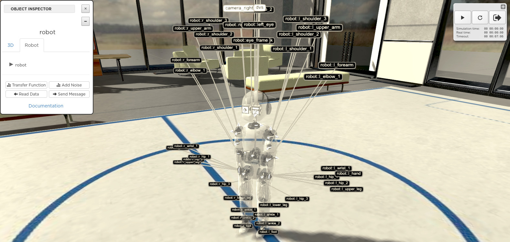
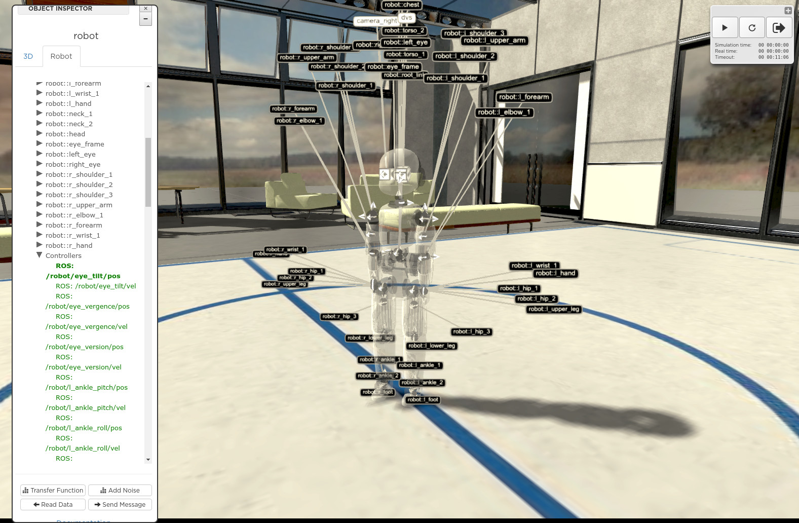

===============
Inspect a robot
===============

|

In order to inspect a robot in the 3D scene, right-click on it. This will display a menu with the
**inspect** option. 

|

|

Clicking on **inspect** displays the robot inspector. When the **Robot** tab of the inspector is selected, the robot
becomes transparent and its different parts are labelled. Sensors and actuators are labelled with white bubbles. The **Documentation** link of the **Robot** tab will direct you to the 
documentation page of the robot, a web page based on the model.config file, see `Create an experiment`_.

|

|

You can expand the robot tree to access the devices of the robot and its ROS topics. 

|

|

  If you select a `ROS topic`_, you can create a transfer function using this topic as a variable by pressing the **Transfer Function** button. This will 
  direct you to the `transfer functions editor`_.

.. _transfer functions editor: edit/7-gz3d-tf-editor.html
.. _ROS topic: http://wiki.ros.org/Topics
.. _Create an experiment: 12-gz3d-create-experiment.html

