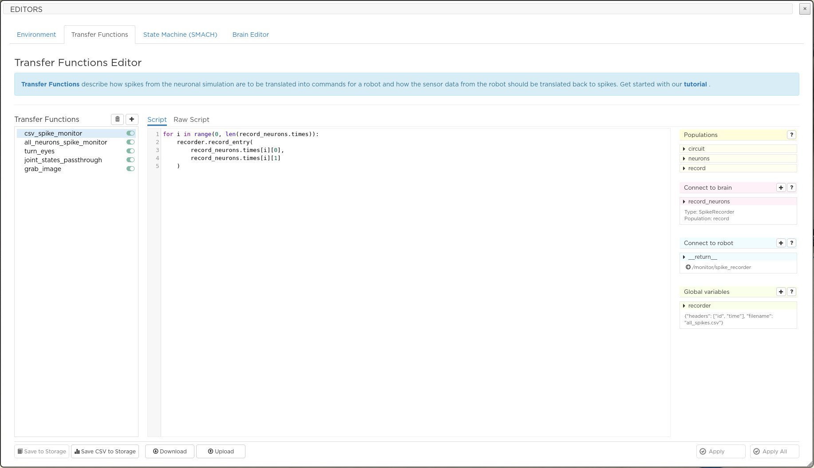
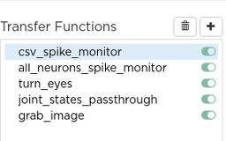
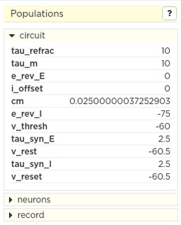
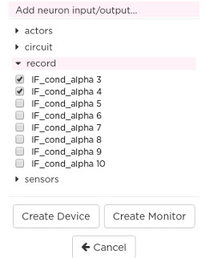
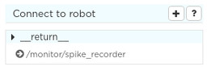
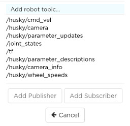
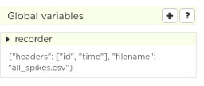

=============================
The transfer functions editor
=============================

The transfer functions editor eases off the specification of transfer functions.
The main features of this editor are described below.

Let us briefly recall what transfer functions are: Python scripts, that transform robot sensor data into spike
input for the brain and brain spike output into commands for the robot actuators. Actually, transfer functions are what you will most likely want to edit.

The editor displays these scripts and enables the user to change them. Users should have knowledge of the expected
syntax and of the brain spike and robot interfaces.

|

|

|

  In the introduction text of the pane, a link takes the user to the relevant documentation.

  - Clicking on **Apply** submits the changes in a transfer function to the current simulation. The user should see the effect on the robot's behavior immediately.
  - Clicking on **Delete** removes this transfer function from the simulation.
  - Clicking on **New** at the top of the editor creates a new transfer function template that you can edit.
  - The **Download** and **Upload** buttons enable saving or loading of a local set of transfer functions. It can be useful to switch between multiple versions.
  - **Save** permanently saves the functions to the experiment

  When a transfer function is newly created or transfer functions are uploaded, they are automatically checked
  for syntax errors and applied. Furthermore, there are several restrictions for Python code that is to be uploaded to the Platform
  for safety reasons. Mainly, this affects the ``import`` statement that is limited to a selected list of modules
  and statements with leading double underscores. If the module that you wish to import is failing to load,
  please contact us for inclusion (see :ref:`contact`).

  .. warning::

    Currently, the NRP does not perform a *semantic* validation of modified and/or uploaded transfer functions.
    That means that if the transfer function tries to address neurons that are not present in the currently selected
    brain model, this semantic error cannot be processed and will cause the simulation to stop. Note that the same
    accounts also for modifications to the brain model.

  .. warning::

    Monitoring is implemented with a special transfer function called "all_neurons_spike_monitor" in our template experiments. If you delete or alter this transfer function, monitoring might not work properly.

|

Overview
--------

The transfer functions editor splits into three main views. 
The view on the left allows you to select transfer functions while
the view in the middle allows you to edit transfer functions body. 
If the **Script** tab is active, the NRP python decorators are hidden and a third view 
is displayed. This third view shows the list of neuron populations and 
three other widgets that help you create devices, monitors, ROS publishers and subscribers.

|

.. image:: ../images/tf-editor-raw-script.jpg
    :align: center
    :width: 100%

|

|

  If the **Raw Script** tab is active, the NRP python decorators are displayed and 
  you have full control of the python code.

|

Transfer functions selection
----------------------------

|

|

|

  The view on the left is used to select the transfer function to be inspected or modified.
  It also includes buttons to delete the selected transfer function or create a new one. 
  Moreover, each selected transfer function can be enabled or disabled. 
  A disabled transfer function will not be executed until it is re-enabled.

|

The Script and Raw Script tabs
------------------------------

|

.. image:: ../images/tf-script.jpg
    :align: center
    :width: 20%

|

  The **Script** tab displays the user-written python. 
  The **Raw Script** tab displays, in addition, the definition name of the function and the python decorators which can be generated by means of the graphical interface.
  The definition name of the transfer function is the name used in the left view to refer to it.
  Changes become effective in the simulation only after the **Apply** button is pressed. **Apply all** will apply the 
  changes of every transfer function. Pressing **Save to storage** will save your changes persistently in your storage space.

|

Populations 
-----------

|

|

|

  The **Populations** widget on the right displays a read-only information about user-defined neuron populations of the brain model.
  Populations are listed and each population item can be expanded so as to unveil the features of its neurons: you can read for instance 
  the value of the resting potential or the refractory period. This information can be useful when designing transfer functions.

|

Connect to brain
----------------

|

.. image:: ../images/connect-to-brain.jpg
    :align: center
    :width: 20%

|

|

  The **Connect to brain** widget displays the list of brain devices and brain monitors.  

|

|

.. image:: ../images/expanded-device.jpg
    :align: center
    :width: 20%

|

|

  Each device or monitor can be expanded to display its configuration. 
  The configuration can be modified from the graphical interface.

|

|

|

|

   Pressing the **+** button of the **Connect to brain** widget displays 
   the list of neuron populations with a tick box for each neuron. This way you can select a subset of a population
   to instantiate a device (brain input) or a monitor (brain output).

|

Connect to robot
----------------

|

|

|

  The **Connect to robot** widget displays the list of ROS publishers and subscribers created by 
  the selected transfer function.

|

|

|

|

  Pressing the **+** button of the **Connect to robot** widget displays the list of all the available ROS topics that can be used to communicate with the robot.
  Clicking on a robot topic selects this topic and then, a new topic channel can be created in the
  selected transfer function by clicking on **Add Publisher** or **Add Subscriber**

|

Global variables
----------------

Global variables allow you to share information accross transfer functions.

|

|

|

  The **Global variables** widget displays the list of user defined global variables.

|

|

.. image:: ../images/expanded-global-variable.jpg
    :align: center
    :width: 20%

|

|

  Each global variable can be expanded so that is value can be edited. 
  Pressing the **+** button will create a new variable that you can edit by expanding its item.

|

The type of the variable currently can be one of the following:

- Integer
- String
- CSV Recorder
- Retina configuration

Based on the type of variable, different configuration options apply. For a CSV recorder, the user is asked to
specify file name and headers. For a retina configuration, the configuration file is requested. For integer or
string variables, the initial value is required.
