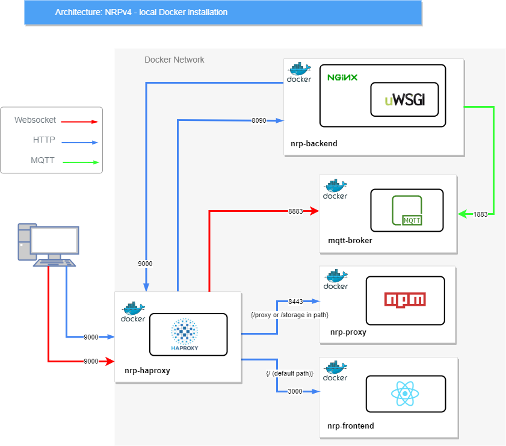
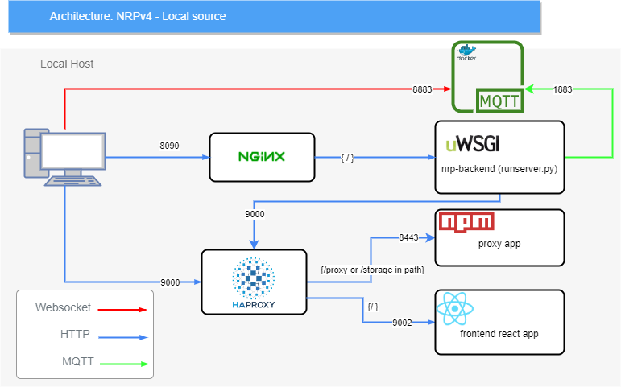

..  _installation-implementations:

======================================================
NRP Implementation depending on installation procedure
======================================================

Local Docker installation 
=========================

The following section describes the current implementation that results from the local Docker installation. The boxes with a Docker logo in the top left-hand corner are Docker containers. The rectangular boxes with black outlines are processes. Three types of connections are necessary for proper functioning: HTTP connections that are routed via Haproxy; WebSocket connections that are handled by the MQTT-broker; and a MQTT message passing connection between the backend app and the MQTT-broker container.

    NRP implementation resulting from local Docker installation.

The entry point to the platform is http://localhost:9000, which is the haproxy container. 

Haproxy is the main entry point to the NRP. It is responsible for dispatching traffic between frontend and backend, proxy and MQTT broker service. 

A drawback of haproxy is that it is not a web server. Therefore, in order to serve the backend rest API, one needs to put it behind an nginx proxy. The latter is a “proper” web server but cannot route traffic as flexibly as haproxy does.

The nrp-proxy is an “internal proxy” that enables abstracting away the mechanisms used to save user data.

Finally, the MQTT broker is needed for two purposes: 1- for the data streaming engine; 2- for the backend to send any runtime simulation information to the user interface. 

Local source installation
==========================

    NRP implementation resulting from local source installation. The black boxes represent processes.  

The following summarizes what happens after starting the NRP: when the user types in localhost:9000 into the address bar of his/her browser, haproxy routes it to port 9002 (frontend) and loads the frontend app into the browser. Then, that app contacts the backend through port 8090 to run the simulation, which in turn triggers the backend python app to run NRP-core and other required engines (e.g., Gazebo).

