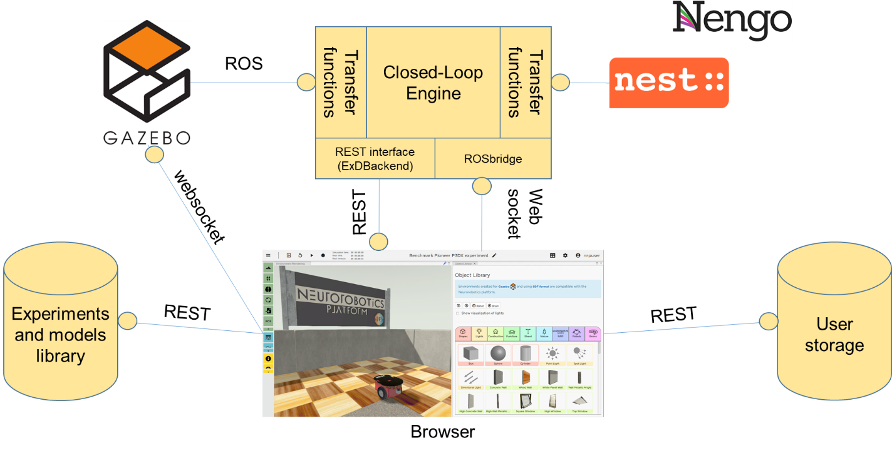

Basics of the NRP software architecture 
========================================

The NRP is (very schematically) comprised of three complementary
components:

a. the frontend, which includes the graphical user interfaces to control
   the NRP

b. the backend , where simulations are actually exectuted

c. data storage

The backend is of particular importance as this is where different
simulators (e.g. Gazebo, NEST) are synchronized and provided with the
means to exchange data through the Transfer Function framework. The
latter pivotal role, as it provides users with a simple way to define
how the different simulators communicate with each other, and in
particular how the connection between brain and body is set up.
Concretely, Transfer Functions are user-defined Python functions, the
main purpose of which is to ensure that the output of a given simulator
is converted into a format that can be consumed by another simulator. A
nice feature of the Transfer Function framework is that any NRP
simulation can be paused at any given time, and the Transfer Functions
modified through the GUI. When unpausing the simulation, these
modifications immediately take effect, enabling users to tailor the
coupling between e.g. brain and body without the need to fully stop and
re-launch experiments.

The main use of the NRP 3.2 is to provide simulated brain models with
embodiment into a simulated, physically realistic world. To this end,
the backend is comprised of a “brain simulation”, a world simulation and
an orchestration mechanism that makes sure these two simulations and the
Transfer Function framework are properly synchronized (see :ref:`Figure 13<qsg-fig13>`).
In NRP v3.2, this component is referred to as the Closed-Loop Engine
(CLE), and runs in the same process as the brain simulator (NEST or
NENGO). The “world simulation” engine is an integral part of the NRP,
and is a fork of the Gazebo Robotics simulation. It communicates with
the CLE through ROS, thus providing a communications mechanism to e.g.,
control the simulations and display experiment-related data to the users
through the GUI.

.. _qsg-fig13:

   .. image:: images/qsg_14.png
   
      Figure 13: Schematic representation of the various architectural components of the NRP

