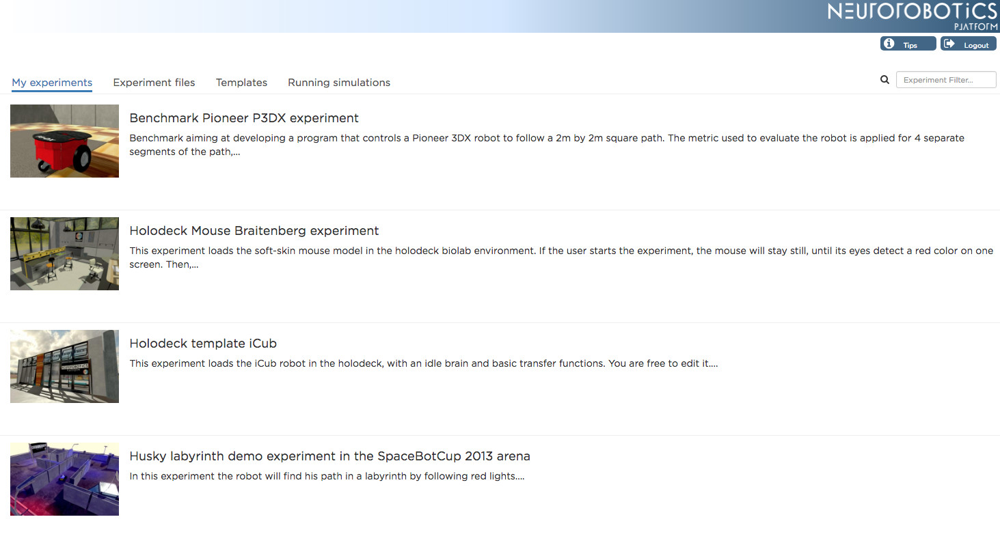

.. sectionauthor:: Viktor Vorobev <vorobev@in.tum.de>

Neurorobotics Platform Guide Book
=================================

The Neurorobotics Platform consists of a web "cockpit", embedded experiment editors and a separate desktop robot designer application. This covers exactly what you need to set-up and run a successful in-silico experiment.

.. toctree::
   :maxdepth: 1

   user_manual/start
   user_manual/index
   tutorials
   developer_manual
   troubleshooting
   specifications/index
   glossary

