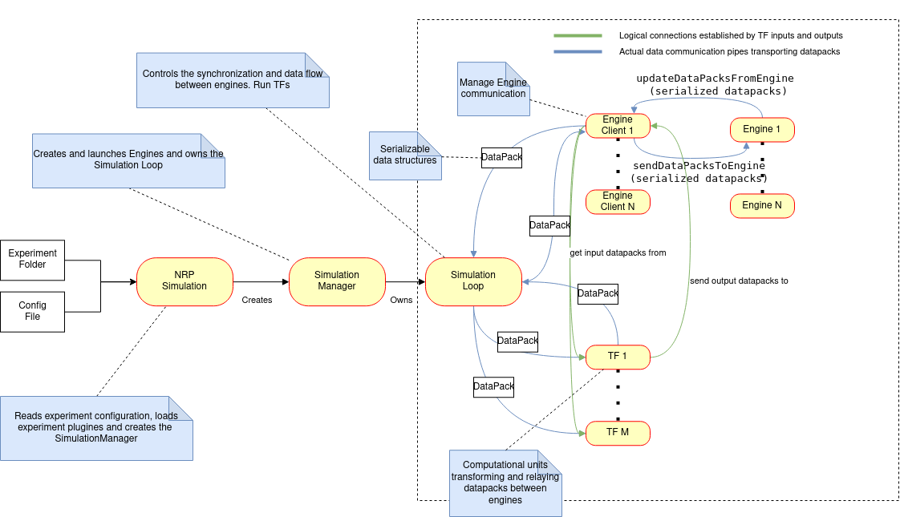
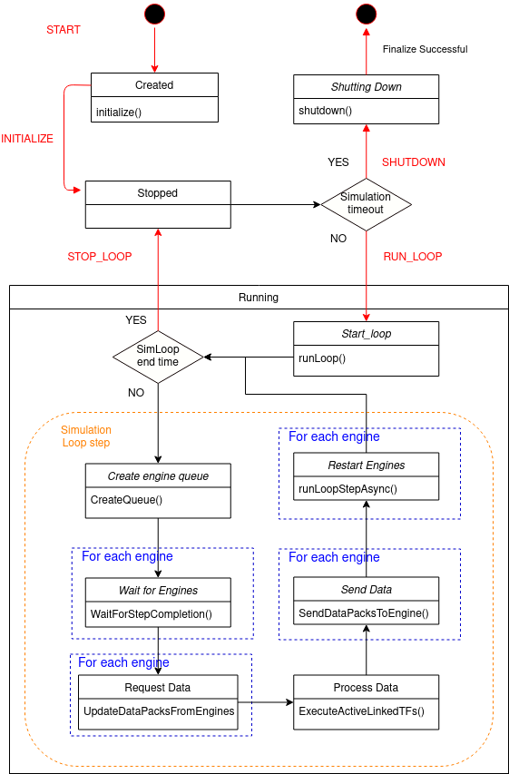

.. index:: pair: page; Architecture Overview
.. _doxid-architecture_overview:

Architecture Overview
=====================

The NRP Core framework (NRP-core) allows NRP users to design and execute experiments where multiple "simulation modules", running in separate processes, synchronize with each other at different frequencies to create a single, coherent simulation. The architecture components that run these "simulations modules" will hereafter be referred to as Engines.

An experiment in NRP-core, therefore, consists of multiple engine processes that synchronize with a central Simulation Loop process at predetermined frequencies defined by the user. These frequencies (expressed in simulation time) determine the engine time step, which defines the duration (also in simulation time) for which that engine carries out a simulation independently (i.e. without communication to the central process). Note that: 1) the engine time step can be different for each engine and is set in the experiment configuration; 2) that the internal time step of the simulator at the heart of a given engine is independent of the engine time step (the latter should nevertheless be a multiple of this internal time step).

For more explanations, this :ref:`page <doxid-sync_model_details>` contains a more detailed description of the **synchronization model**.

Additionally, NRP-core offers an asynchronous mode which allows to interact with external simulation modules or other processes asynchronously. This asynchronous mode is implemented by the :ref:`EventLoop <doxid-class_event_loop>` and is described in detail in this :ref:`page <doxid-event_loop>`.

Please also note that, while NRP-core is - quite literally - the beating heart of the NRP, the so-called NRPCoreSim is the standalone application based on NRP-core. This standalone application can execute experiments through the same lifecycle process, but without the additional functionalities of the NRP (e.g. front end, etc.). This :ref:`page <doxid-nrp_simulation>` contains more information about NRPCoreSim.

The main elements in the NRP-core architecture are briefly described below. A more in-depth description and implementation details are available in separate pages in this documentation.

.. _doxid-architecture_overview_1main_elements:

Main Elements
~~~~~~~~~~~~~

These are the main elements in the architecture involved in the synchronization and communication between simulations:

* :ref:`DataPack <doxid-datapacks>` : user-defined data structures used to exchange data between engine servers and clients. They are as well the input and output of transceiver functions.

* :ref:`Transceiver Function <doxid-transceiver_function>` (TF): user-defined Python functions which enable data exchange between engines.

* :ref:`Preprocessing Function <doxid-preprocessing_function>` (PF): user-defined Python functions which enable to pre-process data coming from engines before injecting it into TFs.

* :ref:`Engine <doxid-engines>` : provides both an abstraction layer and an interface to integrate simulators in NRP-core. Each engine represents a process in which a concrete instance of a simulator is running. For each of them there is a client side component in the simulation loop process interfacing the engine process for simulation control and data exchange.

* :ref:`Simulation Loop <doxid-simulation_loop>` : main loop where synchronization of engines, transmission of data and execution of transceiver functions happens.

.. _doxid-architecture_overview_1experiment_lifecycle:

Experiment Lifecycle
~~~~~~~~~~~~~~~~~~~~

The lifecycle of an experiment consists of a series of states in which the different components in the architecture interact to initialize, run and shutdown the simulation. These components can be grouped in different sections depending on the role they play in the architecture:

* Simulation Management: initializes and manages the Simulation Loop

* :ref:`TransceiverFunction <doxid-class_transceiver_function>` Management: initializes and manage the execution of TransceiverFunctions

* :ref:`Engine <doxid-engines>` : Engine processes and clients

* :ref:`Process Management <doxid-process_launcher>` : those components in charge of launching, monitor and shutdown engine processes.

* Engine Launching: orchestrates the launching of engines. Dynamically loads engine :ref:`plugins <doxid-plugin_system>`, receive process launchers from the :ref:`ProcessLauncherManager <doxid-class_process_launcher_manager>` and configure them to launch the engine processes.

In the diagram below is depicted the structure of an experiment lifecycle. In this other :ref:`diagram <doxid-lifecycle_components>`, the actions performed by each of the architecture components in each of the lifecycle transitions (Start, Initialize, RunLoop, Shutdown, Cleanup) are is described in detail.

.. toctree::
	:hidden:

	page_datapacks.rst
	page_plugin_system.rst
	page_engines.rst
	page_event_loop.rst
	page_lifecycle_components.rst
	page_nrp_simulation.rst
	page_preprocessing_function.rst
	page_process_launcher.rst
	page_simulation_loop.rst
	page_sync_model_details.rst
	page_transceiver_function.rst

.. rubric:: Related Pages:

|	:doc:`page_datapacks`
|	:doc:`page_plugin_system`
|	:doc:`page_engines`
|	:doc:`page_event_loop`
|		:doc:`page_computational_graph`
|		:doc:`page_event_loop_configuration`
|		:doc:`page_python_graph`
|	:doc:`page_lifecycle_components`
|	:doc:`page_nrp_simulation`
|	:doc:`page_preprocessing_function`
|	:doc:`page_process_launcher`
|	:doc:`page_simulation_loop`
|	:doc:`page_sync_model_details`
|	:doc:`page_transceiver_function`

