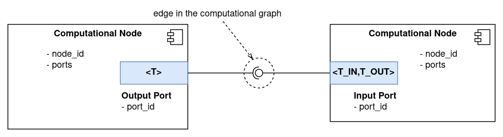
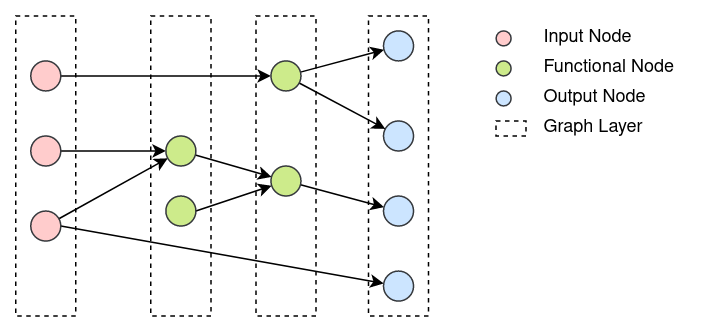
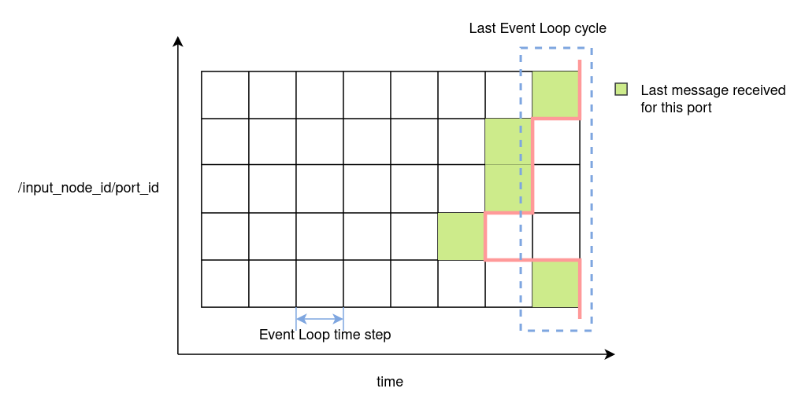
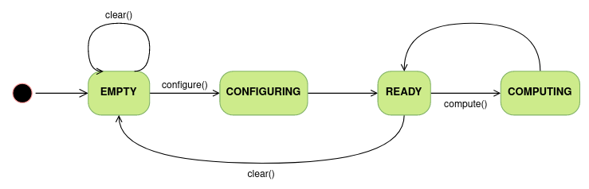

.. index:: pair: page; Computational Graph
.. _doxid-computational_graph:

Computational Graph
===================

The Computational Graph provides event processing and publishing capabilities to the NRP-Core Event Loop. For this purpose three types of nodes, :ref:`Input <doxid-computational_graph_1input_node>`, :ref:`Output <doxid-computational_graph_1output_node>` and :ref:`Functional <doxid-computational_graph_1functional_node>`, are available. These nodes can be connected with directed edges forming a graph structure. Through these connections, nodes can send data to each other. To handle the actual data transmission through these connections, nodes use Ports.

:ref:`Input Nodes <doxid-computational_graph_1input_node>` are used to subscribe to external events outside of the Event Loop and inject them into the graph. These events are always messages in any of the supported formats (e.g. ROS messages). :ref:`Functional Nodes <doxid-computational_graph_1functional_node>` run an user-defined function which input arguments and return values can be both connected to other node Ports. In this way, they act as processing units in the Computational Graph. :ref:`Output Nodes <doxid-computational_graph_1output_node>` receive messages and publish them out of the Event Loop.

In this way, the Event Loop receives messages asynchronously through Input Nodes and process them synchronously through the sequential execution of the Computational Graph nodes. A new message arriving to an Input Node involves two aspects: an event, i.e. a new message has arrived, and the data, payload, contained in the message. Both are propagated to the nodes connected to the Input Node, usually Functional Nodes, triggering their execution.

Finally, the Computational Graph is purely functional, the execution of nodes does not produce side effects beyond the transmission of events and messages through their Ports. That is, neither the graph nor its nodes have any state variables which can be set or modified through the execution of the graph.

In the next sections different aspects of the Computational Graph elements, model and behavior are described. For convenience, each of these sections are linked below:

* :ref:`Graph Edges: Ports <doxid-computational_graph_1graph_ports>`

* :ref:`Computational Nodes <doxid-computational_graph_1computational_nodes>`

* :ref:`Execution Order of Nodes in the Graph <doxid-computational_graph_1graph_layers>`

* :ref:`Data Management in the Computational Graph <doxid-computational_graph_1graph_data_policies>`

* :ref:`Node Execution Policies <doxid-computational_graph_1node_policies>`

* :ref:`Computational Graph Lifecycle <doxid-computational_graph_1graph_fsm>`

.. _doxid-computational_graph_1graph_ports:

Graph Edges: Ports
~~~~~~~~~~~~~~~~~~

Edges in the Computational Graph represent connections between Computational Nodes through which data can be sent. To manage the actual data communication, Computational Nodes use Ports.

There are two types of Ports: Input and Output. As depicted in the figure below, both are templated, and can only be connected if their template parameters coincide. That is, in the figure, it would only be possible to connect the Output :ref:`Port <doxid-class_port>` to the Input :ref:`Port <doxid-class_port>` if ``T`` is equal to ``T_IN``.

Output Ports are used by Nodes to send data to other Nodes. A publisher/subscriber pattern is used to manage data transfer operations. Output Ports have a ``publish(const T* msg)`` function which takes a pointer to an object of type ``T`` (the :ref:`Port <doxid-class_port>` template parameter), and sends it to all subscribed Input Ports.

Input Ports have a ``subscribeTo(:ref:`OutputPort <doxid-class_output_port>`<T_IN>* port)`` function which allows to subscribe to an Output :ref:`Port <doxid-class_port>` of the right type. In their constructor, Input Ports take a callback function with signature ``"void (const T_OUT*)"`` which is called upon new message arrival.

In this way, Nodes can use ports to publish data and receive it through callback functions.

It can be noticed that Input Ports are templated with two types: ``T_IN`` and ``T_OUT``. This opens the possibility of performing data conversion operations in Input Ports. See the section :ref:`Data Conversion in Input Ports <doxid-computational_graph_1graph_data_conversion>` below for more details on how data conversion operations are implemented.

Additionally, it is possible to set the maximum number of Ouput Ports an Input :ref:`Port <doxid-class_port>` can subscribe to. This feature is used by nodes in order to control the graph connectivity. For example, Functional Nodes allow to connect each of their inputs to one :ref:`Port <doxid-class_port>` only.

Finally, each :ref:`Port <doxid-class_port>` is uniquely identified in the graph by its address. This address is used to declare connections in the graph, see :ref:`this page <doxid-python_graph>` for more details. The address of each :ref:`Port <doxid-class_port>` takes the form: ``/node_id/port_id``. ``node_id`` is the id of the parent node of the :ref:`Port <doxid-class_port>`, which is unique in the graph. ``port_id`` is the id of the :ref:`Port <doxid-class_port>`, which is unique in the parent node.

.. _doxid-computational_graph_1computational_nodes:

Computational Nodes
~~~~~~~~~~~~~~~~~~~

Computational Nodes are the computation units in the graph. They are responsible for receiving and processing events and sending out other events in response.

All node implementations inherit from class :ref:`ComputationalNode <doxid-class_computational_node>`, which provides a basic interface used by the Computational Graph to configure and execute them. It has two virtual methods which every derived class must implement:

* ``configure()`` : called in the graph :ref:`configuring state <doxid-computational_graph_1graph_fsm>`. After the call returns the node is assumed to be ready for being executed.

* ``compute()`` : called when the node is executed in each loop cycle.

.. _doxid-computational_graph_1computational_node_types:

Computational Node Types
------------------------

There are three types of nodes: Input, Functional and Output. Each of them is discussed in more detail below.

.. _doxid-computational_graph_1input_node:

Input Nodes
+++++++++++

Input Nodes receive events from out of the graph and propagate them to connected nodes. Input Nodes can only have Output Ports and thus can only be sources in graph edges.

The base implementation of :ref:`InputNode <doxid-class_input_node>` has a ``registerOutput(const std::string& id)`` method which can be used to create ports in the node. For each registered port, a cache is created in the node. Derived classes must use this cache to place pointers to incoming messages. When ``compute()`` is called, :ref:`InputNode <doxid-class_input_node>` publishes the content of each :ref:`Port <doxid-class_port>` cache through the corresponding :ref:`Port <doxid-class_port>`.

:ref:`InputNode <doxid-class_input_node>` has a ``"bool updatePortData(const std::string& id)"`` virtual method which uses as a hook to ask derived classes to update the cache for a given port with id ``id``. If the method returns true it means that new messages are available and ready to be published through this port. In this way, it is assumed that :ref:`InputNode <doxid-class_input_node>` derived classes knows how to map incoming messages to ports in the node.

:ref:`InputNode <doxid-class_input_node>` is templated with a parameter ``DATA`` which specifies the data type the node will publish. That is, all the ports in the node will be of type ``DATA``.

.. _doxid-computational_graph_1output_node:

Output Nodes
++++++++++++

Output Nodes are used to send event messages out of the graph. They can only have Input Ports and therefore can only be targets in graph edges.

The base class :ref:`OutputNode <doxid-class_output_node>` collects data coming through its ports. It has a virtual method ``"void sendSingleMsg(const std::string& id, const DATA* data)"`` which derived classes must implement and which is used to send out received messages.

:ref:`OutputNode <doxid-class_output_node>` is templated with a parameter ``DATA`` which specifies the data type the node can handle. That is, all the input ports in the node will be of type ``<T_IN, DATA>``. The class has a method ``getOrRegisterInput<T_IN>(const std::string& id)`` which allows to create ports in the node.

.. _doxid-computational_graph_1functional_node:

Functional Nodes
++++++++++++++++

This type of node is used to process incoming events and send other. It can have Input and Output Ports.

The node wraps a function which is called in its ``compute()`` method. Each of the function arguments can be connected to an Input :ref:`Port <doxid-class_port>`, and each of its outputs to an Output :ref:`Port <doxid-class_port>`. In this way, Functional Nodes can be used as computational units in the graph which process input data and publish its results through its Output Ports. By connecting these Output Ports to Output Nodes, the output of the function can be sent out of the graph.

.. _doxid-computational_graph_1node_implementations:

Computational Node Implementations
----------------------------------

This section describes the implementations available for Input, Functional and Output Nodes.

:ref:`FunctionalNode <doxid-class_functional_node>` is already the final implementation of a Functional Node. In contrast, there is an implementation of :ref:`InputNode <doxid-class_input_node>` and :ref:`OutputNode <doxid-class_output_node>` for each supported communication protocol. These are described below.

.. _doxid-computational_graph_1ros_nodes:

ROS Nodes
+++++++++

ROS nodes allow to interface a Computational Graph with the ROS middleware.

:ref:`InputROSNode <doxid-class_input_r_o_s_node>` is an implementation of :ref:`InputNode <doxid-class_input_node>` which subscribes to a ROS topic, which address is given in the node constructor, and publishes received messages through an Output :ref:`Port <doxid-class_port>`. The class is templated with the ROS message type the node can subscribe to.

:ref:`OutputROSNode <doxid-class_output_r_o_s_node>` implements an :ref:`OutputNode <doxid-class_output_node>` which publishes incoming messages to a ROS topic, which address is specified in the node constructor. The class is templated with the ROS message type the node can publish.

.. _doxid-computational_graph_1engine_nodes:

Engine Nodes
++++++++++++

This type of node allows to integrate the Computational Graph with the :ref:`Engine <doxid-engines>` interface used in the synchronous mode of NRP-core. This integration can be exploited in several ways which are described in :ref:`this page <doxid-event_loop_configuration>`.

:ref:`InputEngineNode <doxid-class_input_engine_node>` implements an :ref:`InputNode <doxid-class_input_node>` specialization with type :ref:`DataPackInterface <doxid-class_data_pack_interface>`. That is, it publishes messages of type :ref:`DataPackInterface <doxid-class_data_pack_interface>`. It has two methods ``requestedDataPacks()`` and ``setDataPacks()`` which allows to update the node externally with the latest datapacks that the node subscribes to. ``requestedDataPacks()`` returns a set of :ref:`DataPackIdentifier <doxid-struct_data_pack_identifier>` which corresponds to the datapacks the node requires.

:ref:`OutputEngineNode <doxid-class_output_engine_node>` implements an OuptutNode of type DataPackInterface\*, and places all incoming messages in a cache which can be retrieved externally using the method ``getDataPacks()``.

.. _doxid-computational_graph_1graph_layers:

Execution Order of Nodes in the Graph
~~~~~~~~~~~~~~~~~~~~~~~~~~~~~~~~~~~~~

In each cycle of the Event Loop, all the nodes in the graph are executed in order. This order is directly defined by the edges between nodes present in the graph.

Since edges in the graph represent connections through which messages are sent, they impose precedence constraints in the execution order of nodes they connect. In each event loop cycle, the source node in an edge must always be executed before the target node. This basic rule ensures that all nodes are always executed with the latest data available.

Additionally, we want all the I/O operations in the graph to be executed at the beginning and at the end of the graph execution respectively. This can be translated as that all the Input nodes are executed first, then all Functional Nodes and finally all Output Nodes.

The former constraints indirectly allow to divide the graph in layers which must be executed sequentially and in order. These constraints can be translated in the next set of rules which completely define the graph layer structure:

* All the input nodes and only input nodes are placed in the first layer

* All the output nodes and only output nodes are placed in the last layer

* In each layer nodes receive edges only from previous layers

All the nodes in each layer can be executed in parallel.

In the image below a Computational Graph and its division in layers is depicted:

.. _doxid-computational_graph_1graph_data_policies:

Data Management in the Computational Graph
~~~~~~~~~~~~~~~~~~~~~~~~~~~~~~~~~~~~~~~~~~

As it has been already explained, nodes exchange pointers with each other through ports. Also, Input Ports support automatic data conversion if its template parameters ``T_IN`` and ``T_OUT`` are different.

In order to avoid memory leaks and ensure that nodes always operate with pointers that are valid, a set of rules referring to data management in the Computational Graph are established. These rules, which are described below, should be preserved by all node implementations.

#. Data ownership:
   
   #. Nodes own Ports.
   
   #. Nodes own the pointers they publish through their Ports.
   
   #. Input Ports own converted data.

#. Data pointers validity:
   
   #. Nodes only publish data through their Output Ports from their ``compute()`` functions.
   
   #. Nodes must ensure that pointers published through a given port are valid and the pointed data doesn't change until a new pointer is published through the same port.

:ref:`InputPort <doxid-class_input_port>`, :ref:`FunctionalNode <doxid-class_functional_node>` and :ref:`OutputNode <doxid-class_output_node>` have been implemented to preserve these rules. But developers implementing new Input Node types must be careful of respecting rules ``1.b``, ``2.a`` and ``2.b``.

.. _doxid-computational_graph_1graph_data_conversion:

Data Conversion in Input Ports
------------------------------

As it was mentioned above, Input Ports take a callback function with the signature ``"void (const T_OUT*)"`` in their constructor. This function is called with new messages published to the port.

If the template parameters ``T_IN`` and ``T_OUT`` of an Input :ref:`Port <doxid-class_port>` are different, then the received messages should be converted from ``T_IN`` to ``T_OUT`` in order to call the callback function with them. Conversion functions available to :ref:`InputPort <doxid-class_input_port>` are placed in the file ``nrp_event_loop/nrp_event_loop/utils/data_conversion.h``.

Currently, only conversions from and to boost::python::object are implemented.

.. _doxid-computational_graph_1graph_data_caching:

Data Caching and Coherence
--------------------------

The Event Loop receives events asynchronously and processes them synchronously. Messages can arrive at any point in time to Input Nodes and they are processed sequentially by executing graph layers in order.

Input Nodes cache messages arrived to them and, when their ``compute()`` function is called, publish pointers to these cached messages through their Output Ports. The published pointers are received by Functional Nodes Input Ports and cached there to be used as input to their wrapped function. After a Functional Node is executed, it caches the output values of its wrapped function and publishes pointers to them through its Output Ports. Finally, Output Nodes also cache incoming messages to be sent through their ``sendSingleMsg()`` function when they are executed.

The process described above is repeated every event loop cycle. The implication of this design is that all the messages received by Input Nodes during the previous cycle are processed together and are therefore implicitly considered coherent. By imposing the rules ``2.a`` and ``2.b`` described in the section above, it is automatically enforced that all nodes in the graph operate with data that is coherent under the previous definition and which remains invariant during the graph computation.

Then there is another point to consider. The case in which an Input Node didn't receive any message for one of its ports during the last event loop cycle. The figure below provides a graphical view of this possibility. Each green square represents the loop cycle in which the respective Input Node received the last message to be published in particular port.

To handle this case two options are available:

#. keep the last cached message(s) and don't publish any new pointer through its :ref:`Port <doxid-class_port>`.

#. wipe the cache and publish a null pointer.

Option (1) will be desirable in cases where received messages contain an update of part of the state of a simulation or system. For example the value of a joint in a robot simulation or system. Option (2) will be desirable in cases where messages are meant to be processed just once. For example, a new object, which is detected by a computer vision component. Input Nodes can be configured to adopt one of these two options. Referring again to the figure above, if all nodes were configured with option (2), those nodes with a white square in the last cycle will send a nullptr. If option (1) was used, they will keep the last received message.

The implicit consequence of the behavior of Input Nodes described above is that functions used in Functional Nodes must always consider the case in which any of their inputs is a null pointer.

.. _doxid-computational_graph_1node_policies:

Node Execution Policies
~~~~~~~~~~~~~~~~~~~~~~~

There are several configuration options available which affect the execution behavior of Computational Nodes. These are described in this section.

.. _doxid-computational_graph_1input_node_policies:

Input Node
----------

It was already mentioned in the section above that Input Nodes can be configured to keep their cached messages or wipe the cache and publish a nullptr in case they didn't receive new messages in the last event loop cycle. This policy is referred to as ``MsgCachePolicy`` and its two possible values, ``KEEP_CACHE`` and ``CLEAR_CACHE``, implement these two possible behaviors respectively. The default value is ``KEEP_CACHE``.

There is another configurable execution policy available for Input Nodes, ``MsgPublishPolicy``. It refers to how the node publishes cached messages. It can be set to ``LAST``, in which case the node publishes only the last received message for each port, or ``ALL``, in which case the node publishes all messages as a vector of pointers. The default value for this policy is ``LAST``.

.. _doxid-computational_graph_1functional_node_policies:

Functional Node
---------------

There is only one execution policy available for Functional Nodes, named plainly as ``ExecutionPolicy``. It specifies the conditions under which the node should be executed. It can take two values: ``ALWAYS``, in which case the node is executed in every event loop cycle; and 'ON_NEW_INPUT', in which case the node is only executed if at least one of its Input Ports received a new message in the current loop cycle. The default value is ``ON_NEW_INPUT``.

Functional Nodes always keep the cached output from their wrapped functions. This means that if the node is not executed it won't publish any new pointers, but those published in previous cycles will remain valid.

.. _doxid-computational_graph_1output_node_policies:

Output Node
-----------

Output Nodes have a single execution policy, with the name ``MsgPublishPolicy``. It tells how the node publishes out cached messages. If set to ``SERIES``, the node publishes each message individually and sequentially. If set to 'BATCH', it publishes all cached messages as a batch in a single message.

Output Nodes always consume their cached messages every loop cycle. That is, they publish all messages cached in each loop cycle and clear their cache afterwards.

.. _doxid-computational_graph_1graph_fsm:

Computational Graph Lifecycle
~~~~~~~~~~~~~~~~~~~~~~~~~~~~~

The Computational Graph is always in one of the states described below. In each state, only some actions can be applied to the graph. The different states, transitions and possible actions are depicted in the figure below:

Computational Graph states:

* Empty: the graph is created. This is the only state in which nodes and edges can be added to the graph.

* Configuring: all nodes in the graph are configured and the graph layers are created.

* Ready: the graph is ready for being executed.

* Computing: the graph is being executed.

