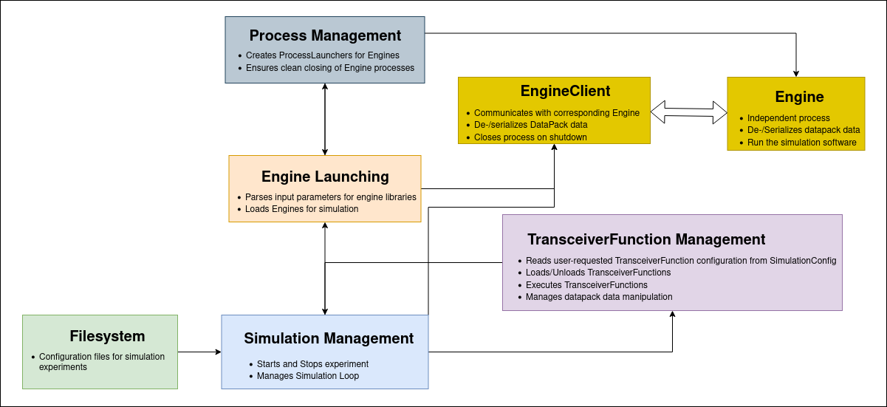
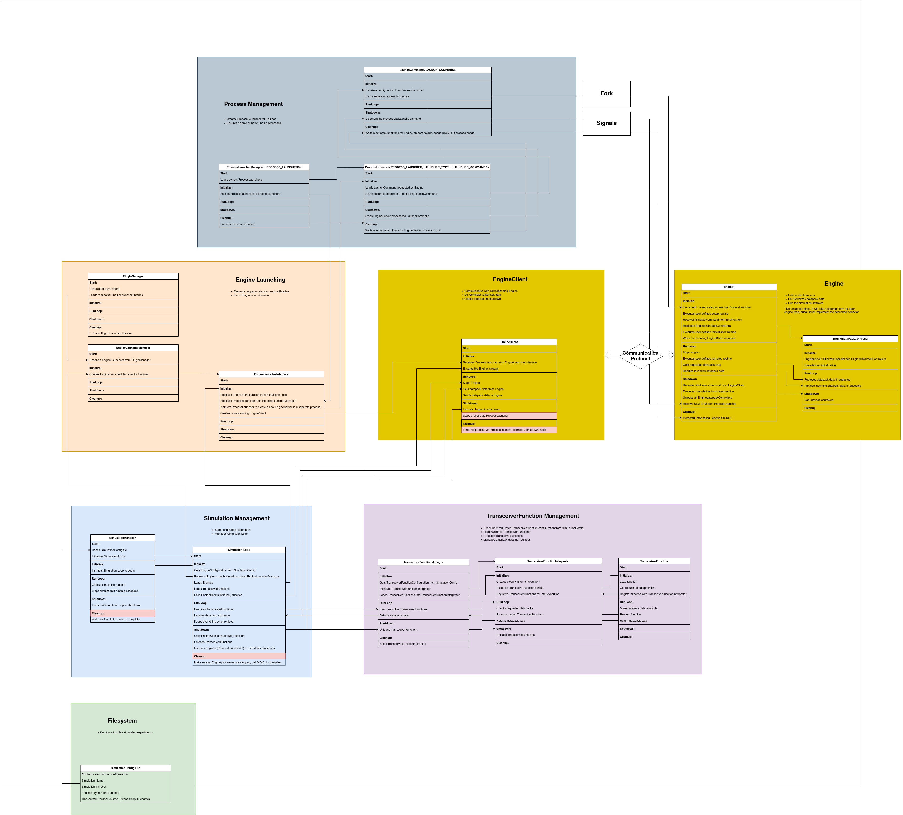

.. index:: pair: page; Lifecycle Component Diagram
.. _doxid-lifecycle_components:

Lifecycle Component Diagram
===========================

This page contains a diagram describing the actions performed by the main components in the architecture during a simulation experiment lifecycle transitions: Start, Initialize, RunLoop, Shutdown, Cleanup.

Each of the boxes in the diagram correspond to an actual class in the architecture. The boxes are grouped by the role they play in the architecture: Simulation Management, :ref:`TransceiverFunction <doxid-class_transceiver_function>` Management, Engine Launching, Process Manager and Engine.

the diagram contains a significant amount of information and in consequence is quite large. Unfortunately doxygen don't offer any advance tools for zooming and panning, which makes navigating such a large diagram not an easy task. To alleviate this situation, below is added a simplified version of the diagram containing just the aforementioned sections in which components are grouped and the relationships between them. This diagram maintains the same color code and spatial distribution of the sections as the large diagram.

Below is the complete diagram, it can be navigated using the scroll bars:

