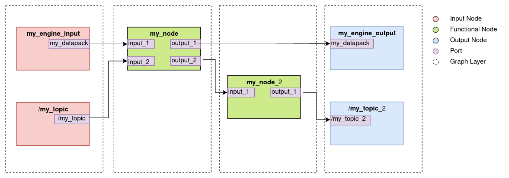

.. index:: pair: page; Instantiating a Computational Graph in Python
.. _doxid-python_graph:

Instantiating a Computational Graph in Python
=============================================

This page describes how to create a Computational Graph, instantiating :ref:`Input <doxid-computational_graph_1input_node>`, :ref:`Output <doxid-computational_graph_1output_node>` and :ref:`Functional <doxid-computational_graph_1functional_node>` nodes and connecting them with edges. The created graph can be afterwards executed by the :ref:`EventLoop <doxid-class_event_loop>`. For this purpose, a set of Python decorators are provided; their use is described below.

The main decorator is ``@:ref:`FunctionalNode <doxid-class_functional_node>```, which takes a Python function and creates a :ref:`Functional Node <doxid-computational_graph_1functional_node>` from it.

The rest of the decorators always decorate a ``@:ref:`FunctionalNode <doxid-class_functional_node>```. They allow to create :ref:`Input <doxid-computational_graph_1input_node>` and :ref:`Output <doxid-computational_graph_1output_node>` Nodes of the different :ref:`available types <doxid-computational_graph_1node_implementations>` and connect the decorated Functional Node to them.

All the decorators are defined in the ``nrp_core.event_loop`` Python module.


.. _doxid-python_graph_1functional_node_decorator:

@FunctionalNode
~~~~~~~~~~~~~~~

:ref:`Functional Nodes <doxid-computational_graph_1functional_node>` can be created from a Python function using the ``@:ref:`FunctionalNode <doxid-class_functional_node>``` decorator. The Node will then execute this function every Event Loop cycle.

The code snippet below shows the creation of a simple Functional Node which just forward each of its two inputs to its two outputs.

.. ref-code-block:: cpp

	@:ref:`FunctionalNode <doxid-class_functional_node>`(name="my_node", outputs=['output_1', 'output_2'], exec_policy=node_policies.functional_node.exec_policy.on_new_message)
	def my_function(input_1, input_2):
	    return [input_1, input_2]

The decorator has three arguments:

* ``name`` : string used as the node ``id`` in the graph and must be therefore unique in the graph

* ``outputs`` : a list of strings declaring the number and names of outputs of this node.

* ``policy`` (optional): the :ref:`execution policy <doxid-computational_graph_1functional_node_policies>` of the node. Its value must be of type ``node_policies.functional_node.exec_policy``, an enum with possible values: ``always`` and ``on_new_message``. Its default value is ``on_new_message``.

Each of the declared outputs can be connected to other nodes using decorators. Each of the input arguments of the function can be connected to other nodes too.

The decorated Python function must always return a list with the length equal to the number of declared outputs in the Functional Node decorator. Otherwise a runtime error will be triggered.


.. _doxid-python_graph_1from_functional_node_decorator:

@FromFunctionalNode
~~~~~~~~~~~~~~~~~~~

This decorator allows to connect one Functional Node input port to another Functional Node output port. It, therefore, creates an edge in the Computational Graph between two Functional Nodes.

The code below will create a Functional Node with one input, ``input_1``, and one output ``output_1``, and connect ``input_1`` to an output :ref:`Port <doxid-class_port>` with id ``output_2`` from a node with id ``my_node``.

.. ref-code-block:: cpp

	@FromFunctionalNode(keyword='input_1', address='/my_node/output_2')
	@:ref:`FunctionalNode <doxid-class_functional_node>`(name="my_node_2", outputs=['output_1'])
	def my_function_2(input_1):
	    return [input_1]

The decorator has two arguments:

* ``keyword`` : id of the input port in the decorated functional node which will be connected.

* ``address`` : address of the output port which will be connected.

The expected syntax for the output port address is ``/node_id/port_id``. If a node with id ``node_id`` doesn't exist or doesn't have an output with id ``port_id``, a runtime error will occur.


.. _doxid-python_graph_1from_engine_decorator:

@FromEngine
~~~~~~~~~~~

This decorator creates an :ref:`InputEngineNode <doxid-class_input_engine_node>` and connects it to one of the decorated Functional Node inputs. It, therefore, creates a node and an edge in the Computational Graph.

The code below extends on a previous example by connecting ``input_1`` in ``my_node`` to an output ``my_datapack`` of an :ref:`InputEngineNode <doxid-class_input_engine_node>` with id ``my_engine``.

.. ref-code-block:: cpp

	@FromEngine(keyword='input_1', address='/my_engine/my_datapack')
	@:ref:`FunctionalNode <doxid-class_functional_node>`(name="my_node", outputs=['output_1', 'output_2'])
	def my_function(input_1, input_2):
	    return [input_1, input_2]

If ``my_engine`` doesn't exist in the graph it is created. Then an Output :ref:`Port <doxid-class_port>` ``my_datapack`` is registered with ``my_engine`` and datapack id ``my_datapack`` is added to the node requested datapacks. See :ref:`here <doxid-computational_graph_1engine_nodes>` for more details.

The decorator has three arguments:

* ``keyword`` : id of the input port in the decorated functional node which will be connected.

* ``address`` : address of the output port which will be connected.

* ``cache_policy`` (optional): the :ref:`message cache policy <doxid-computational_graph_1input_node_policies>` of the node. Its value must be of type ``node_policies.input_node.msg_cache``, an enum with possible values: ``clear`` and ``keep``. Its default value is ``keep``.


.. _doxid-python_graph_1to_engine_decorator:

@ToEngine
~~~~~~~~~

This decorator creates an :ref:`OutputEngineNode <doxid-class_output_engine_node>` and connects it to one of the decorated Functional Node outputs. It works in a very similar way to the previous one.

The code below extends the previous example by connecting ``input_1`` in ``my_node`` to an output ``my_datapack`` of an :ref:`OutputEngineNode <doxid-class_output_engine_node>` with id ``my_engine``.

.. ref-code-block:: cpp

	@ToEngine(keyword="output_1", address="/my_engine/my_datapack")
	@FromEngine(keyword='input_1', address='/my_engine/my_datapack')
	@:ref:`FunctionalNode <doxid-class_functional_node>`(name="my_node", outputs=['output_1', 'output_2'])
	def my_function(input_1, input_2):
	    return [input_1, input_2]

The decorator has two arguments:

* ``keyword`` : id of the output port in the decorated functional node which will be connected.

* ``address`` : address of the input port which will be connected.

It can be noted that from the example above, according to the descriptions given, two nodes with the same id, ``my_engine``, would be created. Since node ids must be unique in the graph and in order to still allow using the same Engine name for both Input and Output Engine node ids, when an :ref:`OutputEngineNode <doxid-class_output_engine_node>` is created with a particular id, it internally adds the postscript ``"_output"`` to it. In the same way, InputEngineNodes add '"_input"' to their ids. In this way, from the example above three nodes will be created with ids: ``my_engine_input``, ``my_engine_output`` and ``my_node``.


.. _doxid-python_graph_1ros_subscriber_decorator:

@RosSubscriber
~~~~~~~~~~~~~~

This decorator creates an :ref:`InputROSNode <doxid-class_input_r_o_s_node>` and connects it to one of the decorated Functional Node inputs. It creates, then, a node and an edge in the Computational Graph.

The code below extends on the previous example by connecting ``input_2`` in ``my_node`` to an output port ``/my_topic`` of an :ref:`InputROSNode <doxid-class_input_r_o_s_node>` with id ``/my_topic``.

.. ref-code-block:: cpp

	@RosSubscriber(keyword="input_2", address="/my_topic", type=nrp_core.data.nrp_ros.std_msgs.String)
	@ToEngine(keyword="output_1", address="/my_engine/my_datapack")
	@FromEngine(keyword='input_1', address='/my_engine/my_datapack')
	@:ref:`FunctionalNode <doxid-class_functional_node>`(name="my_node", outputs=['output_1', 'output_2'])
	def my_function(input_1, input_2):
	    return [input_1, input_2]

The decorator has five arguments:

* ``keyword`` : as in other decorators, specifies the name of the Functional Node input port that the decorator connects.

* ``address`` : tells the ROS topic to subscribe to.

* ``type`` : the ROS message type that is received through this ROS topic.

* ``cache_policy`` (optional): the :ref:`message cache policy <doxid-computational_graph_1input_node_policies>` of the node. Its value must be of type ``node_policies.input_node.msg_cache``, an enum with possible values: ``clear`` and ``keep``. Its default value is ``keep``.

* ``publish_policy`` (optional): the :ref:`message publish policy <doxid-computational_graph_1input_node_policies>` of the node. Its value must be of type ``node_policies.input_node.msg_publish``, an enum with possible values: ``last`` and ``all``. Its default value is ``last``.

In this case, a new :ref:`InputROSNode <doxid-class_input_r_o_s_node>` is created to subscribe to each different topic. From each @RosSubscriber decorator a node with ``id`` ``address`` is created, and an OuputPort with id also ``address`` is added to it.

The value used in the ``type`` argument of the decorator must be a class from ``nrp_core.data.nrp_ros`` Python module. These are the ROS message types supported in NRP-core. For more information about which are the message types supported by default see :ref:`here <doxid-datapacks_1datapacks_rosmsg>`. For information about how to compile NRP-core to support additional ROS message types see :ref:`here <doxid-tutorial_add_ros_msg_definition>`.


.. _doxid-python_graph_1ros_publisher_decorator:

@RosPublisher
~~~~~~~~~~~~~

This decorator creates an :ref:`OutputROSNode <doxid-class_output_r_o_s_node>` and connects it to one of the decorated Functional Node outputs. It adds a node and an edge to the Computational Graph.

The code below extends on a previous example by connecting ``input_1`` in ``my_node_2`` to an input port ``/my_topic_2`` of an :ref:`OutputROSNode <doxid-class_output_r_o_s_node>` with id ``/my_topic_2``.

.. ref-code-block:: cpp

	@RosPublisher(keyword="output_1", address="/my_topic_2", type=nrp_core.data.nrp_ros.std_msgs.String)
	@FromFunctionalNode(keyword='input_1', address='/my_node/output_2')
	@:ref:`FunctionalNode <doxid-class_functional_node>`(name="my_node_2", outputs=['output_1'])
	def my_function_2(input_1):
	    return [input_1]

The decorator arguments are analogous to those in ``@RosSubscriber``, but in this case message arriving to the created :ref:`OutputROSNode <doxid-class_output_r_o_s_node>` will be published to ``/my_topic``.

It is not possible to subscribe and publish to the same topic from a graph. Attempting to do this will result in having two nodes with the same id, which is not allowed.


.. _doxid-python_graph_1python_graph_example:

Putting the Examples Together
~~~~~~~~~~~~~~~~~~~~~~~~~~~~~

To conclude the overview of the available Computational Graph decorators lets put together the different examples shown in the sections above:

.. ref-code-block:: cpp

	@RosSubscriber(keyword="input_2", address="/my_topic", type=nrp_core.data.nrp_ros.std_msgs.String)
	@ToEngine(keyword="output_1", address="/my_engine/my_datapack")
	@FromEngine(keyword='input_1', address='/my_engine/my_datapack')
	@:ref:`FunctionalNode <doxid-class_functional_node>`(name="my_node", outputs=['output_1', 'output_2'])
	def my_function(input_1, input_2):
	    return [input_1, input_2] 
	
	@RosPublisher(keyword="output_1", address="/my_topic_2", type=nrp_core.data.nrp_ros.std_msgs.String)
	@FromFunctionalNode(keyword='input_1', address='/my_node/output_2')
	@:ref:`FunctionalNode <doxid-class_functional_node>`(name="my_node_2", outputs=['output_1'])
	def my_function_2(input_1):
	    return [input_1]

This script, when loaded by the :ref:`EventLoop <doxid-class_event_loop>`, will create a graph with six nodes:

* two input nodes: ``my_engine_input``, ``/my_topic``.

* two output nodes: ``my_engine_output``, ``/my_topic_2``

* two functional nodes: ``my_node``, ``my_node_2``

Five edges will be added to the graph:

* From ``my_engine_input`` to ``my_node``

* From ``/my_topic`` to ``my_node``

* From ``my_node`` to ``my_node_2``

* From ``my_node`` to ``my_engine_output``

* From ``my_node_2`` to ``/my_topic_2``

When the graph is configured, the nodes in the graph are divided into four layers (see :ref:`here <doxid-computational_graph_1graph_layers>` for more details), each containing the following nodes:

#. ``my_engine_input``, ``/my_topic``.

#. ``my_node``

#. ``my_node_2``

#. ``my_engine_output``, ``/my_topic_2``

Ports required to connect the different Nodes are also created. The resulting graph is depicted in the figure below:



Each time the graph is executed (i.e. in every Event Loop cycle) the nodes in each of the layers are executed sequentially and in order. The next behavior is expected: If a new message has been published to the ROS topic ``/my_topic`` in the last event loop cycle, it will be sent to ``my_node``, which will, in turn, forward it to ``my_node_2`` and finally will be published to a ``/my_topic_2`` ROS topic. ``my_engine_input`` node will publish the latest available datapack with id ``my_datapack`` from Engine ``my_engine`` to ``my_node`` input port ``input_1``. The datapack will be sent back to the same Engine through the node ``my_engine_output``.

As a final comment, the order in which the decorators are added in the Python script is arbitrary. Only the ``@:ref:`FunctionalNode <doxid-class_functional_node>``` decorator must be placed directly above the Python function which will be executed.

For more examples on how the presented decorators are used to create Computational Graphs, take a look at the three example experiments provided in the ``examples/event_loop_examples`` folder.

