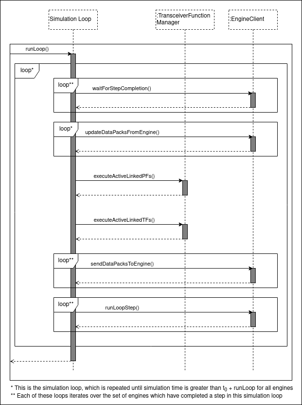

.. index:: pair: page; Synchronization Model
.. _doxid-sync_model_details:

Synchronization Model
=====================

An experiment in NRP-core consists of multiple Engine processes which synchronize with the main Simulation Loop process at fixed intervals of time (ie. simulation time, see below). The length of these intervals is determined by the Engine time step, which can be different for each engine and is set in the experiment configuration by the EngineTimestep parameter. See :ref:`here <doxid-engine_base_schema>` for more details about engine configuration.

The Simulation Loop also has its own time step defined by SimulationTimestep parameter in the experiment configuration.

.. _doxid-sync_model_details_1sim_timeline:

Simulation time and time frame
~~~~~~~~~~~~~~~~~~~~~~~~~~~~~~

All references to time in this page must be understood as "simulation time". The communication between the Engines and the Simulation Loop is always synchronous and all time values and parameters refer to simulation time in each of the engines, with the exception of timeouts that can set in the Simulation Loop for waiting for engine response.

It is assumed that there is an unique time frame common to all engines participating in an experiment. Furthermore all engines are assumed to be at time t=0 at the beginning of the experiment. All engine client implementations must override :ref:`EngineClientInterface::runLoopStepAsync() <doxid-class_engine_client_interface_1aabe6d06f4b2272422b782aef2ba7df4b>`, which requests the corresponding Engine to advance its simulation by a amount of time given by its input parameter *timeStep*.

.. _doxid-sync_model_details_1engine_sync:

Communication with Engines
~~~~~~~~~~~~~~~~~~~~~~~~~~

There are two means of communication between Simulation Loop and Engines:

* requests to advance the engine simulation, by calling runLoopStepAsync() in the corresponding :ref:`EngineClient <doxid-class_engine_client>`

* exchange of datapacks either (1) from Engines to Simulation Loop, by calling updateDataPacksFromEngine() or (2) from Simulation Loop to Engines, by calling sendDataPacksToEngine().

Which particular datapacks are requested and sent is determined by the inputs and outputs of the :ref:`transceiver functions <doxid-transceiver_function>` present in the experiment. The set of input datapacks for all TFs define a datapack pool or cache which is stored in the Simulation Loop process heap. The datapack cache is updated as Engines complete a simulation step. This cache is actually divided among the different EngineClients in the experiment, each of them storing those datapacks coming from their linked Engines. EngineClients also manage all the communication between the Simulation Loop process and the Engines, including requests to advance the simulation and sending or requesting datapacks.

.. _doxid-sync_model_details_1step_structure:

Simulation Loop step structure
~~~~~~~~~~~~~~~~~~~~~~~~~~~~~~

:ref:`FTILoop::runLoop() <doxid-class_f_t_i_loop_1adedc0d66c8e286e31c3b00dcd9ee46dc>` is the main function in which the synchronization and communication between engines and the Simulation Loop process is managed. It takes a parameter, ``runLoopTime``, which indicates the amount of (simulation) time expressed in seconds that the experiment simulation will be advanced by.

The choice of the terms *runLoop* and *runLoopStepAsync* can be better understood by looking at the Simulation Loop step structure diagram below. Once runLoop() is called, the simulation loop will be repeated until the simulation time of all the engines in the experiment is ``t >= t0 + runLoopTime``, being ``t0`` the time of the simulation loop when runLoop() is called.

Each simulation loop consists on the next steps:

#. The set of engines which should complete their current step next is computed

#. Execution blocks until all of these engines have actually completed their current step (waitForStepCompletion)

#. DataPacks required by any of the active TFs are requested from these engines and saved in the datapack cache of the respective engine clients (updateDataPacksFromEngine)

#. Active PFs linked with these engines are executed and their output saved in the datapack cache of the respective engine (executeActiveLinkedPFs)

#. Active TFs linked with these engines are executed (executeActiveLinkedTFs)

#. Output DataPacks from the TFs are sent to their respective engines (sendDataPacksToEngine)

#. Idle engines are requested to advance their simulations another time step (runLoopStepAsync). These calls are executed in separate threads and block until the step has been completed

This structure ensures that: 1) TFs always operate with the freshest datapacks available, including preprocessed datapacks; 2) When engines are restarted they have always been updated with the datapacks returned by the TFs linked to them.

.. _doxid-sync_model_details_1initial_loop:

case t=0, first simulation loop and empty datapacks
~~~~~~~~~~~~~~~~~~~~~~~~~~~~~~~~~~~~~~~~~~~~~~~~~~~

As commented above, all engine simulation are supposed to be at t=0 at the beginning of the simulation. In this first simulation loop, all engines are synchronized since none of them have still advanced their simulations. This means that also all TFs are executed and all datapacks in the datapack pool are requested.

The main implication of the former is that engines are supposed to be able to provide their registered datapacks even before they have advanced their simulation for the first time. Since this won't be always possible, Engines are allowed to return empty datapacks. :ref:`DataPack <doxid-class_data_pack>` Python wrappers have an ``isEmpty()`` method which can be used in TFs to check if datapacks are empty and adapt their behavior if this is the case.

