Quick start guide for NRP 3.2
================================

Introduction
---------------------

The NRP is designed to be an easy to use, intuitive interface for *in
silico* brain simulation experiments. An experiment typically includes a
virtual agent or “body” performing a specific task using a dedicated
brain model in a simulated environment. While brain models can be
implemented through a variety of simulators, the simulated environment
is always provided by the simulator called Gazebo
(http://gazebosim.org/)

Our community of users mostly includes roboticists, computational
neuroscientists and engineers working on applications of neuromorphic
computing. However, anyone with a working knowledge of Python can easily
learn how to use our platform.

This quick start guide shows you how to set up and run a simple
experiment - connecting a robot’s control command to two oscillating
neurons so that the robot will start waving its arm – by using a network
of spiking neurons created with the simulator called NEST
(https://www.nest-simulator.org/)

Step 1. Access the NRP
------------------------------------

You can access the NRP either online with your EBRAINS account or
locally, after installation on your machine (see:
https://neurorobotics.net/access-the-nrp.html). Regardless of how you
log in to the NRP, you will have access to the same GUI (displayed below
in fig.1, the “Experiment overview”).

First-time users must accept EBRAINS Terms and Conditions before
accessing our software.

a. Go to https://neurorobotics.net/access-the-nrp.html.
b. Choose between online access or local installation.
c. Create an EBRAINS account at https://ebrains.eu/register.
d. Choose between versions 3.05 and 3.2.
e. Follow the link and login with your username and password.

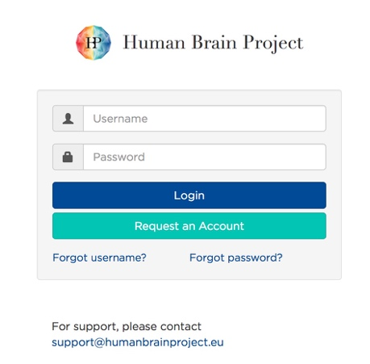

Congratulations! You can now start using the NRP via its “\ **Experiment 
overview**\ ” interface.

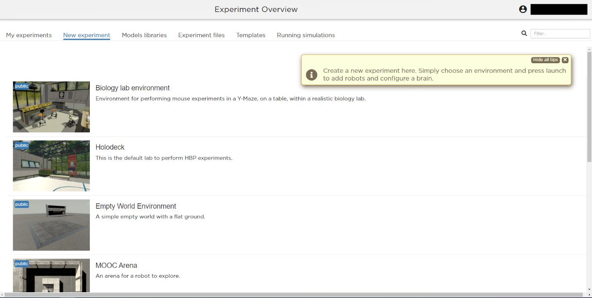
   
   Figure 1: The experiment overview page is the landing page of the NRP. 
   Pop-up tips, like the one shown here, provide users with suggestions and
   highlight functions. You can turn these tips on and off.

In the **EXPERIMENT OVERVIEW** (see Figure 1), the following multiple
tabs offer different functionalities to control your simulation
experience:

-  **My experiments:** An overview of all experiments created (or cloned) by you will be displayed here.

-  **New experiment:** A list of pre-defined, empty experimental environments. They
   can be selected, along with a Brain Simulator, to create a new
   experiment.

-  **Models libraries:** A collection of available models organized in
   categories, such as environments, robots, and brains. New models may
   also be uploaded at your convenience to enrich your libraries.

-  **Experiment files:** A browser-view of the files associated with
   user experiments.

-  **Templates:** Experiment templates that can be cloned by all users, and subsequently run, modified, etc.

-  **Running simulations:** An overview of all simulations that are
   currently running.

Detailed information on each of these tabs can be found at:
https://neurorobotics.net/Documentation/nrp/user_manual/index.html.

Step 2. Set up a new experiment with tab “New experiment”
-----------------------------------------------------------------------------------

a. Click on the tab “New Experiment”

b. Click on the “Empty World Environment” list entry and select the
   environment. Choosing one of the available environments reveals two
   fields: one where the name of the experiment should be entered, and
   one where you can select the brain simulator of your choice.

c. From the “Brain Simulator” dropdown, select “NEST” - our choice for the example detailed in the present guide. 
   For convenience, selecting a given
   brain simulator at this step automatically generates some boilerplate code inside
   experiment files. however, this choice can be changed later on if
   necessary, by modifying manually said boilerplate code.

d. Click the “Experiment Title” field and enter any name for your
   experiment. In this example, we’re going to name it
   “MyFirstExperiment”.

e. Finally, click the “Launch” button to launch the simulation.

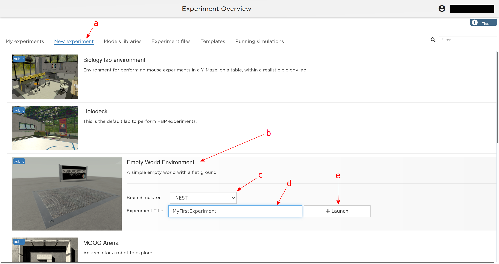
   
   Figure 2: Illustration of the steps to create a new experiment from a given environment.

Once the simulation is launched, a new view, referred to as the
**SIMULATION VIEW**, is displayed (see Figure 3). It comprises several
features and functionally relevant areas. These are:

-  the toolbar,

-  simulation controls, and

-  the display area.

The **toolbar** contains several entries, each yielding different
color-coded functionalities to model, control, and evaluate the
experiment. Green icons indicate editors, blue icons open evaluation
windows, and the yellow ones offer general information and help. The
color coded sections can be expanded or collapsed by clicking the small
arrows at the end of each section.

**Simulation controls** are displayed at the top of the window. From
here, one can leave, reset, start/stop the simulation, start and stop a
recording, and access additional settings of the environment rendering.

**The display area** is where the various environment rendering, plots,
consoles, etc. can be opened (through the toolbar) and arranged as per
the user’s wishes and needs.

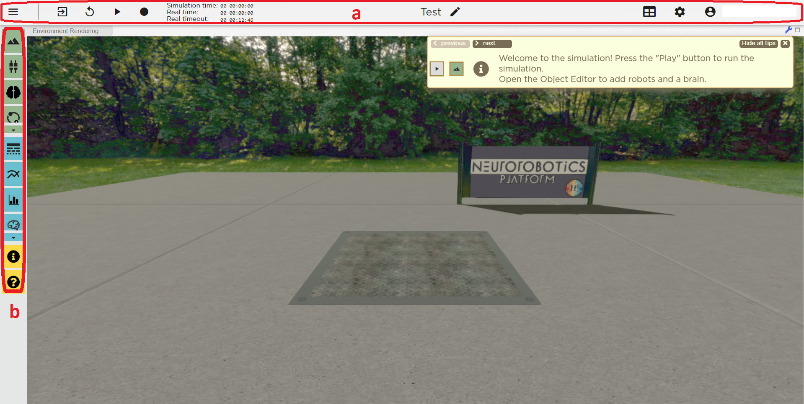
   
   Figure 3: Simulation view, as seen when creating a new experiment from the Empty World Environment. 
   The two areas highlighted in red are: top, (a) - Simulation controls; left, (b) - Toolbar. The yellow window opens up at startup and shows tips.

Step 3. Add a robot to your experiment
--------------------------------------------------------

Having created an experimental environment, you can now populate the
latter with an agent. You can choose the body for this agent by
searching the **object library**, which is located at the top of the
toolbar in the simulation view and denoted by a green “mountain” icon.

The following steps, illustrated in Figure 4,describe the procedure:

a. Click on the “Object library” in the menu bar. This will open the
   object library in a new tab next to the environment rendering.

b. Select “Robots” from the object categories.

c. Select any robot you wish to use. In this example we use the “iCub
   HBP ros” robot.

d. Hover your mouse on the environment rendering to see the robot. Click
   to place it at any location.

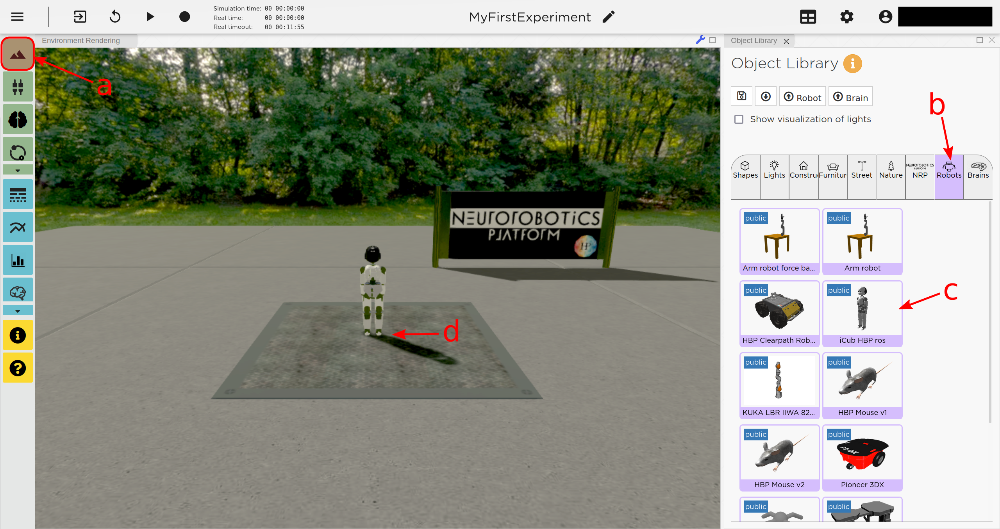
   
   Figure 4: Placing a robot into the environment.

Placing the robot into the environment will automatically open the
**OBJECT INSPECTOR**. We don’t need these functionalities for now, so we
may close the “Object Inspector” tab, using the little cross next to the
tab’s name. It can be re-opened by right clicking the robot and
selecting “Inspect” from the context menu.

**NB:** You can place any object into the environment and you can even
upload your own robot models into the NRP.

.. note::
    **Manipulating the camera view**
	
    You can manipulate the camera view to inspect the scene of your experiment using the keyboard or the mouse.

    - Use the “W, S, D, A” keys or the scroll wheel to move the camera view
    - Use the arrow keys or click and hold the left mouse button inside the environment rendering, then drag in the desired direction, to rotate the camera view.

    By default, the view is centered on the camera itself. To center the view on any object, right-click the object, and select “Look At” from the context menu.

Step 4. Add a “brain” circuit
----------------------------------------

A fundamental step in the setting up of any experiment is the inclusion
of a “brain” through the NRP **BRAIN EDITOR**. In most cases, it is a
single neuronal circuit, the function of which we want to investigate
through embodiment inside the NRP. To implement the neural circuit
required in the experiment we are describing here, we use the **NEST
Simulator**.

The NRP enables you to define a neural circuit using the PyNEST
python-interface of NEST. This makes it possible to build this circuit
graphically using the convenient “NEST Desktop” application, which is
accessible through EBRAINS (https://ebrains.eu/service/nest-desktop/).
The resulting PyNEST code can easily be transferred to the NRP.

To add a brain to the experiment, proceed as follows (illustration in Figure 5):

a. Select the “Brain Editor” from the menu bar. It is denoted by the
   green icon with the brain symbol in Figure 5).

b. Use the brain editor to implement your NEST network. You can either:

   i. import a brain script (e.g. created with NEST Desktop) using the
      “Upload” button

    or

   ii. write your script directly in the brain editor tab.

    It’s important to note that you import the PyNEST module at the top
    of your script (using import nest at the top of the script).

c. Apply your changes and save them by clicking the “Apply” button.

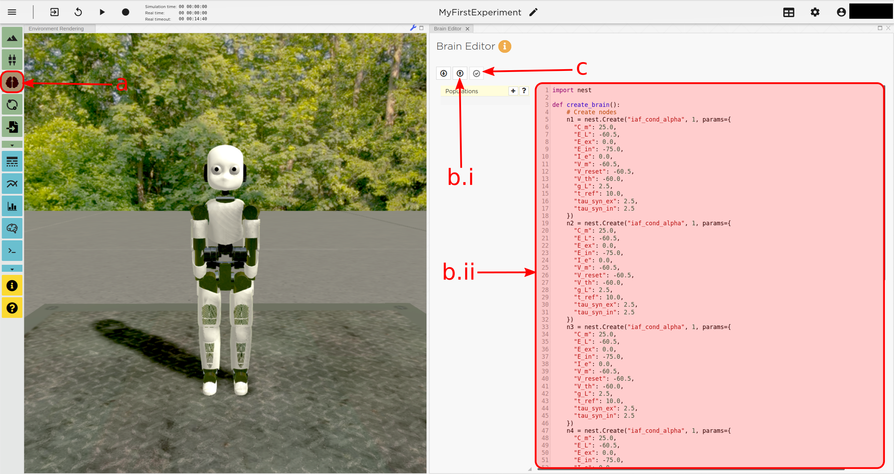
   
   Figure 5: Generating a brain for your robot using the brain editor.

All neuron populations that are created in the brain script will be
displayed in the **transfer function editor** (more on that later).

.. note::
    A little NEST trick: you can create sub-populations in the 
    BRAIN EDITOR by slicing the “circuit” population, thus creating a more 
    sophisticated neural architecture to be used in more complex experiments (see NEST documentation at
    https://nest-simulator.readthedocs.io/en/v3.1/).

The brain circuit implemented in the experiment described in this guide
is implemented through the following brain script, which you can
copy/paste in the brain editor. **Please respect the code
indentation provided in the example above. In general, on the NRP, when
in doubt use pythonic rules.**

This script creates a network consisting of four conductance based leaky
integrate-and-fire neurons
(`https://nest‑simulator.readthedocs.io/en/v2.18.0/models/neurons.html#classnest\_1\_1iaf\_\_cond\_\_alpha <https://nestsimulator.readthedocs.io/en/v2.18.0/models/neurons.html#classnest_1_1iaf__cond__alpha>`__).
Two excitatory neurons connect to each other via inhibitory
interneurons. Once excited sufficiently, the excitatory neurons can
maintain their spiking activity through recurrent connections. Activity
only stops when enough inhibitory spikes are received from the other
neuron.

.. code-block:: python

    import nest

    def create_brain():
        # Create nodes
        n1 = nest.Create("iaf_cond_alpha", 1, params={
          "C_m": 25.0,
          "E_L": -60.5,
          "E_ex": 0.0,
          "E_in": -75.0,
          "I_e": 0.0,
          "V_m": -60.5,
          "V_reset": -60.5,
          "V_th": -60.0,
          "g_L": 2.5,
          "t_ref": 10.0,
          "tau_syn_ex": 2.5,
          "tau_syn_in": 2.5
        })
		 
        n2 = nest.Create("iaf_cond_alpha", 1, params={
          "C_m": 25.0,
          "E_L": -60.5,
          "E_ex": 0.0,
          "E_in": -75.0,
          "I_e": 0.0,
          "V_m": -60.5,
          "V_reset": -60.5,
          "V_th": -60.0,
          "g_L": 2.5,
          "t_ref": 10.0,
          "tau_syn_ex": 2.5,
          "tau_syn_in": 2.5
        })
		 
        n3 = nest.Create("iaf_cond_alpha", 1, params={
          "C_m": 25.0,
          "E_L": -60.5,
          "E_ex": 0.0,
          "E_in": -75.0,
          "I_e": 0.0,
          "V_m": -60.5,
          "V_reset": -60.5,
          "V_th": -60.0,
          "g_L": 2.5,
          "t_ref": 10.0,
          "tau_syn_ex": 2.5,
          "tau_syn_in": 2.5
        })

        n4 = nest.Create("iaf_cond_alpha", 1, params={
          "C_m": 25.0,
          "E_L": -60.5,
          "E_ex": 0.0,
          "E_in": -75.0,
          "I_e": 0.0,
          "V_m": -60.5,
          "V_reset": -60.5,
          "V_th": -60.0,
          "g_L": 2.5,
          "t_ref": 10.0,
          "tau_syn_ex": 2.5,
          "tau_syn_in": 2.5
        })

        # Connect nodes
        nest.Connect(n1, n3, conn_spec={
          "rule": "all_to_all"
        })
		
        nest.Connect(n2, n4, conn_spec={
          "rule": "all_to_all"
        })
		
        nest.Connect(n3, n2, conn_spec={
          "rule": "all_to_all"
        }, syn_spec={
          "weight": -1.0,
          "delay": 1.0
        })
		 
        nest.Connect(n4, n1, conn_spec={
          "rule": "all_to_all"
        }, syn_spec={
          "weight": -1.0,
          "delay": 1.0
        })
	
        nest.Connect(n1, n1, conn_spec={
          "rule": "all_to_all"
        }, syn_spec={
          "weight": 0.3,
          "delay": 5.0
        })
	
        nest.Connect(n2, n2, conn_spec={
          "rule": "all_to_all"
        }, syn_spec={
          "weight": 0.3,
          "delay": 5.0
        })

        return n1 + n2

    circuit = create_brain()

		

Step 5. Connect body and brain with Transfer Functions 
---------------------------------------------------------------------------

After setting up our “brain”, we now want to use it to control our
robot. Therefore, the sensor outputs of the robot must be made available
to the brain, and neurons have to be connected to the robot’s actuators.
This can be achieved using so-called **TRANSFER FUNCTIONS**. For further
information on Transfer Functions, see:
https://neurorobotics.net/Documentation/nrp/user_manual/simulation_setup/transfer_functions.html

Please note that this step involves many ROS concepts (e.g.
publish/subscribe semantics, messages, topics, etc.) that it is better
to be familiar with (see for example: http://wiki.ros.org/ROS/Concepts).

5.1 Create a transfer function that feeds sensor data from the robot into the brain:
~~~~~~~~~~~~~~~~~~~~~~~~~~~~~~~~~~~~~~~~~~~~~~~~~~~~~~~~~~~~~~~~~~~~~~~~~~~~~~~~~~~~~~~~~~

A transfer function (**TF** for brevity) is, first and foremost, a python
function. As such, all pythonic concepts and quirks (decorators,
indentation, etc.) apply to TFs. First, let’s create a transfer function
that feeds sensor data from the robot into the brain [Figure 6]:

a. Open the “Transfer Function Editor” found in the menu bar as the
   green button with the “plugs” icon. In this editor, the populations
   defined in the BRAIN EDITOR are displayed in the “Populations” list.

b. Create a new transfer function by either

   i. Uploading a transfer function by clicking the “Upload” button

    or

   ii. Creating a new transfer function using the “Create New TF” button 
   (the large "plus"-shaped button on the top line of the Transfer Function Editor).
   This will create some boilerplate code that you can later edit directly inside
   the transfer function editor.

a. Give it a meaningful name: for instance, here, we will call it
   “sense”. To do so, click the default name "transferFunction" in the Transfer Function 
   list, type in the new name, and click on the green checkmark on the same line.

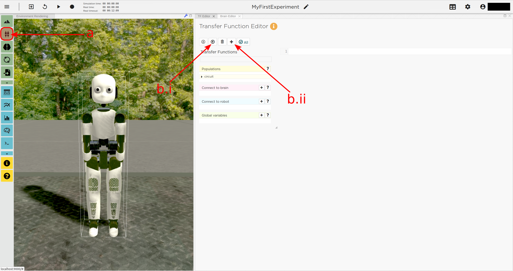
   
   Figure 6: Creating a new transfer function using the Transfer Function Editor

In this guide, we follow option b.ii. and create a new transfer function
that we call “sense” using the “Create New FT” button.

The boilerplate code that appears in the editor upon creation of the Transfer
Function uses a *decorator* to define the type of transfer function,
namely @nrp.Robot2Neuron(). This decorator is used to define functions
that feed data from the robot to the brain.

The function’s first argument is the simulation time step (which must
always be the first argument of any transfer function). When created
through the process followed above, the function body automatically
consists of the logging of the time step, if a certain condition is met,
with the clientLogger object used to write the actual messages to the
log console (more on that later).

5.2 mapping a robot subscriber to a function argument
~~~~~~~~~~~~~~~~~~~~~~~~~~~~~~~~~~~~~~~~~~~~~~~~~~~~~~~~~~~~~~

Now we map a **ROBOT SUBSCRIBER** to a function argument, i.e., we read
a value that is being published by the robot, to make sensor data
available inside our function:

a. Press the button with the “+”‑sign next to the “Connect to robot”
   section. This will open a list of available topics to subscribe or
   publish to.

b. Select the topic you wish to subscribe to by clicking once on it (and
   highlighting it as a result). In this case, we are going to use the
   “/icub\_hbp\_ros\_0/joints” topic.

c. | Scroll all the way down and click the “Add
     Subscriber” button to confirm your choice.
   | The topic is now displayed in the “Connect to robot” section and a
     decorator - @nrp.MapRobotSubscriber() is added to the code along with an argument to
     the transfer function. **NB:** You may also
     add the subscriber by typing this decorator and the function
     argument directly into the editor.

d. Give the topic a meaningful name – here we call it “joints” - by

   i.  expanding the topic (by clicking on it) in the “Connect to robot”
       section and editing the corresponding field,

   ii. or by changing it directly in the decorator using the editor.
       **NB:** doing so in the decorator also requires manually changing
       the function argument to match the new name of the topic.

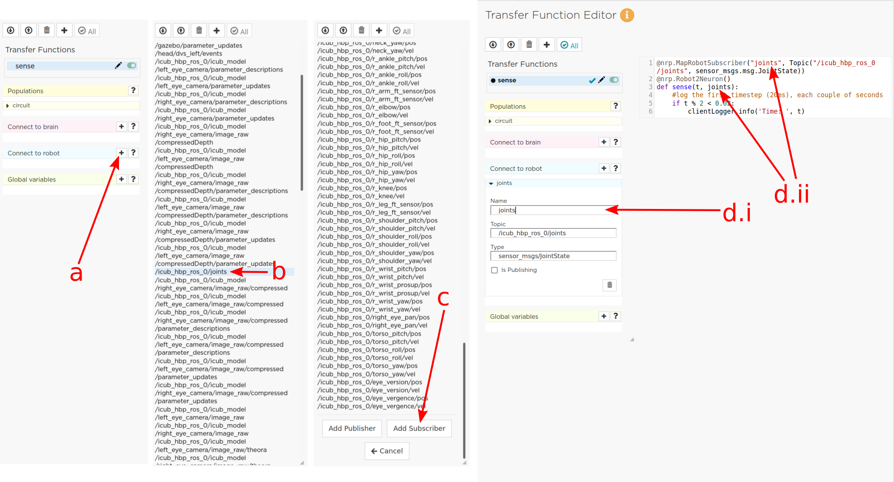
   
   Figure 7: Adding a robot subscriber to the transfer function.

5.3 Perform some basic testing
~~~~~~~~~~~~~~~~~~~~~~~~~~~~~~~~~~~~~~~

Now that we have set our sensor input, let us perform a simple but
essential check that everything works as expected, and let us take a
look at the contents of the messages published by the sensor. For this
purpose, you will log these contents to the “Log Console” from within a
transfer function using the clientLogger object. Please note that the
latter doesn’t have to be imported nor created; it is already available
in the scope of the function.

a. Include the following line in the template function body to log our new message 
   in the console:

   .. code-block:: python

      clientLogger.info(joints) 

   This line will write a
   timestamp along with the contents of the argument (in this case: the
   variable “joints”) into the Log Console at every time step. 
   **NB**: Pay attention to pythonic indentation rules! 

b. Press the button designated by the red arrow in Figure 8 to open this 
   Log Console – note that, depending on the size of your screen, you may 
   have to expand the blue section of the toolbar to find this button. 
   We can now apply the changes to the transfer function (green 
   checkmark near the TF name) and start the simulation via the play button in 
   the “Simulation Control” bar at the top of the window.

c. See and verify that the “joints” variable holds an object of type “RosSubscribedTopic”. 

d. Change the 'clientLogger.info(joints) ' line to the following in order 
   to log the actual message contents:

   .. code-block:: python

      clientLogger.info(joints.value) 

After applying the changes to the transfer function (green checkmark sign), you should now see
the message contents. The message contains some meta-data, a list of
joint-names and three arrays containing position, velocity, and effort
values.

You can pause the simulation to inspect the console outputs by pressing the large "pause" button 
in the "Simulation controls" (see Figure 3).

When testing the experimental setup, it is often useful to check that
some values correspond to expectations for which we possess a high
degree of confidence. Let us suppose that, for this purpose, we want to
retrieve the position of the roll-axis of the left shoulder, as we are
confident about the range they should be in. To do so, delete the
logging command and insert the following lines of code into the function
body:

.. code-block:: python

    l_shoulder_roll = joints.value.position[joints.value.name.index("l_shoulder_roll")]
    clientLogger.info("Left shoulder roll: {}".format(l_shoulder_roll))

The first line retrieves the position of the left shoulder roll axis
from the “position” array of the message. It therefore uses the index of
the “l\_shoulder\_roll” value in the “name” list, and stores it into the
variable l\_shoulder\_roll. The second line logs this value into the
console. Upon restarting the simulation, the values should appear in the
console, as expected. You are all set to go to the next step!

.. note::
    The names of topics, and the message types and structures are specific to the robot model. They will be different for other robot models.

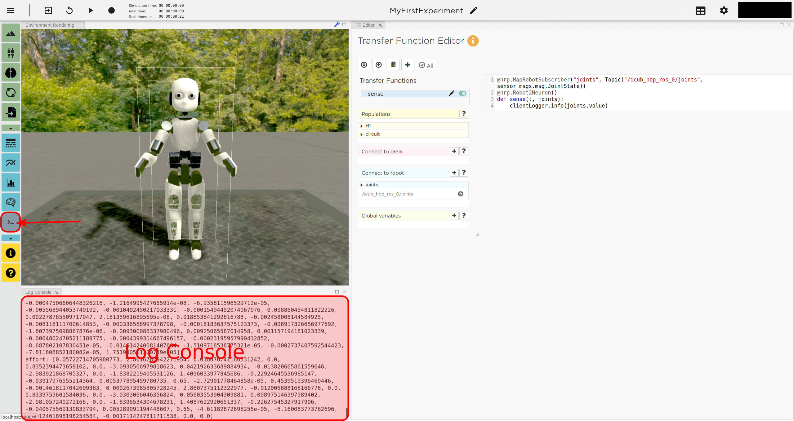
   
   Figure 8: Opening the "Log Console".

5.4 Create a device to drive brain activity with sensor output:
~~~~~~~~~~~~~~~~~~~~~~~~~~~~~~~~~~~~~~~~~~~~~~~~~~~~~~~~~~~~~~~~~~~~~~~~~~~~~~~~~~~~~~~~~~

Gazebo (our robotic simulation) can now send sensor data to our “brain”
that is implemented inside the NEST simulator. In the next sections, you
will learn how to handle this data so that NEST can make sense of it via
so-called “devices”, which are the software constructs that allow us to
establish such connection between NEST and the rest of the NRP.

Concretely, in the following we will create such devices and will define thresholds for 
sensor signals as input that, when crossed, trigger the devices to 
send spikes to neurons into the NEST “brain”.

To create a device, follow the instructions below and refer to Figure 9:

a. Click the “+” sign next to the “Connect to brain” section in the
   Transfer Function Editor. The available neuron populations are
   displayed.

b. Click on the right-facing black triangle close to the name "circuit" to 
   expand the “circuit” population. This reveals two neurons. Select the
   first neuron.

c. Click the “Create Device” button.

d. Rename the device (click on its name to edit it). Here, we will call it “lower\_threshold”.

e. Select “Poisson Generator” in the “Type” dropdown-list of the device.

f. Create a second device, connected to the second neuron, by repeating
   steps a-e, and name this device “upper\_threshold”.

g. Click the green tick mark that sits beside the name of the TF
   (“sense”) to make sure that the changes are saved.
   

We have now created two *Poisson* *generators*, that are connected to
our brain circuit.

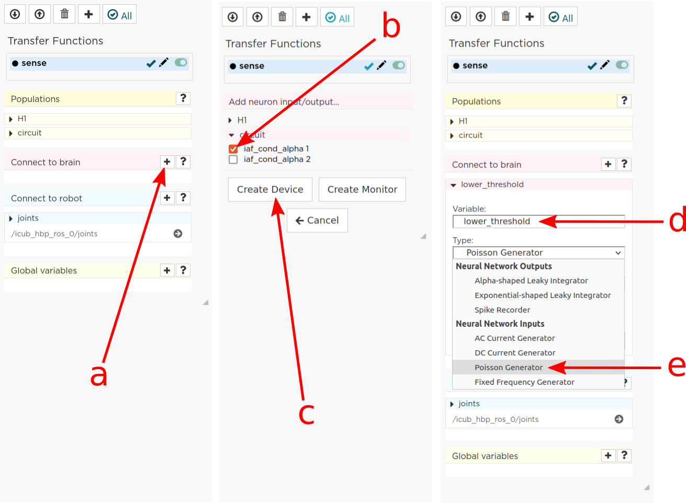
   
   Figure 9: Adding a device to feed sensor data into a neuron in NEST.

5.5 Configuring the Poisson generators
~~~~~~~~~~~~~~~~~~~~~~~~~~~~~~~~~~~~~~~~~~~~~~~~~~~~~~~~~~~~~~~~~~~~~~~~~~~~~~~~~~~~~~~~~~~~~~~~

Now, paste the lines in the box below at the end of the body of the
“sense” transfer function, in the text editor. As usual, pay attention
to indentation.

.. code-block:: python

    lower_threshold.rate = 500. if l_shoulder_roll < 1.8 else 0.
    upper_threshold.rate = 500. if l_shoulder_roll > 2.4 else 0.

These lines set the rates of the *Poisson* *generators* depending on the
current position of the robot left shoulder.

Our excitatory neurons are now receiving excitatory signals in the shape
of Poisson spike trains whenever the left shoulders roll-axis position
takes values above or below the specified threshold values of 1.8 and
2.4.

Step 6. Close the loop: connect the brain to the body
-------------------------------------------------------------------------

In the previous section, we have connected sensor outputs of the robot
to the brain. The next step is to connect the brain to the robot’s
actuators. This will allow us to control the robot’s movements using the
brain’s activity.

To do this, we create another transfer function, this time mapping
neuron activity to the robot. The following steps along with Figure 10
describe how to achieve this.
 
a. Add a new transfer function in the Transfer Function Editor (use the
   “Create new TF” button illustrated in Figure 6, as described in section 5.1). 
   We will call it “act”.

b. Change the decorator of the template function from
 .. code-block:: python

        @nrp.Robot2Neuron()

 to

 .. code-block:: python

        @nrp.Neuron2Robot(Topic("icub_hbp_ros_0/l_shoulder_roll/vel", std_msgs.msg.Float64))
 This decorator maps the return value of the function to the specified topic.

c. Add two devices in the “Connect to brain” section (see section 5.4), each connecting to
   one of the neurons in our circuit. We will name the device connecting
   to the first neuron “up\_motion”, and the other one “down\_motion”.
   Set their **type** to “Alpha-shaped Leaky Integrator”. The
   mathematical details behind the function of these devices are beyond
   the scope of this guide and can be found elsewhere (e.g.
   https://neuronaldynamics.epfl.ch/online/Ch1.S3.html). Note that this
   steps adds decorators above the body of the “act” TF.

d. | In the editor, insert the following line in the body of the “act”
     TF, replacing the template code:
 .. code-block:: python
   
   return 1.0 + 10.0 * (up_motion.voltage - down_motion.voltage)
 This line computes the value we want to set as the left shoulder
 roll axis velocity and returns it. We are using 1.0 as our resting
 value. The voltage values of the leaky integrators are scaled by a
 value of 10.0 and added onto the resting value.

e. Apply the changes to the transfer
   function (green tick mark to the right of the TF name).
   
f. Restart the simulation ("play" button on the Simulation Controls).

The robot should now start waving its left arm!

.. note::

    The simulation can get stuck in states that are undesirable,
    especially if the scripts are changed on the fly. If that happens, it may help to 
    stop and leave the simulation, and then relaunch it.

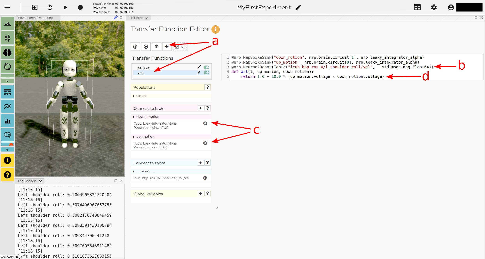
   
   Figure 10: Adding a transfer function connecting the brain activity to the robot’s actuator.

Step 7. Monitor neuronal activity during the simulation with the 'Spiketrain Monitor'
-----------------------------------------------------------------------------------------------------------------

After setting up all functional parts of the experiment, we might want
to observe the underlying neuronal activity, therefore we are going to
add a so-called **NEURON MONITOR**.

The following steps (illustrated in Figure 11) show how to add a neuron
monitor and observe the activity using the “Spiketrain” monitor tool.

a. Open the Menu Bar, select and launch the 
   “Spiketrain” Monitor.

b. In the Transfer Function Editor, select any transfer function (its
   exact identity does not matter: see step d) and click the “+” sign
   next to the “Connect to brain” section.

c. In the “Add neuron input/output…” menu, select all neurons of the
   circuit.

d. Click the “Create Monitor” button. A new transfer function will be
   added automatically.

e. Set the type of the device to 
   “Spike Recorder”.

f. Apply changes to the new monitor TF 
   (green tick mark to the right of the TF name).

g. Start the simulation ("play" button on the Simulation Controls). 
   The spike trains should now be displayed in the
   “Spike Train” tab.

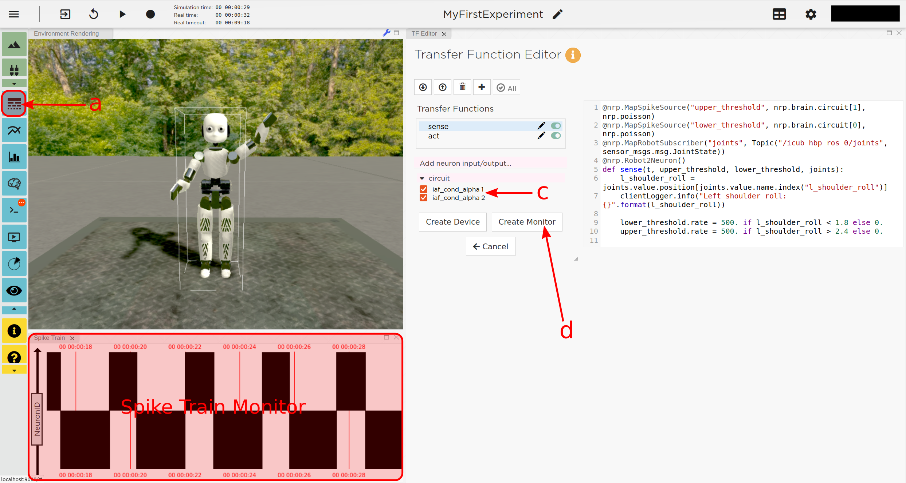
   
   Figure 11: Adding a Spike Train Monitor.

Step 8. Postprocessing: record data into CSV files. 
-------------------------------------------------------------------

Data from the experiments can be recorded into files for postprocessing.
The TF framework offers mechanisms to store data in the CSV format.

To create a Transfer Function that records spikes into a CSV file you
need to

a. Create a new Transfer Function in the Transfer Function Editor and name
   it “csv\_spike\_monitor”.

b. Add a new device in the “Connect to brain” section, connecting to
   all neurons in the circuit. Set its name as “spikes” and its type
   to “Spike Recorder”. One can now inspect the contents of this
   device by using
   
   .. code-block:: python

      clientLogger.info(spikes.times)
   in the function body. The “times” field of the “SpikeRecorder”
   object holds a list of spikes. Each spike is itself a list, with
   the first entry representing the neuron’s identifier, and the
   second entry the spike’s timestamp.

c. Add a new variable and name it “recorder” in the section “Global
   variables” (as before, use "plus" sign to add the variable).

d. Set up the recorder as follows:

   i.   Select “CSV Recorder” as its type.

   ii.  Give a file name. In this case: “all\_spikes.csv”.

   iii. Add headers by writing a name into the “Header” field and
        pressing the “+” button to submit. In this guide, two headers –
        namely “ID” and “TIME” – are used.

e. Insert this piece of code into the function body:
 .. code-block:: python

     for entry in range(len(spikes.times)):
        recorder.record_entry(
            spikes.times[entry][0],
            spikes.times[entry][1]
        )

 The first line defines a loop over all elements of the of the list
 in the “times” field. The remaining code uses the “record\_entry”
 method of the CSVRecorder object stored in “recorder” to write each
 spike into the CSV file. Note that the order of the input arguments
 to the “record\_entry” method should match the order in which the
 headers were defined during step d.iii.

.. image:: images/qsg_12_create_csv_recorder.png
   :width: 6.50000in
   :height: 3.07292in
   
   Figure 12 Create a Transfer Function to record experiment data into a CSV file.

If you wish to add another recorder for the left shoulder roll position
of the robot, repeat steps a-d with the following modifications:

a. Name the Transfer Function “csv\_joint\_monitor”.

b. Add a subscriber in the “Connect to robot” section that subscribes to
   the “/icub\_hbp\_ros\_0/joints” topic and name it “joints” (see
   section 5.2).

c. Add a new variable and name it “recorder” in the section “Global
   variables”.

d. Set up the recorder as before, but make sure to use a different file
   name, e.g. “l\_shoulder\_roll.csv”. As for the headers, name them
   “TIME” and “POS”.

e. Insert the following piece of code into the function body:
 .. code-block:: python
 
        l_shoulder_roll = joints.value.position[joints.value.name.index("l_shoulder_roll")]
        recorder.record_entry(t, l_shoulder_roll)

 The first line reads the position of the joint, as in the “sense”
 Transfer Function. The remaining code again stores the values using
 the “record\_entry” method. This time, the default Transfer
 Function argument “t”, representing the simulation time, is stored
 alongside the joint position.

f. Apply all changes (green tick mark to the right of the TF name) and run the simulation. 
   At this point the CSV files
   can be found in the “Experiment files” tab of the “Experiment
   overview”. The files can be downloaded and used for further
   processing.

.. |image12| image:: images/qsg_12_create_csv_recorder.png
   :width: 6.50000in
   :height: 3.07292in
