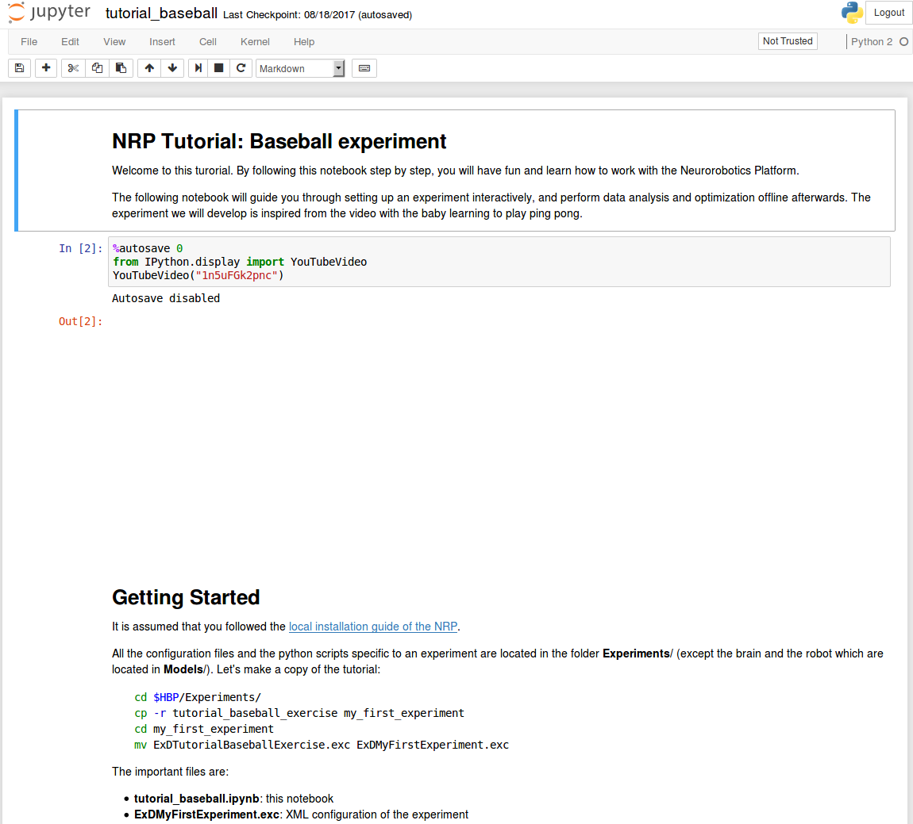

======================
Scope of this tutorial
======================

This tutorial will teach you how to set up an experiment and how to use iPython (Jupyter) Notebook to post-process it with the :term:`Virtual Coach`.

1. Create the basic setup of the experiment
2. Launch the Platform, tune rendering quality
3. Discover the brain editor
4. Automate throwing balls at the robot using State Machines
5. Implement robot vision and action in Transfer Functions
6. Monitor and debug the simulation
7. Edit the environment
8. Save all your work

===========
Get started
===========

This tutorial is actually documented in an iPython (Jupyter) Notebook script. Let us first get it running (for more information about running the experiments in the :term:`Virtual Coach` see the :ref:`corresponding tutorial <virtual-coach-tutorial>`). 

Local source installation
~~~~~~~~~~~~~~~~~~~~~~~~~

Be sure to have an up-to-date :abbr:`NRP` in case you are using :ref:`the source installation <source-installation>`.

.. code-block:: bash

    cd $HBP/user-scripts
    ./update_nrp update all

    
Local Docker installation
~~~~~~~~~~~~~~~~~~~~~~~~~

Make sure you have the latest Docker installation of the NRP and attach the terminal to the backend containers in order to have access to the Virtual Coach and NRP environment (use the script provided in :ref:`the Docker installation instructions <docker-installation>`).

.. code-block:: bash

    ./nrp_installer.sh install latest
    ./nrp_installer.sh connect_backend

The terminal is attached to the backend container now.

==============================
Preparation for the experiment
==============================

All the configuration files and the python scripts specific to an experiment are located in the Experiments folder (except the brain and the robot which are located in Models). Let's make a copy of the tutorial:

.. code-block:: bash

    cd $HBP/Experiments/
    cp -r tutorial_baseball_exercise my_first_experiment
    cd my_first_experiment
    mv ExDTutorialBaseballExercise.exc ExDMyFirstExperiment.exc

The important files are:

    - tutorial_baseball.ipynb: this notebook
    - ExDMyFirstExperiment.exc: XML configuration of the experiment
    - tutorial_baseball.bibi: XML configuration of the brain/body interaction
    - throw_ball.exd: A state machine referenced in the .exc
    - \*.py: Transfer functions referenced in the .bibi

Let's edit the **ExDMyFirstExperiment.exc** to change the name of the experiment:

.. code-block:: bash

    sed -i "s/<name>.*<\/name>/<name>My First Experiment<\/name>/g" ExDMyFirstExperiment.exc

.. note::

    In the following exercises, we will edit the transfer functions and state machine through the Neurorobotics Platform editors. If you want to save your edits, make sure to download your modified code to the respective files in the my_first_experiment/ folder.

- Go to your new experiment folder and run the script

.. code-block:: bash

    cd $HBP/Experiments/my_first_experiment
    cle-virtual-coach ipython notebook tutorial_baseball.ipynb

- If you have not yet installed the iPython notebook, install it now

.. code-block:: bash

    sudo apt-get install ipython-notebook

You should now have a new browser window with the following view (in case you are using the Docker installation, by default the page should be available at :code:`http://localhost:8888`, see :ref:`this tutorial <virtual-coach-tutorials-launch>` for details).

The tutorial continues in this window. Have fun!
