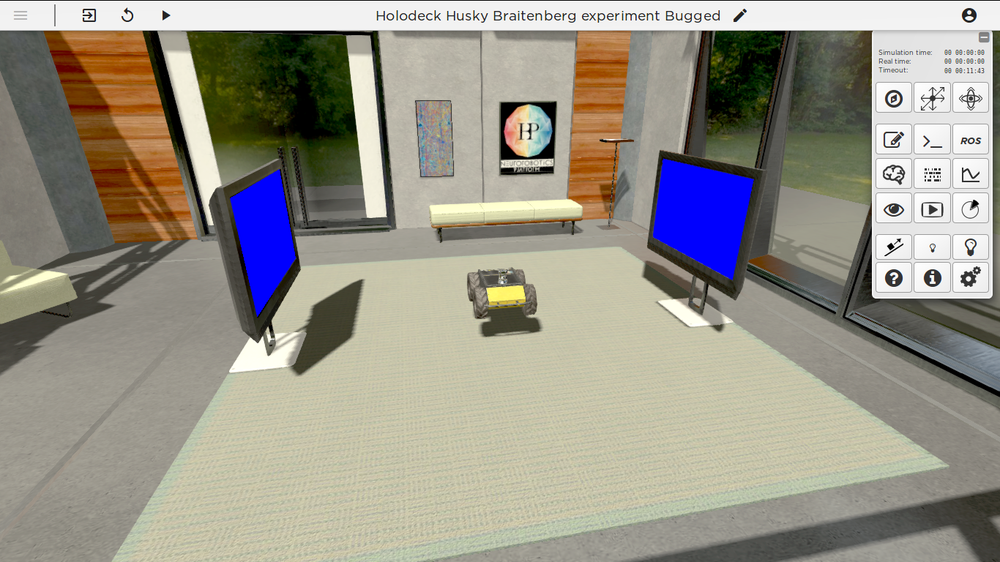
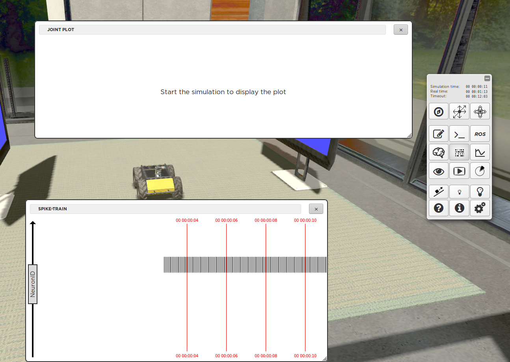
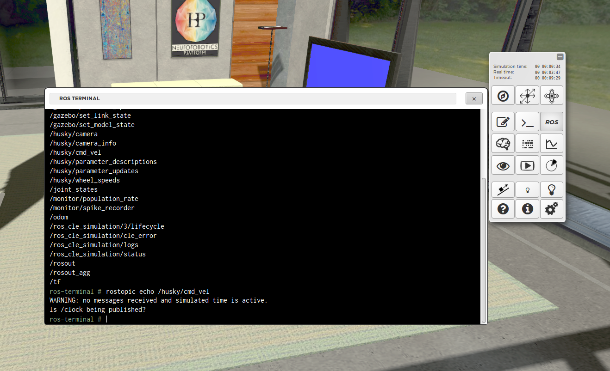

Step 1: using monitoring tools
==============================

.. todo:: Add author/responsible

Context
^^^^^^^

This is the husky braitenberg experiment, but it has some bugs that we will hunt down with the :abbr:`NRP (Neurorobotics Platform)` tools.

If you launch and press play, you can see that the physics are working but the wheels of the robot are not moving, in this tutorial we want to use the monitoring tools to observe the data flows and find possible reasons for this issue.

    The Husky Braitenberg experiment

The spike monitor and the joint monitor
^^^^^^^^^^^^^^^^^^^^^^^^^^^^^^^^^^^^^^^

Without bugs, we would expect Husky to drive towards red screens and drive in circles if there is no red screen.
As we don't know what is going wrong, we can use both the joint monitor tool and the spike monitor tool to screen for activity. We see that indeed the output neurons are not spiking as expected (only one neuron is).

    
    The spike and joint monitor

The ROS terminal
^^^^^^^^^^^^^^^^

Using the ROS terminal tool, we can see if and what communication is taking place between the robot and the brain. First run 'rostopic list' to list all available topics. Then run 'rostopic echo topic_name' to monitor what's being published to a topic. We see that nothing is published, there is definitely something wrong here! 

    The ROS terminal

.. code-block:: bash

    rostopic list #to list all available rostopics
    rostopic echo /husky/cmd_vel #to see all messages being published to the husky actuators
    rostopic echo /husky/camera #to see all messages being published by the husky camera
