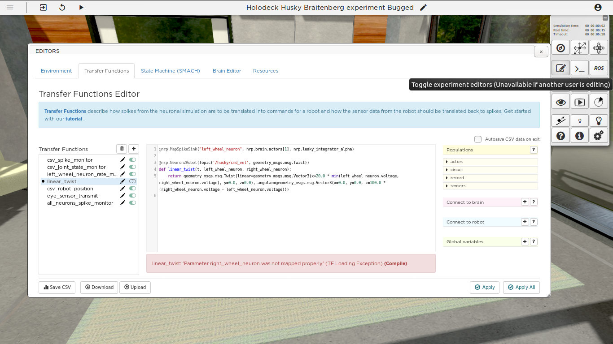

Step 2: fixing transfer function errors
=======================================

.. todo:: Add author/responsible

Context
^^^^^^^

At this point you have observed that the brain is spiking somehow. The robot does seem to have all ROS topics correctly loaded, but apparently, brain output and robot wheels may not be connected properly? We will inspect the transfer functions and find out if one could be faulty.

The Transfer Functions Editor
^^^^^^^^^^^^^^^^^^^^^^^^^^^^^

Open the editors tool and go to the **Transfer Functions** tab. On the left, the transfer functions are listed and we see one that is not activated (**linear twist**). Click to edit the function, and you will see the error **Parameter right_wheel_neuron was not mapped properly**. Indeed, the function **linear_twist** expects an argument **right_wheel_neuron**, but there is only one decorator and it maps **left_wheel_neuron**. 

    The transfer function editor

We need to write another decorator for the right wheel neuron. Your transfer function should now look like this:

.. code-block:: python

	@nrp.MapSpikeSink("left_wheel_neuron", nrp.brain.actors[1], nrp.leaky_integrator_alpha)
	@nrp.MapSpikeSink("right_wheel_neuron", nrp.brain.actors[2], nrp.leaky_integrator_alpha)
	@nrp.Neuron2Robot(Topic('/husky/cmd_vel', geometry_msgs.msg.Twist))

	def linear_twist (t, left_wheel_neuron, right_wheel_neuron):
	    return geometry_msgs.msg.Twist(linear=geometry_msgs.msg.Vector3(x=20.0 * min(left_wheel_neuron.voltage, right_wheel_neuron.voltage), y=0.0, z=0.0), angular=geometry_msgs.msg.Vector3(x=0.0, y=0.0, z=100.0 * (right_wheel_neuron.voltage - left_wheel_neuron.voltage)))

Press **Apply** and activate the function.

