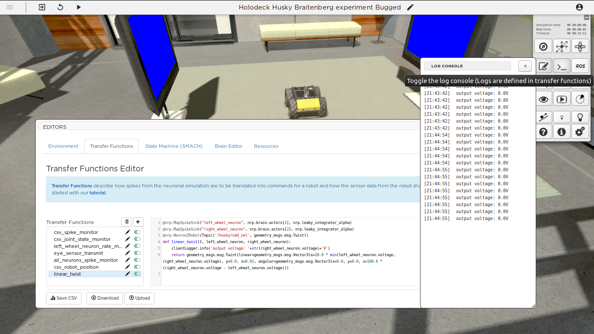
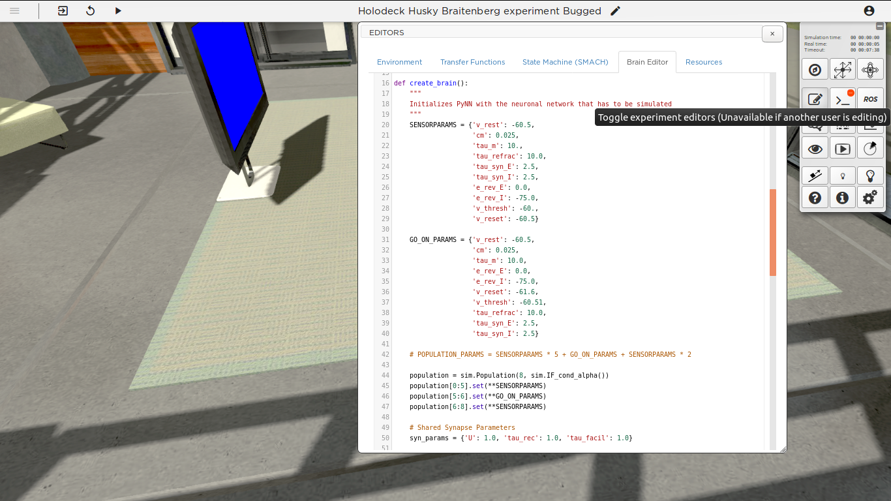
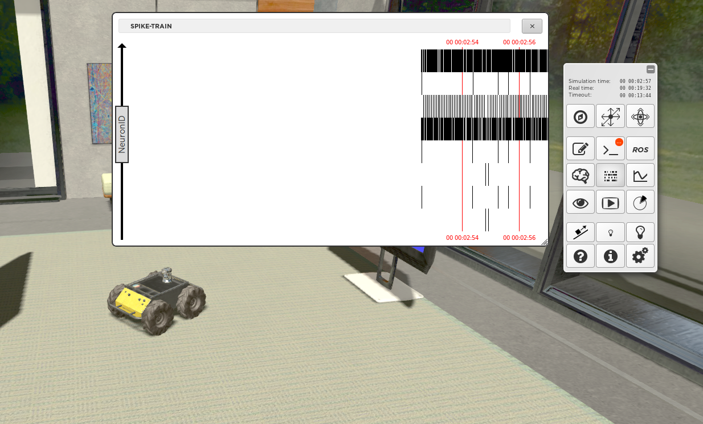

Step 3: fixing the brain file
=============================

Context
^^^^^^^

Now we fixed this transfer function. But the robot is still not moving for some reason. In the previous step we created a leaky integrator and attached it to the output neuron for the right wheel. Let us now use logging to see exactly what is coming out of this neuron.

Using the log console
^^^^^^^^^^^^^^^^^^^^^

Go again to the **linear_twist** transfer function definition. This function receives as an argument the two output neurons (left and right) of the brain (More precisely the two leaky integrators attached to the output neurons). To print these values to the console, simply add one line of code right before the return statement:

.. code-block:: python

	@nrp.MapSpikeSink("left_wheel_neuron", nrp.brain.actors[1], nrp.leaky_integrator_alpha)
	@nrp.MapSpikeSink("right_wheel_neuron", nrp.brain.actors[2], nrp.leaky_integrator_alpha)
	@nrp.Neuron2Robot(Topic('/husky/cmd_vel', geometry_msgs.msg.Twist))

	def linear_twist (t, left_wheel_neuron, right_wheel_neuron):
	    clientLogger.info('output voltage: '+str(right_wheel_neuron.voltage)+'V')
	    return geometry_msgs.msg.Twist(linear=geometry_msgs.msg.Vector3(x=20.0 * min(left_wheel_neuron.voltage, right_wheel_neuron.voltage), y=0.0, z=0.0), angular=geometry_msgs.msg.Vector3(x=0.0, y=0.0, z=100.0 * (right_wheel_neuron.voltage - left_wheel_neuron.voltage)))

Press **apply** and open the log console and you see that the network outputs only zero's! This means that either it receives no input, or the brain is not configured properly. Note: now that the transfer function is fixed, we can also monitor messages being published using the ROS terminal!

    Output is printed in the log console.

Save data to a CSV file
^^^^^^^^^^^^^^^^^^^^^^^

Alternatively, data can be saved in a CSV file for later processing. See for instance the **csv_joint_state_monitor** transfer function on how to set up a CSV recorder. Click 'save CSV' in the editor to save the data to a folder in the experiment files.

The Brain Editor
^^^^^^^^^^^^^^^^

In the Editors tool, open the **Brain Editor** tab. Take a look at the PYNN script to see if perhaps any of the parameters or connections may prevent the network from producing a non-zero output. 

Perhaps you noticed a strange value in **SENSORPARAMS**. The spiking threshold ('v_thresh') is set to 9999.0! This threshold is way too high, preventing the sensor neurons from ever firing and thus also preventing the output neurons from ever firing. Change **v_thresh** to a more realistic value (such as -60.0) and press the **apply** button. The robot should now move in circles or towards red screens. You can change the screen color using the right mouse button.

    The brain editor

Check the spike monitor and the joint monitor again to see the activity!

    The spike and joint monitors
