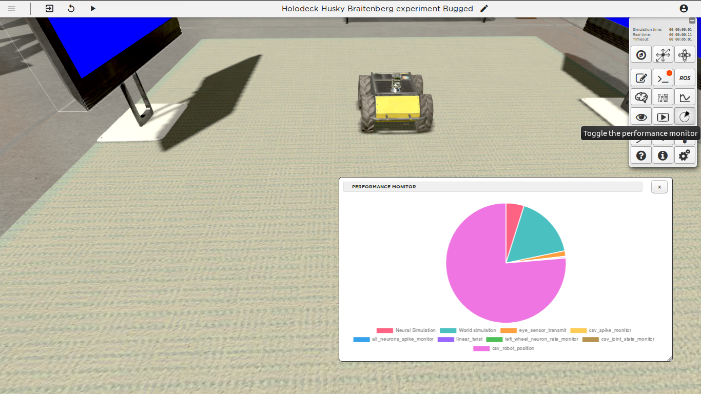

Step 4: debugging performance issues
====================================

.. todo:: Add author/responsible

Context
^^^^^^^

Now the robot is moving, we fixed the problems. Though the simulation is rather slow. We can use the performance monitor to find out what is consuming resources.

The performance monitor
^^^^^^^^^^^^^^^^^^^^^^^

Select the performance monitor to see which processes consume the most resources. You will see that the "csv_robot_position" transfer function is consuming a disproportional amount of CPU. Go to the transfer function editor and remove the useless *for* loop inside.

.. code-block:: python

    for i in range(1,1000000):
        j = i*52,7

You can also remove your logging line from **linear_twist**. The experiment should now run at full speed!

    The performance monitor
