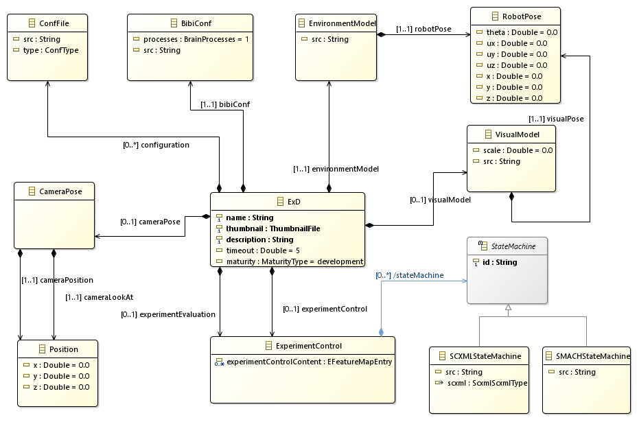
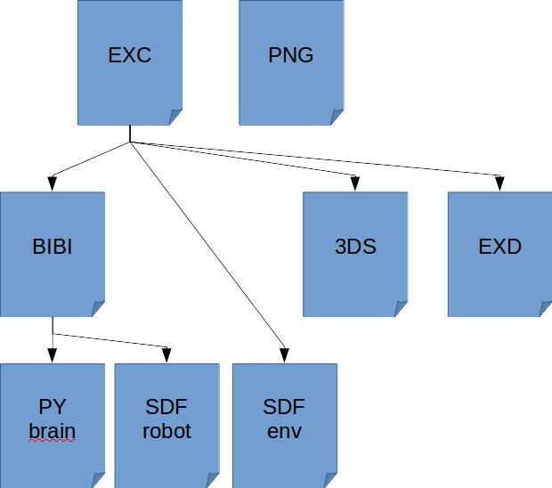

Tutorial: Writing an Experiment Configuration
=============================================

.. todo:: Add author/responsible
.. todo:: Consider duplication :doc:`/nrp/modules/ExDBackend/hbp_nrp_backend/tutorials/ex_configuration`, https://hbpneurorobotics.atlassian.net/l/c/iHd8of31

File format
^^^^^^^^^^^

The Experiment Configuration (ExD Configuration) is shown in :numref:`exd-config-nrp`. The metamodel of the experiment
configuration is available as an XML Schema document. Experiment Configurations models have the file extension **.exc**.

.. _exd-config-nrp:

    The Experiment configuration at a glance

An experiment configuration consists of an **ExD** root element. This element contains the
information  on which environment model is used, where the robot is placed in the environment
and how it is connected to a neural network. In addition, the configuration allows to specify an initial
camera position and state machines to control or evaluate the experiment.

Experiment File Structure
^^^^^^^^^^^^^^^^^^^^^^^^^

An experiment is a subdirectory in $HBP/Experiments and contains the following files, assuming the experiment is called "MyExperiment" :

- MyExperiment.exc : called the "Experiment Configuration file", it holds high level information such as name, description, timeout, environment model, ...
- MyExperiment.png : the experiment thumbnail image. This image is displayed on the web cockpit client on the experiment list
- MyExperiment.3ds : graphical settings. This file stores web cockpit rendering settings, which are generally edited within the user interface. You can though also edit it manually
- MyExperiment.bibi : the "BIBI" file. This file references the brain model to use, the robot model, and definitions of transfer functions
- MyExperiment.exd : experiment design file. It defines state machines in python to automate your experiment life

These reference models from robot, environment and brain libraries. Apart from the PNG file, which has to be named after the EXC file, all others reference each other and can be named freely.

Libraries are:

- Robot library in $HBP/Models/robots. Robot files are Gazebo SDF (.sdf) files.
- Environment library in $HBP/Models/environments Environment files are Gazebo SDF (.sdf) files.
- Brain library in $HBP/Models/brains. Brain files are PyNN python (.py) files.

Fig. :numref:`experiment_file_formats` shows how the file formats work together.

.. _experiment_file_formats:

    The File formats describing an experiments and how they are linked together

The ExD Configuration for the Braitenberg vehicle experiment running with the Husky in the virtual room
^^^^^^^^^^^^^^^^^^^^^^^^^^^^^^^^^^^^^^^^^^^^^^^^^^^^^^^^^^^^^^^^^^^^^^^^^^^^^^^^^^^^^^^^^^^^^^^^^^^^^^^

This tutorial shows how to create an experiment configuration to run the Braitenberg Demo with the Husky robot in the virtual
room with some interactions.

We begin by declaring a new ExD Configuration.

.. code-block:: xml

    <ExD xmlns:xsi="http://www.w3.org/2001/XMLSchema-instance"
         xmlns="http://schemas.humanbrainproject.eu/SP10/2014/ExDConfig">
    </ExD>

The namespace for the ExDConfig is necessary for tools to recognize the XML root element as ExDConfig.

.. note::
    The URL *http://schemas.humanbrainproject.eu/SP10/2014/ExDConfig* currently does not exist and thus, editors cannot load the schema file from there.
    To still get a good editor support, we recommend to specify the schema location explicitly. This can be done with the following XML attribute
    (assuming that the schema is located in *../ExDConfFile.xsd* relative to the ExD model path):

    *xsi:schemaLocation="http://schemas.humanbrainproject.eu/SP10/2014/ExDConfig ../ExDConfFile.xsd"*

At first, we give our experiment a name, a description and a thumbnail. The thumbnail must be an image file and is used for the experiment list.
It should be able to identify a given experiment based on the thumbnail.

.. code-block:: xml

    <name>Tutorial experiment</name>
    <thumbnail>Example.png</thumbnail>
    <description>
        This can be a very long experiment description. It is shown in the experiment list to give users a brief information of the purpose of
        the experiment.
    </description>

The name and description are simply text. The thumbnail should be a path relative to the experiment configuration file.
In the example above, we would expect an image file named *Example.png* in the same directory as the experiment.

Next, we may specify a timeout.

.. code-block:: xml

    <timeout>840</timeout>

The timeout is specified in seconds. If an experiment is simulated on the vizualization cluster, this also influences the cluster allocation time.
Ab simulation may be shut down befire this timeout ends.

.. warning:: 
    In the future, the platform may reject to simulate experiments with longer timeouts than granted for your account. Therefore,
    try to be realistic with what time you really need for the experiment.

The next thing that we need is a declaration of the environment model, i.e. the virtual room. This is done by the following XML:

.. code-block:: xml

    <environmentModel src="virtual_room/virtual_room.sdf">
        <pose>
            <x>0.0</x>
            <y>0.0</y>
            <z>0.0</z>
            <ux>0.0</ux>
            <uy>0.0</uy>
            <uz>1.0</uz>
            <theta>0.0</theta>
        </pose>
    </environmentModel>

Here, we specify the path to the environment model (relative to the **NRP_MODELS_DIRECTORY** environment variable).
Furthermore, we specify where the robot should be placed. The example shown can be used as default, setting the robot (we have not specified which robot to use, yet) in
the center of the room.

The next and probably most important thing to specify is the BIBI Configuration. Unlike the environment model, this path is relative to the
file location of the experiment configuration. In the example, we assume the BIBI model to have the name **husky_braitenberg.bibi** and to reside in
the same directory as the experiment configuration. If the BIBI model is shared among multiple experiments, the path may also contain relative
path segments to load an existing BIBI model from a different experiment. However, the default experiments all have the BIBI models locally.
An alternativ can be that all experiments for a given BIBI model share the same directory.

.. code-block:: xml

    <bibiConf src="husky_braitenberg.bibi" />

The BIBI Configuration itself specifies which robot model to use, which brain model to use and how connect the two of them using transfer functions.
BIBI Configuration models have the file extension **.bibi**.

Additionally to the pose of the robot, we may specify an initial position of the camera. This camera position is specified using two vectors. The first vector *cameraPosition*
specifies the position of the camera while the second, *cameraLookAt*, specifies where the camera should look at. In comparison with the seven-dimensional robot pose, this specification
suffices because camera positions are always upright.

For example, a camera position 1.8m above the ground, looking downwards at a spot nearby is created with the following specification:

.. code-block:: xml

    <cameraPose>
        <cameraPosition x="4.5" y="0" z="1.8"/>
        <cameraLookAt x="0" y="0" z="0.6"/>
    </cameraPose>

In theory, our ExD Configuration is already valid. However, we have not specified any interaction yet. Therefore, the environment will not interact with the state machine.
To solve this, we may add state machines to the experiment. These state machines can either be defined as control state machines or evaluation state machines.

.. note::
    At the moment, there is no technical difference between control state machines and evaluation state machines. The difference is just for documentation purposes. State machines of both groups
    control and evaluate the experiment.

State machines may either be defined using SMACH, a Python library for ROS, or through SCXML. In the former case, they should have the file extension **.exd**, in the latter case the file extension **.scxml**.
In both cases, the specification of the used state machine is done relative to the experiment configuration file. For example, the specification to load a control state machine for screen switching,
we require the following XML fragment:

.. code-block:: xml

    <experimentControl>
        <stateMachine xsi:type="SMACHStateMachine"
                      id="HuskyAwareScreenControlling"
                      src="screen_switching_husky_aware_compatible.exd"/>
    </experimentControl>

.. warning:: At the moment, state machines using SCXML are not integrated into the platform and therefore will not be executed.
