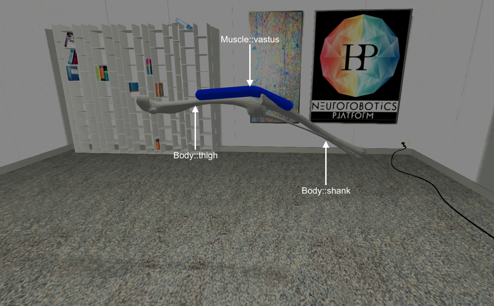

Tutorial Description
--------------------

.. todo:: Add author/responsible

The goal of the experiment is to build a model to simulate a simple knee reflex.
A knee reflex tries to compensate for a sudden muscle stretch by activating the
muscle under stretch appropriately based on its' muscle stretching speed to compensate
the stretch.

To achieve this we will be using the NRP-OpenSim interface. The first step would be to 
clone the experiment "Opensim Muscle Tutorial - Knee Jerk Experiment". After cloning
click on the experiment and click files to view all the simulation files that we are
going to be editing. The file explorer can be used to download and upload all the files.

Model Creation
--------------

In order to create a musculoskeletal model in NRP, it involves two stages:

1. Gazebo Modeling : Physical Model
2. Opensim Modeling : Muscle Model

Gazebo Modeling
^^^^^^^^^^^^^^^

The model used in this experiment is a simple two link thigh and shank bodies
with one rotational degree of freedom to represent the knee joint.
The properties of the model are as described below,

+----------+-----------+----------+----------------+
|  *Body*  |*Length(m)*|*Mass(kg)*|*Inertia(kg-m2)*|
+----------+-----------+----------+----------------+
|  thigh   |   0.5     |    5     |    1           |
+----------+-----------+----------+----------------+
|  shank   |   0.5     |    5     |    1           |
+----------+-----------+----------+----------------+

With the properties described in the above table, one can setup up the basic sdf
model. In order to attach and make the opensim plugin to work in NRP, the
following tag needs to be added in the sdf file. You can download and edit
the model.sdf file from the robot folder through the file explorer.

``<muscles>model://opensim_knee_jerk_tut/muscles.osim</muscles>``

``<plugin name="muscle_interface_plugin" filename="libgazebo_ros_muscle_interface.so"></plugin>``

The muscles tag points to the location where the description of muscles is setup.
More details on writing this file can be found in the following section.

The plugin is needed to link the necessary libraries that interface :abbr:`NRP (Neurorobotics Platform)` with
Opensim functionality.

Opensim Modeling
^^^^^^^^^^^^^^^^

The next step is to describe the muscles in the model. This is achieved by
writing a ``*.osim`` file. This file follows the same syntax as described by
the standard opensim osim file description format.

For more details checkout the `link <https://simtk-confluence.stanford.edu/display/OpenSim/OpenSim+Models>` __ under
``The Muscle Actuator`` subheading.

The osim file should contain only the muscles description and the wrapping objects.
The bodies/links will be used from the model description defined in sdf file earlier.
*Hence make sure to use the same names for the bodies in both files*

In the current tutorial, a single muscle named *vastus* is used with the following
properties,

+-------------------------+-------------------------+-------------------------+
|       *Property*        |         *Value*         |         *Units*         |
+-------------------------+-------------------------+-------------------------+
|     Isometric Force     |           500           |            N            |
+-------------------------+-------------------------+-------------------------+
|  Optimal Fiber Length   |          0.19           |            m            |
+-------------------------+-------------------------+-------------------------+
|   Tendon Slack Length   |          0.19           |            m            |
+-------------------------+-------------------------+-------------------------+
|         Origin          |     [0. 0.25 0.05]      |            m            |
+-------------------------+-------------------------+-------------------------+
|        Insertion        |     [0. 0.08 -0.15]     |            m            |
+-------------------------+-------------------------+-------------------------+

The above table translated to the osim file looks like,

.. code-block:: XML

    <Millard2012EquilibriumMuscle name="vastus">
	  <!--The set of points defining the path of the actuator.-->
	  <GeometryPath>
	    <!--The set of points defining the path-->
	    <PathPointSet>
	      <objects>
		<PathPoint name="origin">
		  <body>thigh</body>
		  <!--The fixed location of the path point expressed in its parent frame.-->
		  <location>0.050000000000000003 0 0</location>
		</PathPoint>
		<PathPoint name="insertion">
		  <body>shank</body>
		  <!--The fixed location of the path point expressed in its parent frame.-->
		  <location>0.037499999999999999 0.17499999999999999 0</location>
		</PathPoint>
		</objects>
		  <groups />
		</PathWrap>
		</objects>
		  <groups />
		</Appearance>
		</GeometryPath>
		  <!--Maximum isometric force that the fibers can generate-->
		  <max_isometric_force>500</max_isometric_force>
		  <!--Optimal length of the muscle fibers-->
		  <optimal_fiber_length>0.19</optimal_fiber_length>
		  <!--Resting length of the tendon-->
		  <tendon_slack_length>0.19</tendon_slack_length>
	</Millard2012EquilibriumMuscle>

**Note: The above snippet is only an example. Do not copy and paste**

The muscles.osim file used for this tutorial also describes a muscle wrapping object.
This constraint makes sure that the muscle does not penetrate the bones during the
motion of the joint.

Gazebo-ROS-OpenSim Inerface
---------------------------

Once you have setup the models using the above described steps, you should be
able to create new experiments with the usual :abbr:`NRP (Neurorobotics Platform)` procedure to create a model.
Assuming you are familiar with the process, we continue the tutorial.

If you are in doubt please refer to the following `link <https://developer.humanbrainproject.eu/docs/projects/HBP%20Neurorobotics%20Platform/2.0/index.html>`_.

In order to be able to write controllers and access the muscles in the simulation,
there exists a set of muscle topics and messages that can be used.

Subscribers
^^^^^^^^^^^

The states of the muscles initialized and described in the ``*.osim(muscles.osim)``
is automatically published on a ros topic with the name
`` /gazebo_muscle_interface/robot/muscle_states ``
The above topic uses the ros-msg type ``MuscleStates`` which is an array containing
``MuscleState`` whose format which looks like,

+-------------------------+-------------------------+
|         *Type*          |         *Name*          |
+-------------------------+-------------------------+
|         string          |          name           |
+-------------------------+-------------------------+
|         float32         |          force          |
+-------------------------+-------------------------+
|         float32         |         length          |
+-------------------------+-------------------------+
|         float32         |    lengthening_speed    |
+-------------------------+-------------------------+
| geometry_msgs/Vector3[] |       path_points       |
+-------------------------+-------------------------+

Publishers
^^^^^^^^^^

To control the muscle state, the muscle activation needs to be set by the controller.
During initialization every muscle described in the ``*.osim(muscles.osim)`` is
generated with a individual ros-publisher of the topic,
`` /gazebo_muscle_interface/robot/**MUSCLE_NAME**/cmd_activation ``
The above topic accepts messages of type Float64.

Reflex-Control
--------------

Now that the full experimental model is setup, we can develop the controller to
simulate the knee reflex.

.. code-block:: python

    # Muscle Properties
    m_optimal_fiber_length = 0.19
    m_max_contraction_velocity = 10.0

    # Get muscle state
    muscle_states =dict((m.name, m) for m in muscle_states_msg.value.muscles)

    # Muscle Lengthening speed
    m_speed = muscle_states['vastus'].lengthening_speed

    # Maximum muscle speed
    m_max_speed = m_optimal_fiber_length*m_max_contraction_velocity

    #: Knee jerk reflex control
    # Reflex gain
    reflex_gain = 2.
    m_reflex_activation = min(1., 0.2*reflex_gain*(abs(m_speed) + m_speed)/m_max_speed)

    # Send muscle activation
    knee_jerk.send_message(m_reflex_activation)
