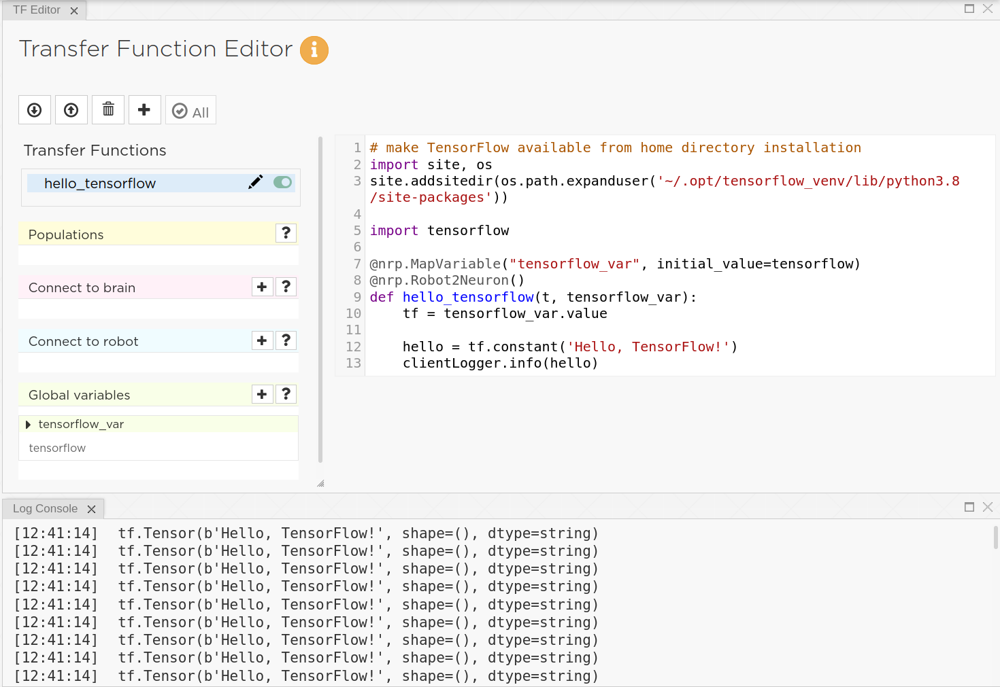

.. _latest_tensorflow:

TensorFlow and NRP v3.2
=======================

=====
Scope
=====

.. todo:: Add author/responsible

This tutorial will teach you how to install and use TensorFlow within an experiment in the NRP version 3.2. Upon completion, you will be able to run a "Hello World" level experiment and be able to explore a more advanced experiment distributed with the NRP.

.. note::
    If you want to use TensorFlow with the legacy version of the NRP (v3.0.5), please refer to :ref:`this tutorial<legacy_tensorflow>`.

========================================
Installing TensorFlow for Use in the NRP
========================================

The :abbr:`NRP (Neurorobotics Platform)` and TensorFlow have slightly different Python dependency versions for core libraries such as Numpy. Unfortunately, this means that TensorFlow cannot be directly installed in the same virtual environment as the NRP, but it can easily be installed separately and used within the platform.

The most convenient way to install TensorFlow is in an isolated virtual environment. Steps are provided below, but for up-to-date instructions refer to: https://www.tensorflow.org/install/pip#2.-create-a-virtual-environment-recommended.

1. Ensure you have Python 3.8 pip and dev libraries installed.

.. code-block:: bash

    sudo apt-get install python3-pip python3-dev

2. Create and activate a virtual environment for TensorFlow, the steps below will assume installation into your ~/.opt directory used by the NRP. If you change this location, you will need to modify later steps.

.. code-block:: bash

    python3 -m venv ~/.opt/tensorflow_venv
    source ~/.opt/tensorflow_venv/bin/activate

3. Upgrade pip within your virtual environment, this is required by TensorFlow.

.. code-block:: bash

    pip install --upgrade pip

4. Install TensorFlow version 2.3, select one of the options below depending on your GPU configuration.

.. code-block:: bash

    pip install tensorflow==2.3       # select this option if you have no or a non-Nvidia GPU
    pip install tensorflow-gpu==2.3   # select this option if you have an Nvidia GPU with proper drivers

5. Install protobuf version 3.9.2:

.. code-block:: bash

    pip install protobuf==3.9.2

6. Test your TensorFlow installation.

.. code-block:: bash

    python -c << _EOF
    import tensorflow as tf
    hello = tf.constant('Hello, TensorFlow!')
    print(hello)
    _EOF

.. note::

    Installing TensorFlow using the pip library will not include all CPU optimizations that may be possible if compiled natively. If performance is an issue, you may want to explore this option separately.

==========================================
Building a "Hello, TensorFlow!" Experiment
==========================================

Using TensorFlow within an experiment is now fairly straightforward. The structure of the pip installation of TensorFlow is too complex to simply add to your PYTHONPATH as is possible with other libraries. Instead, we will need to use Python's own site-package parsing library.

You can easily embed the above "Hello, TensorFlow!" example within the :abbr:`NRP (Neurorobotics Platform)` by adding a new Transfer Function:

.. code-block:: python

    # make TensorFlow available from home directory installation
    import site, os
    site.addsitedir(os.path.expanduser('~/.opt/tensorflow_venv/lib/python3.8/site-packages'))

    import tensorflow

    @nrp.MapVariable("tensorflow_var", initial_value=tensorflow)
    @nrp.Robot2Neuron()
    def hello_tensorflow(t, tensorflow_var):
        tf = tensorflow_var.value
        
        hello = tf.constant('Hello, TensorFlow!')
        clientLogger.info(hello)

This can be added to any of the templated experiments and starting the experiment will produce continuous "Hello, TensorFlow!" messages within the graphical client logger.

Now you can easily use TensorFlow to perform any task in the NRP v3.2!

=============================================================
Further Reading: A More Complex TensorFlow Example Experiment
=============================================================

If you would like to look at a more complex, self-documented example experiment within the :abbr:`NRP (Neurorobotics Platform)` - please examine the "
CodeJam 2017 Tutorial - TensorFlow Husky Braitenberg Experiment" experiment.

This is a development maturity level experiment that requires additional TensorFlow model dependencies and editing of experiment files. It uses TensorFlow image classification to semantically interact with the environment and may be useful to examine before building your TensorFlow-based experiment.

Please refer to the README documentation:

.. code-block:: bash

    $HBP/Experiments/tutorial_tensorflow_husky/README.txt
