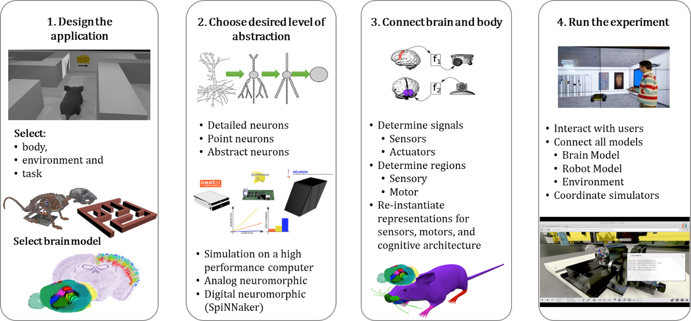

Typical workflow with the NRP
=============================

The general workflow that one follows with the NRP looks is described in
:ref:`Figure 14<qsg-fig14>`. It consists in four main steps:

1) Designing the experimental setup, including the body to be
   controlled.

2) Choosing the model or script that implements the brain functionality
   to be studied.

3) Connecting the brain to the body by writing adequate transfer
   funtions.

4) Running the experiment and collecting the data.

.. _qsg-fig14:

   .. image:: images/qsg_15.png
   
      Figure 14: Typical workflow on the NRP for a neuroscience experiment.
 

