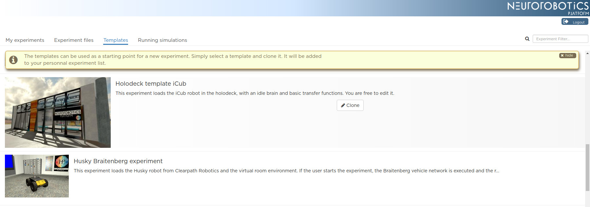
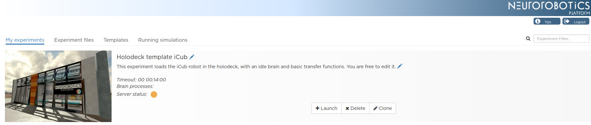
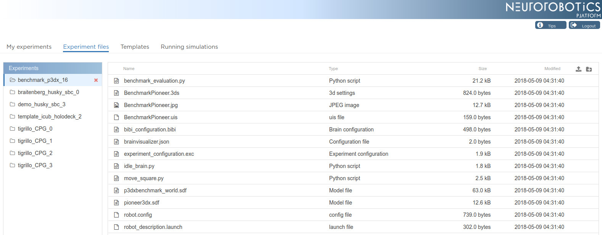
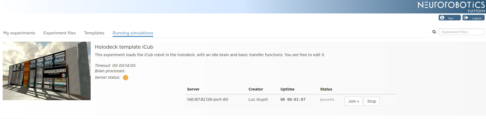

.. _web-cockpit-clone:

Clone an experiment and start a simulation
==========================================

The easiest way to start with the Platform is to clone the ready-to-use template experiment into your private storage and launch it. Follow the **Templates** tab in the user interface, select the desired template and push the **Clone** button.

The cloned experiment is displayed automatically in **My Experiments** tab.

You can start the corresponding simulation by pressing the **Launch** button. 

Launching a simulation will enable you to edit the simulation's configuration, like transfer functions, state machines (experiment work flow) or the environment. You will be redirected to the simulation page as an "owner" (:ref:`Simulation view <web-cockpit-simulation-view>`). If no server slot is available, the button will be grayed out and you will have to wait for a slot.

You can also **Delete** the cloned experiment or make a new copy of it by pressing the **Clone** button.

**Experiment files** tab gives you access to your storage space.

You can upload, download or delete the files of each of your experiment folders. 

The **Running Simulations** tab displays the list of your running simulations. 

You can see for how long it has been running and on which server slot it runs.
Click on **Join** in the simulation list to join a running simulation. **Stop** will kill the simulation.
