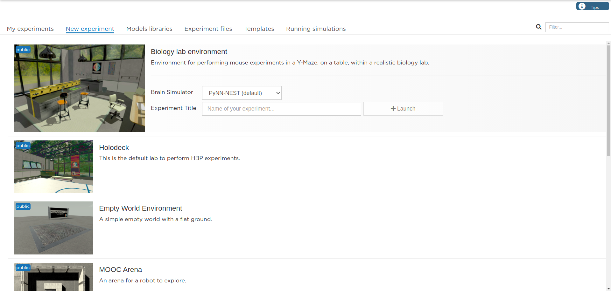

.. _web-cockpit-create-experiment:

Create an experiment
====================

The **My Experiments** tab lets you create an experiment by selecting models for the environment, the robot and the brain.

A model can be selected from the template model library provided with the NRP, from your private storage or from a file stored on your computer.

In order to select a model located on your computer, it should be first added to your private library inside your storage space (via :ref:`Models libraries tab <web-cockpit-library>`). For environment and robot models, you can select a zip file from your computer. This zip file must be a zipped folder containing a file named model.config at its root. The format of this file is described in the example below. 

.. code-block:: xml

  <?xml version='1.0'?>
  <model xmlns:xsi="http://www.w3.org/2001/XMLSchema-instance" 
  xmlns="http://schemas.humanbrainproject.eu/SP10/2017/robot_model_config" 
  xsi:schemaLocation="http://schemas.humanbrainproject.eu/SP10/2017/robot_model_config 
  ../robot_model_configuration.xsd">
      <name>HBP Clearpath Robotics Husky A200</name>
      <version>1.0</version>
      <license>GPL</license>
      <sdf version="1.5">model.sdf</sdf>
      <thumbnail>thumbnail.png</thumbnail>
      <author>
          <name>J. Camilo Vasquez Tieck</name>
          <email>tieck@fzi.de</email>
          <name>Ryan Gariepy</name>
          <email>rgariepy@clearpathrobotics.com</email>
          <name>Oliver Zweigle</name>
          <email>zweigle@fzi</email>
      </author>
      <description>
          Model of a husky unmanned ground vehicle robot.
          More information: https://www.clearpathrobotics.com/husky-unmanned-ground-vehicle-robot/
      </description>
      <website>https://www.clearpathrobotics.com/husky-unmanned-ground-vehicle-robot/</website>
      <documentation>
          <sensors>
            <sensor name="back_left_sensor" type="force_torque" />
            <sensor name="back_right_sensor" type="force_torque" />
            <sensor name="front_left_sensor" type="force_torque" />
            <sensor name="front_right_sensor" type="force_torque" />
            <sensor name="camera" type="camera" />
          </sensors>
          <actuators>
            <actuator name="back_left_joint" type="motor" />
            <actuator name="back_right_joint" type="motor" />
            <actuator name="front_left_joint" type="motor" />
            <actuator name="front_right_joint" type="motor" />
          </actuators>
          <publication title="Semi-Supervised Spiking Neural Network for One-Shot Object Appearance Learning" 
          authors="J. Kaiser, R. Stal, A. Subramoney, A. Roennau, R. Dillmann" 
          url="https://link.springer.com/chapter/10.1007%2F978-3-662-54712-0_10"/>
          <youtube title="Tutorial - Overview of the HBP Neurorobotics Platform" youtube-id="uAXzS7SPFG4"/>
          <picture title="Home page" url=
          "https://developer.humanbrainproject.eu/docs/projects/HBP%20Neurorobotics%20Platform/0.9/_images/gz3d-interact.png"/>
      </documentation>
  </model>

The content of model.config will be used to generate the online robot documentation, see :ref:`web-cockpit-inspect-robot`

When your choice of assembly is made, you can instantiate the experiment in your private storage 
by pressing the **Clone** button. The new experiment is now available in **My Experiments** tab.
