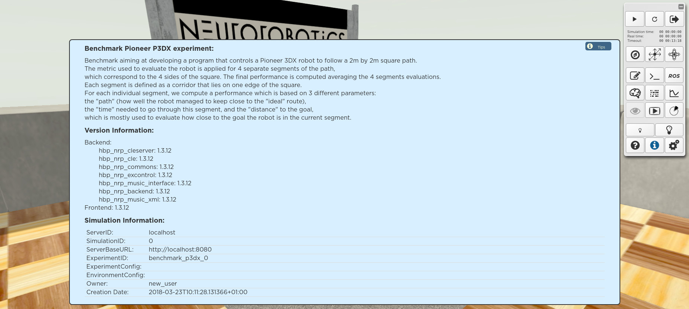

=========
Find help
=========

Once your simulation is launched, you can activate the **Info panel** by clicking on the **(i)** button of the toolbar.
The panel shows the description of the experiment and the **software versions** of every component of the platform.

Please report **version numbers** whenever you submit a bug report or feature request.

To get help about the buttons of the toolbar, click on the **(?)** button.
Once the **UI Help mode** is activated, just click on a button of your choice to read the description of its functionality.

.. image:: images/gz3d-help-panel.jpg
    :align: center
    :width: 100%

