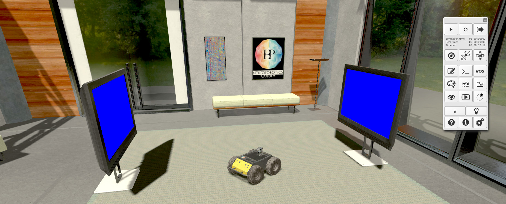

================
Simulation view
================

You have cloned or created an experiment which is now located in your private storage. 
This page describes how you can control simulations. 
Once your simulation is launched, you can access the 3D simulation view, a view similar to the one below.

From there, you can essentially start, pause, stop, reset the simulation and interact with the environment. 
Details about spike monitoring and real-time interaction are covered in `Interact with the simulation`_ and `Monitoring the simulation`_.

The following image displays all available controls and indicators.

.. image:: images/gz3d-toolbar.png
    :align: center
    :width: 50%

Let us detail the toolbar from left to right and top to bottom:

- **Play**: when you start the simulation, the real time and the simulation time are elapsing and the robot starts to turn around. On the server side, the Nest_ brain model is being synchronized with the Gazebo_ world simulation engine and they run together in time slices of around 20ms. The camera on the robot sends its data to the brain model through appropriate transfer functions (see details in the introduction_). In return, after the next brain time slice, the movement commands are sent back to the robot actuators and the scene updates. You can interact with the scene while the simulation is running (see `Interact with the simulation`_).
- **Pause**: this pauses the simulation on the server. The timeout though, is still elapsing.
- **Exit**: leave the simulation and resume it later, or kill it. 
- **Reset**: this button resets whole or part of the simulation. You can reset the robot position, the environment, the brain, the view or the entire simulation. In this last case, the timeout is also reset. It is the best choice if you want to rerun everything without having to start a new simulation.

.. image:: images/gz3d-reset-pane.jpg
    :align: center
    :width: 50%

- **Time**: simulation time is the time measured from the robot's point of view, real time is our time and timeout shows the time left before a simulation stop is forced. Simulation and real time are equal in the best case, when the simulation is run in real time. They may differ if the server is too slow to compute it as fast as needed.
- **Light Intensity**: these two buttons control the general light intensity of the scene. More details in `Interact with the simulation`_.
- **Translate View**: this controller enables navigation into the scene by translating the camera. You can translate along X, Y or Z by clicking on the corresponding arrow head. Clicking in the center resets the camera to its original position. Translating in the scene is also possible, and actually much more handy, using the keyboard or gestures. For details, see `Navigate in the scene`_.
- **Rotate View**: this controller rotates the view. You can rotate using the same commands as **Translate View**.
- **Spike Monitor**: this button opens up a spike monitoring real-time graph view. You may move or resize this view. More info in `Monitoring the simulation`_.
- **Joint Monitor**: opens a view that displays curves of robot joints states data. More info in `Monitoring the simulation`_.
- **Robot view**: opens an overlaid view of the robot camera(s). You may move or resize this view, toggle camera frustum on / off.

.. image:: images/gz3d-robot-view.jpg
    :align: center
    :width: 100%

- **Apply Force**: enables a mode in which you can apply forces on objects by dragging the mouse. See `Interact with the simulation`_.
- **Performance Monitor**: opens the Performance Monitor panel showing statistics about the execution of the experiment. See `Performance Monitor`_.
- **Navigation Mode**: you can use this pop-up to choose the navigation mode. See `Navigate in the scene`_.
- **Editors**: if you are the owner of the simulation, you can open the editor pane here and change the simulation. This is a very important feature described in `Edit the simulation`_.
- **Brain visualizer**: This opens a panel for neuron visualization. More info in `Monitoring the simulation`_.
- **Video Streams**: opens a view to watch all available image streams (ROS topics of type image) generated by the simulation.
- **Log Console**: opens the log console (See `Log Console`_).
- **3D Settings**: opens the 3D settings panel where you can change quality level of the 3D rendering and apply advanced 3D effects to the scene. Moreover, it is possible to customize the user camera. See `3D settings`_. 
- **Help**: opens up the help mode. This is detailed in `Find help`_.

.. _Interact with the simulation: 5-gz3d-interact.html
.. _Monitoring the simulation: 6-gz3d-monitor-data.html
.. _Find help: 2-gz3d-help.html
.. _Navigate in the scene: 35-gz3d-navigate.html
.. _Edit the simulation: 7-gz3d-edit.html
.. _Gazebo: http://www.gazebosim.org
.. _introduction: introduction.html
.. _Nest: http://www.nest-initiative.org
.. _3D settings: 64-gz3d-3dsettings.html
.. _Log Console: 66-gz3d-log-console.html
.. _Performance Monitor: 6-gz3d-monitor-data.html#performance-monitor
