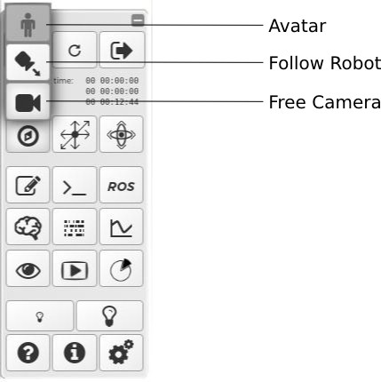

.. _web-cockpit-navigate:

Navigate in the scene
=====================

.. image:: images/gz3d-navigation-picture.jpg
    :align: center
    :width: 100%

The most convenient way to navigate in the 3D scene is to use the keyboard and the mouse on computers and touch gestures on tablets.
The platform offers three navigation modes:

- `Free Camera`_

- `Follow Robot`_

- Avatar_

Free Camera
~~~~~~~~~~~

This default navigation mode allows you to move a camera freely in 3D space using the mouse and the keyboard.

  For **translation**, use the keys :kbd:`W`:kbd:`A`:kbd:`S`:kbd:`D` + :kbd:`R`:kbd:`F` or :kbd:`PageUp`:kbd:`PageDown`.

  For **rotation**, use the :kbd:`→`:kbd:`←`:kbd:`↑`:kbd:`↓` arrow keys. Or use the mouse: hold the left button and drag Left/Right/Up/Down.

  Holding the :kbd:`Shift` key accelerates movements in any mode, :kbd:`Alt` slows them down.

Follow Robot
~~~~~~~~~~~~

In this mode, the camera always face the robot following it when it moves around the scene.

  You can control the camera, using **the same keys as the free camera mode**,
  which pivots around the robot constantly keeping it in the frame.

Avatar
~~~~~~

Avatar navigation feels like walking yourself around the scene.

  For moving, you can use the :kbd:`W`:kbd:`A`:kbd:`S`:kbd:`D` keys.

  To change the view target of the avatar, use the mouse:

  - Hold down the left button and drag Left/Right/Up/Down
  - Use the :kbd:`→`:kbd:`←` arrow keys

  Holding the :kbd:`Shift` key accelerates movements in any mode, :kbd:`Alt` slows them down.

