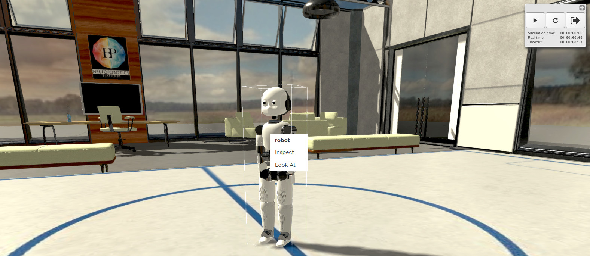
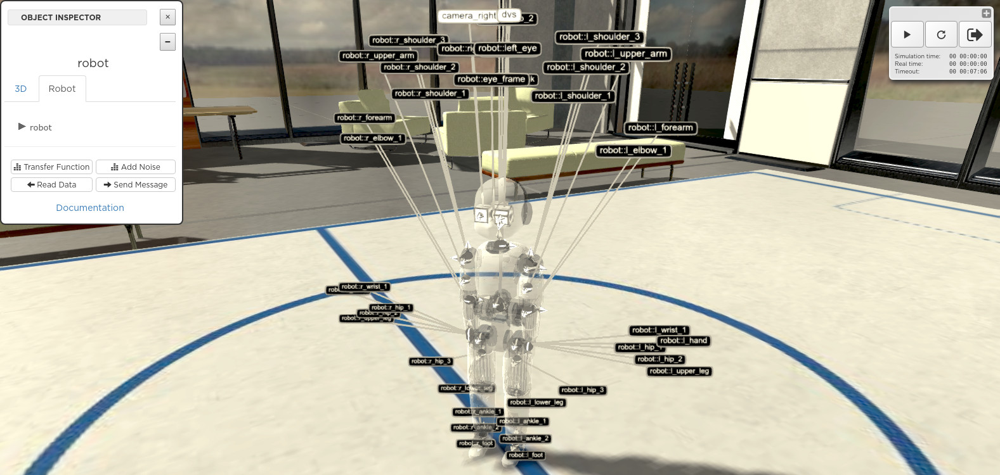
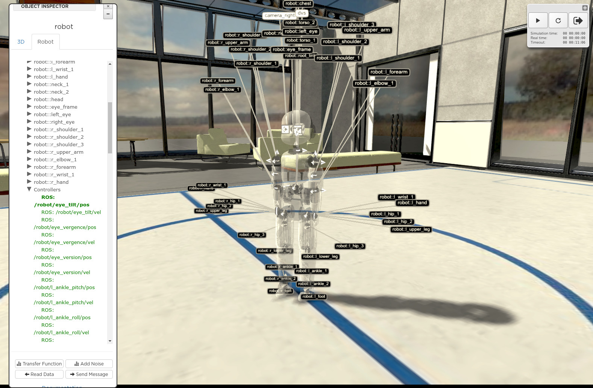

.. _web-cockpit-inspect-robot:

Inspect a robot
===============

In order to inspect a robot in the 3D scene, right-click on it. This will display a menu with the
**inspect** option. 

Clicking on **inspect** displays the robot inspector. When the **Robot** tab of the inspector is selected, the robot
becomes transparent and its different parts are labelled. Sensors and actuators are labelled with white bubbles. The **Documentation** link of the **Robot** tab will direct you to the 
documentation page of the robot, a web page based on the model.config file, see :ref:`web-cockpit-create-experiment`.

You can expand the robot tree to access the devices of the robot and its ROS topics. 

.. _ROS topic: http://wiki.ros.org/Topics

