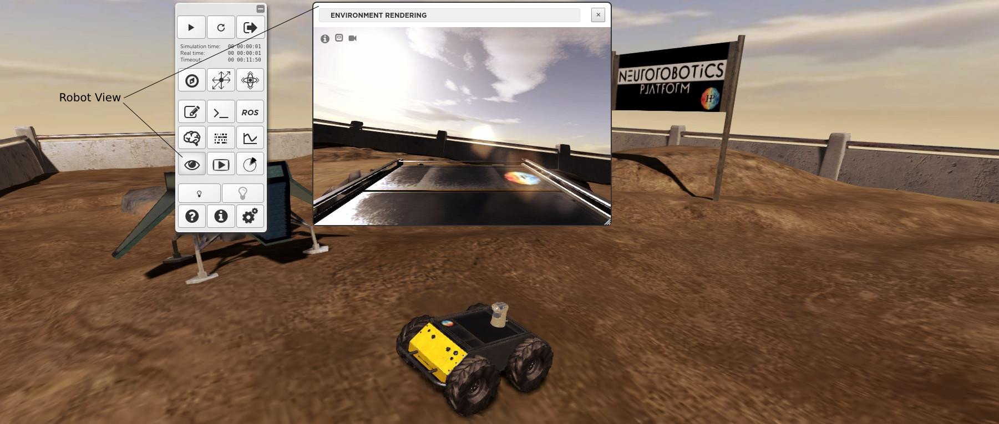
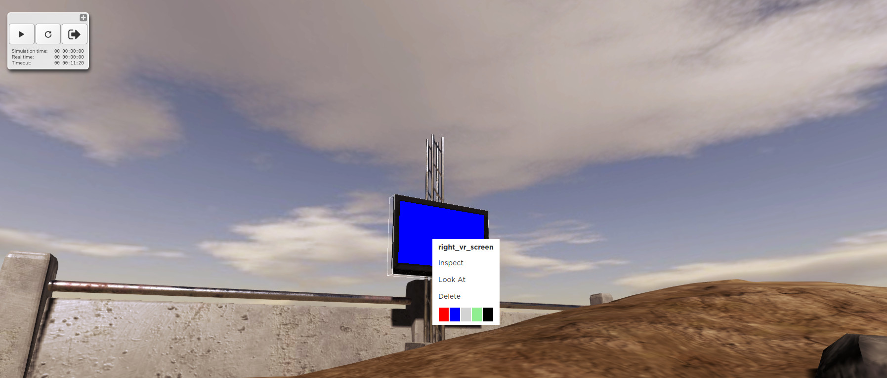

============================
Interact with the simulation
============================

A core feature of the Web Cockpit is to let you interact with the objects of the scene, in order to see how the robot reacts.
While doing that, you can view the changes in the brain by monitoring spikes, as explained in `Monitoring the simulation`_.
You can also check what the robot "sees" by displaying its camera view.

If the simulation scene is equipped with a **screen**, you can *change the color* of the screen.
Right-click on the **screen** and a pop-up menu will show a color picker. 
In several of our template experiments, e.g., *Husky Braitenberg experiment in the SpaceBotCup*, the Husky robot is programmed to 
move towards red objects. You can observe this behavior by switching screens color to red.

Another way of analyzing the robot's behavior is to *change the general light intensity* by **using the light buttons** on the toolbar.
By doing this, the scene gets darker or brighter, but not the screens because they are supposed to be auto-luminescent like real screens.
This changes the contrast between the screens and the environment and you may want to observe how it changes the spiking scheme or affects the robot's behavior.

.. image:: images/gz3d-decrease-light-intensity.jpg
    :align: center
    :width: 100%

You can perturbate a robot by applying a force on its body or on the objects it is interating with. To do so, press the **Apply Force** button
of the toolbar.

.. image:: images/gz3d-apply-force-widgets.jpg
    :align: center
    :width: 100%

A new widget containing a slider appears. It lets you control the factor by which the magnitude of the force vector 
drawn with your mouse is multiplied. In order to apply a force, click on an object and then dragg the mouse. 
The force vector is drawn in the plane which is parallel to your screen and which contains the point where you click.
The default force amplifier factor is 1 and the largest value that can be set through the slider is 10.
If the simulation is paused, the amplifier factor itself is multiplied by 75 and the force will be applied during only one time
step when the user resumes to play. The total applied force in Newtons is given by the following formula: 

**Force = (Force Amplifier Factor) * (length of the vector drawn in the 3D scene)^3 N**.

If you need to control precisely the direction and the magnitude of the applied force, you can use 
the **advanced mode**.

.. image:: images/gz3d-advanced-apply-force-widgets.jpg
    :align: center
    :width: 100%

Once you have selected the **advanced mode** and clicked on the object where the force will be applied,
two new widgets appear and let you specify the magnitude and the direction the force vector. 
The first widget lets you enter numbers. The second widget has two colored manipulators that help 
you adjust the force direction with the mouse.
    
  

It is also possible to edit the environment at run-time by adding, moving or deleting objects.
This is detailed in the `Edit simulation`_ section.

.. _Monitoring the simulation: 6-gz3d-monitor-data.html
.. _Nest: http://www.nest-initiative.org
.. _Edit simulation: 7-gz3d-edit.html
