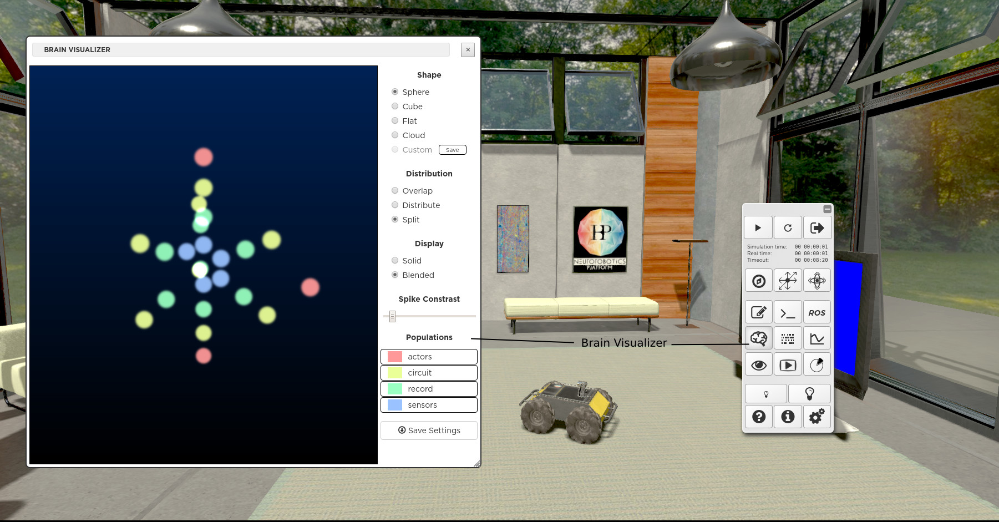
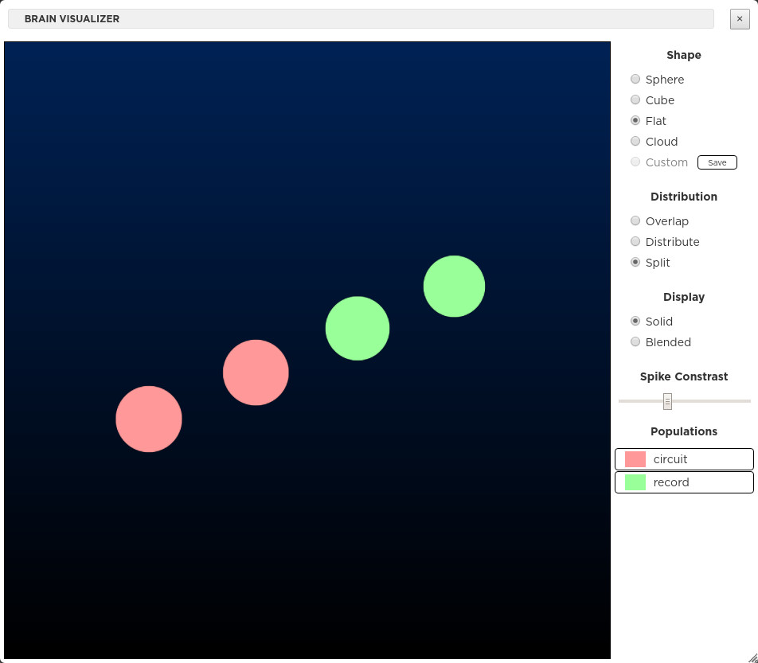

=========================
Monitoring the simulation
=========================

Spike Monitor
-------------

When you click on the **monitor spikes** button in the toolbar, a graph pops up, that lets you see a
representation of the spikes in real-time.

.. image:: images/gz3d-spikemonitor.jpg
    :align: center
    :width: 100%

The spikes are displayed as they are produced, in real time. They are plotted horizontally, each line
representing a single neuron. Red vertical lines give time ticks every 3 seconds. You may close this
graph and reopen it later, the graph keeps track of former plots. You may also move or resize the
view. Same goes for the joint monitoring.

.. warning::
    Monitoring is implemented with a special transfer function called "all_neurons_spike_monitor" in our template experiments. If you delete or alter this transfer function, monitoring might not work properly.

Joints Monitor
--------------

When you click on the **Joints Monitor** button, a view pops up where you can select the joints and
the type of data you want to plot.

.. image:: images/gz3d-joint-monitor.jpg
    :align: center
    :width: 100%

Brain Visualizer
----------------

When clicking on the **Brain Visualizer** button, a view pops up showing a 3D representation of the brain used in the running experiment.
The **Shape**, **Distribution** and **Display** of the neurons can be customized using the available controls.
It is possible to toggle the display of the different population types.

  The **Shape**, **Distribution** and **Display** of the neurons can be customized using the available controls.
  It is possible to toggle the display of the different population types and save your setting by hitting the **Save Settings** button.
  If you have defined 3D positions and colors for your neuron populations
  in the file named brainvisualizer.json, you can display them in checking the **custom** radio button. 
  If you haven't written anything in brainvisualizer.json, you can save the current 3D configuration by selecting the **custom** radio button and pressing 
  the **save** button beside it.

The following example of brainvisualizer.json file defines the 3D positions and colors of 
the two neuron populations depicted in the figure below.

.. code-block:: json

  {
	"populations": {
		"circuit": {
			"neurons": {
				"0": {
					"pos": [
						0,
						-2,
						0
					],
					"size": 1
				},
				"1": {
					"pos": [
						1.7320508075688772,
						-1.0000000000000004,
						0
					],
					"size": 1
				}
			},
			"color": "hsl(0,100%,80%)"
		},
		"record": {
			"neurons": {
				"0": {
					"pos": [
						-1.7320508075688776,
						0.9999999999999996,
						-2.1211504774498143e-16
					],
					"size": 1
				},
				"1": {
					"pos": [
						0,
						2,
						0
					],
					"size": 1
				}
			},
			"color": "hsl(180,100%,80%)"
		}
	},
	"scale": 1
  }

Performance Monitor
-------------------

In order to detect performance issues, you can profile the simulation using the **Performance Monitor** available from the toolbar. 
The diagram illustrates the cumulative time taken by the different components of a simulation.

Transfer functions, the brain and world simulation are shown as sectors of a pie-chart representing the whole time passed in simulating the experiment.

.. image:: images/gz3d-performance-monitor.jpg
    :align: center
    :width: 100%

