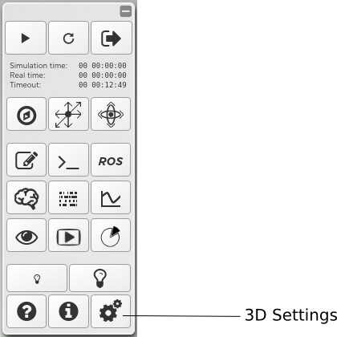
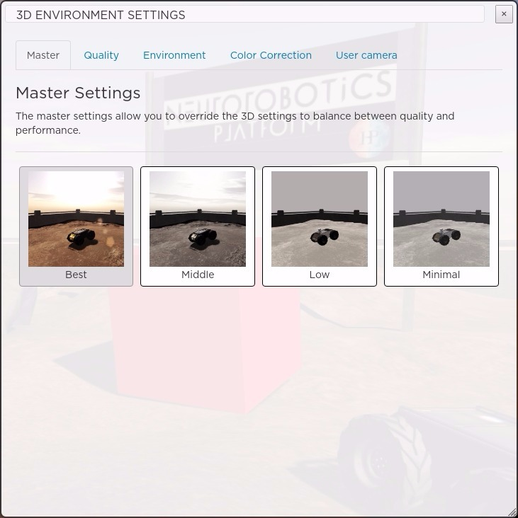
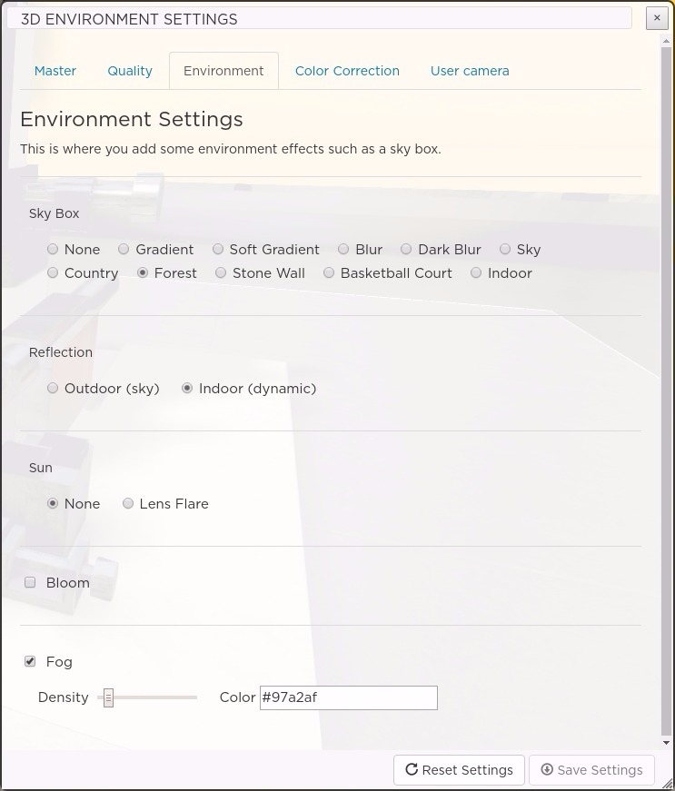
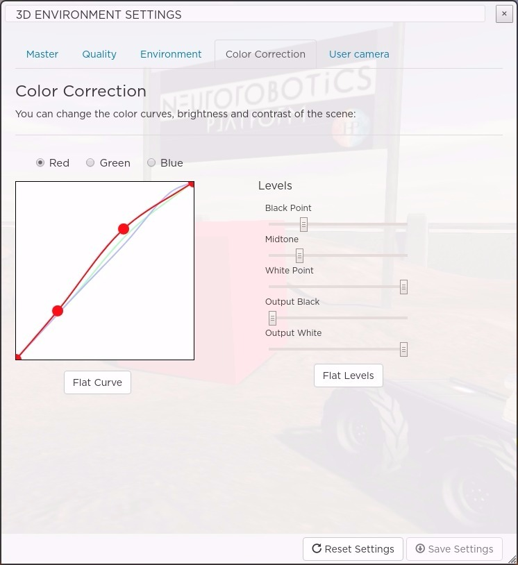
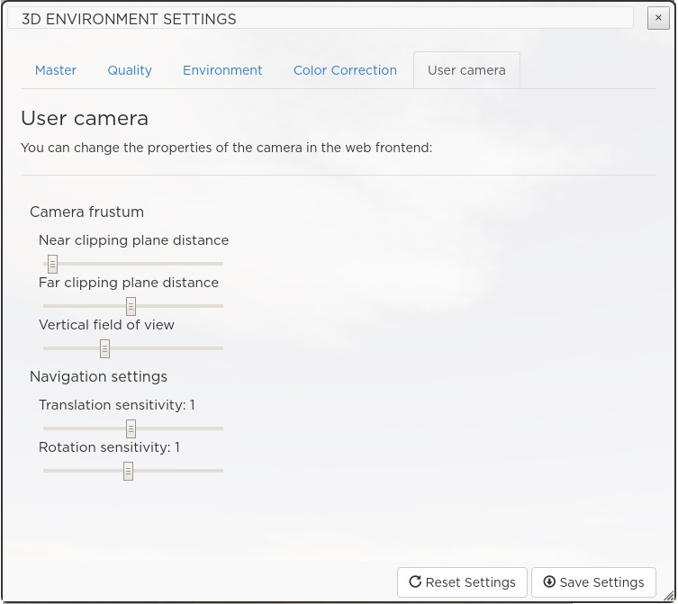

.. _web-cockpit-3d-settings:

3D Settings
===========

The 3D settings panel can be opened by pressing the gear button of the toolbar.

        

The 3D settings panel can be used to set the level of quality, color filtering and global environment effects for the 3D scene. 
Once modified the settings can be saved to the user storage, so they won't be lost the next time you start a simulation.

The 3D settings are divided in four main categories:

- **Master**: Quick selection among presets
- **Quality**: Define the quality of the 3D rendering
- **Environment**: Setup skybox, bloom, fog, and more
- **Color Correction**: Set color correction and image contrast
- **User Camera**: Set some parameters of the user camera

Master
~~~~~~

The master settings allow you to override the 3D settings to balance between quality and performance. 

There are four preset options to set the quality of the 3D environment. The option **Best** sets the settings to achieve the best quality, and hence might affect the performance. You can find the optimal settings for your system by trying out other options.
        

Quality
~~~~~~~

This is where you fine tune the 3D rendering quality. 

.. image:: images/3dsettings_quality.jpeg
    :align: center
    :width: 50%

Removing options will lower the quality but improve the performance, so depending on your configuration you may want to disable some GPU intensive effects like the Ambient Occlusion.

- **Shadows**: Turn on/off global scene shadows.
- **Physically Based Rendering (PBR)**: Turn on/off advanced material lighting. PBR is a technique to render complex and reflective materials like metals, plastics, etc. Enabling PBR has an effect only for 3D meshes that have associated PBR texture maps. Also for the reflection to be effective a skybox needs to be selected (see above in "Environment").
- **Ambient Occlusion**: Turn on/off shadow generation for the occluded objects. Ambient occlusion allows the generation of shadows where areas of two meshes are very close. You can set how close objects should be to generate shadows using the **Clamp** slider. The **Luminosity** slider lets you define how strong the shadow will be.
- **Anti-aliasing**: When enabled, it will smooth the pixels to avoid pixel aliasing.

Environment
~~~~~~~~~~~

This is where you can add effects and environment global elements to enhance the 3D scene.

- **Skybox**: Choose a sky box or none for a flat single color background. For good results with PBR textures, a sky box should be defined.
- **Sun**: It is possible to simulate sun lens flare effect using this option. You can obtain good results by combining this option with the "Sky" sky box.
- **Bloom**: This technique can be used to add blooming effects on very shiny objects. The **Threshold** option lets you decide how much light is required for the blooming effect to start. If this value is very high, only white colors will generate blooming. The **Strength** defines how strong the bloom effect is and the **Radius** its size.
- **Fog**: Can be used to simulate a fog effect. The **Density** slider controls its density and the **Color** its color. When you change the sky box, the color is automatically  with a fitting value. You can still change it afterwards.

Color Correction
~~~~~~~~~~~~~~~~

This section allows you to set color correction, brightness and contrast of the rendered image.

It is divided in two main components:

  - **Color channels**: You can apply a curve to each color channel independently. The X axis represents the input light of the scene, while the Y axis represents the output colors. That is, with a linear line (output color = const x light value) lower-left corner represents dark pixels with color value of 0. Similarly, uppper-right corner would represents bright pixel, typically mapped to a higher color value. Following is an example of color inversion of a scene when pixels are mapped inversely to their light values.
  - **Levels**: Levels is a standard tool that you can find in most image editing programs which can move and stretch the brightness levels of an image histogram. It has the power to adjust brightness, contrast, and tonal range by specifying the location of complete black, complete white, and midtones.

User Camera
~~~~~~~~~~~

This section allows you to fine tune some parameters of the camera in the web frontend.

Change the translation and rotation sensitivity parameters depending on how fast or how precise the camera motion should be.

