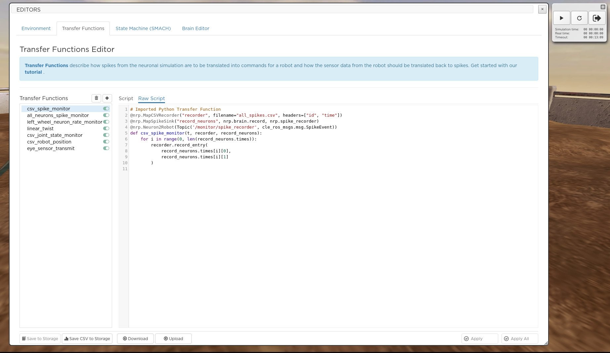

.. _web-cockpit-log-console:

Data Logging and Post-processing
================================

All simulations from our template experiments contain a code snippet that logs spike and joint data 
in CSV files accessible from your storage. See the "Experiment files" section in the :ref:`web-cockpit-clone`.

The brain spikes and the robots joints states (position / velocity) are logged in CSV format.
The logged data contains an additional 'Simulation_reset' column that tags the reset events.
CSV is a well known human readable format that can be easily imported in most calculation sheets editors (Excel, OpenOffice) and post-processing tools (Matlab, iPython Notebook).
For example, you might want to download your logs and use an iPython Notebook to post-process them.
