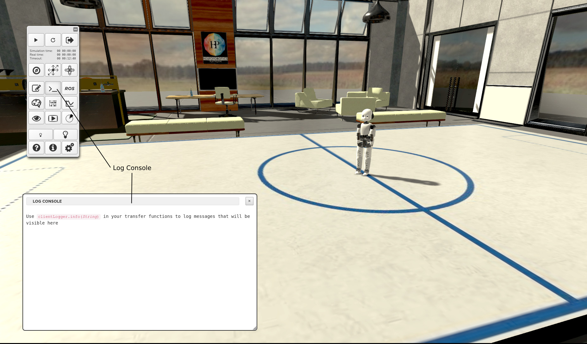
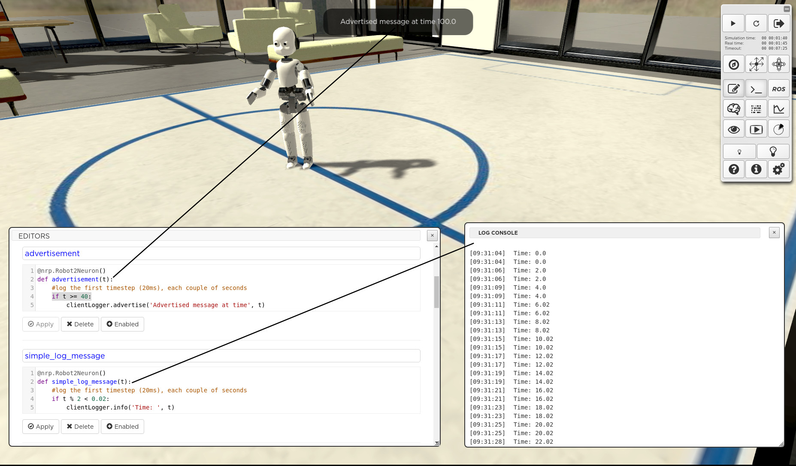

===========
Log console
===========

Use this console to output logs from Transfer Functions and :term:`SMACH` scripts by means of the **clientLogger** module.

The **clientLogger.info()** function displays any comma-separated list of python objects in the log console window. Similarly, the **clientLogger.advertise()** shows a message in the front-end using the function. For each call of the **advertise** function, the popup will be displayed on screen for three seconds. It is also possible to monitor the logs and trigger an action from the state machine when a given string is logged, see the :ref:`state_machines_tutorial`.

