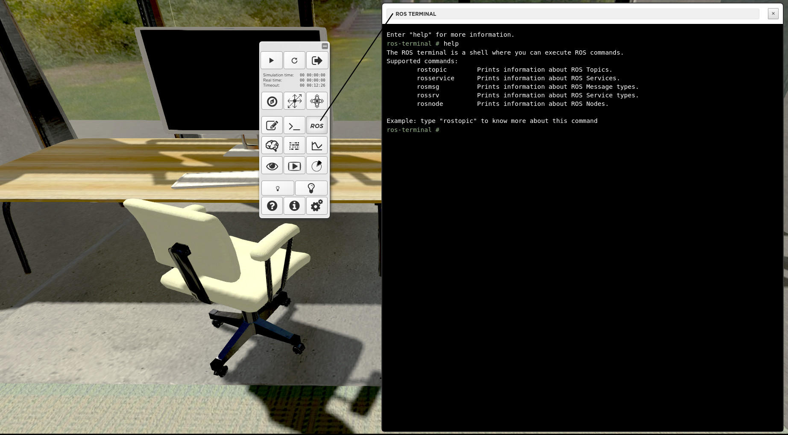
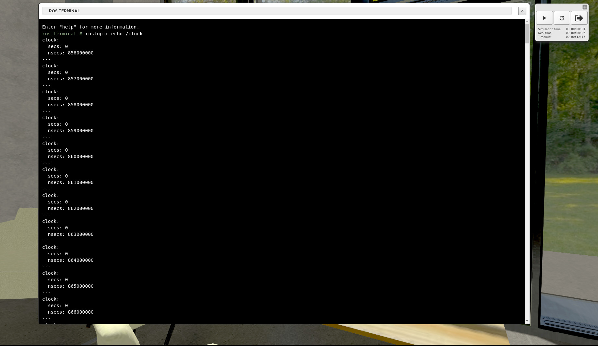

============
ROS terminal
============

  This web terminal lets you use the `rostopic`_ and `rosservice`_ command-line tools in the Web Cockpit. Display the list available common `ROS commands`_ by typing *help* in the ROS terminal.

Issuing for instance *rostopic list* in the ROS terminal will list all available ROS topics. The command *rostopic echo <ros-topic-name>* will echo the messages published on *<ros-topic-name>*. Ctrl+C will interrupt the process of the current command. Pressing the Tab key auto-completes your command.

.. _rostopic: http://wiki.ros.org/rostopic
.. _rosservice: http://wiki.ros.org/rosservice
.. _ROS commands: http://wiki.ros.org/ROS/CommandLineTools