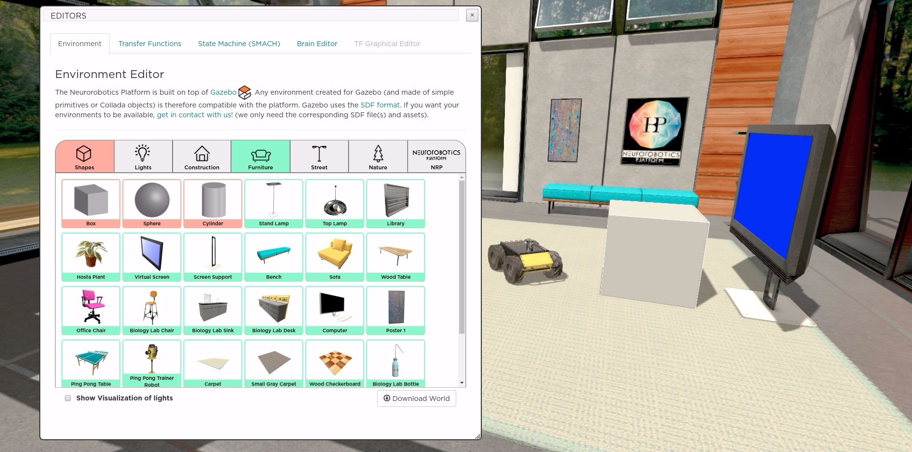
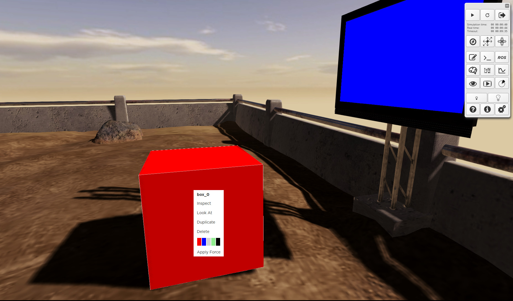
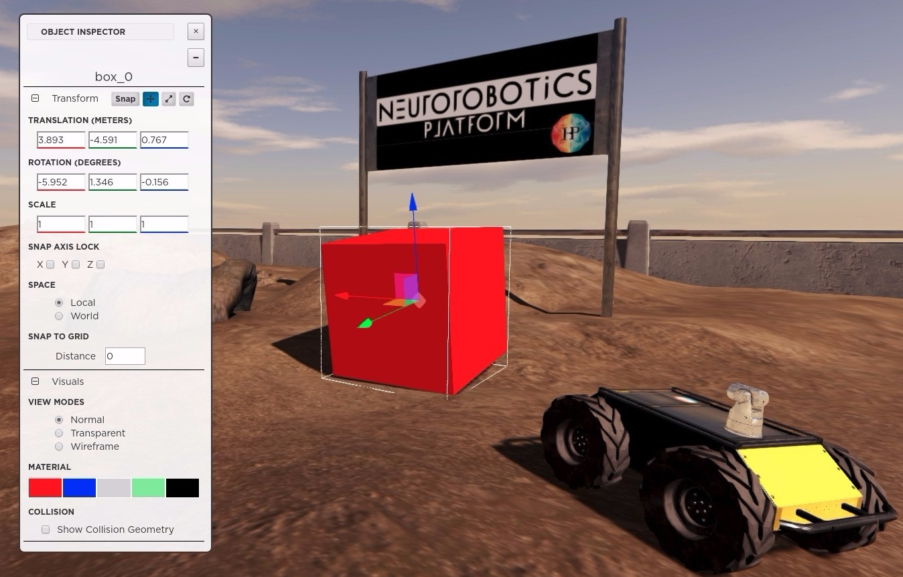

====================
Edit the environment
====================

|

Add Objects and Lights
----------------------

|

It is possible to **add** objects in the environment by clicking on their icon.
The objects are grouped in color-coded categories.

When clicking on a category, the thumbnails of the objects belonging to it are added to the object list.

For example, in the picture below the *Shapes* and *Furniture* categories are selected and a cube has been added to the environment.

The **Download World** button downloads the environment in a file that you can edit.
This is useful if you want to have multiple versions of the environment for this experiment.
If you want to make your changes permanent, the relative files have to be saved to the storage.

|

|

Three types of **Lights** available; they are shown by selecting the *Light* category.

Lights can be visualized, in the scene, by green wire-frame shapes checking the *Show Visualization of Lights* box in.
This allows the user to easily interact with them and also gives an idea about their orientation.
Note that the lights positions are saved but not the light intensity that you set using the buttons in the toolbar.

| 

.. image:: ../images/gz3d-edit-lights-helperGeom.jpg
    :align: center
    :width: 100%

|

Object inspector
----------------
|

Right-clicking on an object will result in a contextual menu appearing.

- *Inspect* opens the Object Inspector.
- *Look At* fixes the camera on the object. Moving it will make it pivot around the object.
- *Duplicate* clones the selected object. The clone can be then freely placed in the scene.
- *Delete* deletes the selected object. Pressing the *Delete* keyboard button has the same effect.

|

|

The top of the **Object Inspector** (**OI**) always shows the *Name of the selected model*.

The **OI** is divided in two sections: *Transform* and *Visuals*.

*Transform* contains the tools useful to manipulate and transform the scene:

- *Snap* button: toggle the snap mode for object manipulation. It's also possible to activate snap locks on the three axes and input the snapping distance from the objects
- *Translate* button: toggle it on and drag the manipulators on the object itself
- Translation inputs to set absolute positions
- *Scale* button: toggle it on and drag the manipulators on the object itself
- Scaling inputs to set absolute scaling values
- *Rotate* button: toggle it on and drag the circles on the object itself
- Rotation inputs to set absolute angles
- Toggle between local and world *Space*

*Visualize* tools allow the user to alter the visualization of the scene:

- Color picker for changing the color of objects that supports it
- Radio buttons to switch the *View Mode* between Normal, Transparent and Wireframe 
- Display *Collision geometries*. This can be particularly useful to understand how the object collides with others

|

|
