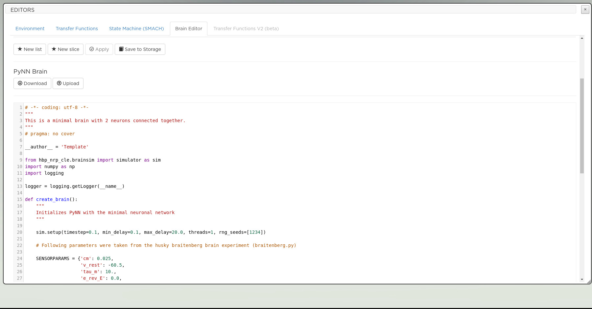

===================
Edit the simulation
===================

Edit experiment flow (State machines)
-------------------------------------

This tab displays the experiment automation script when available. Experiments' lifecycle can be scripted to force events to occur at given times or in reaction to others. An example experiment implementing a state machine is the Husky Braitenberg with automatically switching screens. But you may add state machines to any experiment. State machines are Python scripts which follow a specific syntax detailed in :ref:`state_machines_tutorial` and in the link supplied in the editor itself.

The editor proposes following features:

- **New** create a new template state machine. There may be multiple state machine scripts for one experiment/simulation
- **Delete** deletes the current state machine script
- **Apply** applies the state machine to the current simulation (not saved to experiment)
- **Upload** and **Download** saves or loads from a local script on your computer. Useful to test multiple versions
- **Save** permanently writes changes to the (cloned) experiment in your storage

|

.. image:: ../images/gz3d-smach-editor.png
    :align: center
    :width: 100%

|

Edit brain
----------

This tab displays the brain model code as a PyNN script (Python).
In some simulations where the brain is not defined as a PyNN script, this feature is not available.

Neuron population
~~~~~~~~~~~~~~~~~

You may change the neuron population mapping using the text fields at the top.
These populations are referred to in the transfer functions and the names and indices should match.
This is **not** checked by the system. In case of error, the simulation will fail.
For details on how to edit populations and brain model, please refer to `Brain model`_ or the link within the editor.

- **New list** creates a new population in list format
- **New slice** creates a new population in slice format
- **Apply** applies the changes and resets the brain with the new code

|

.. image:: ../images/gz3d-population-editor.png
    :align: center
    :width: 100%

|

Brain model
~~~~~~~~~~~

You may change the brain model code directly. Beware that the system does not check for consistency
As is the case with the other editors, you can download your brain model and upload an existing one (see previous picture).

- **Download** downloads the current brain model
- **Upload** uploads an existing brain model
- **Save** permanently writes changes to the (cloned) experiment

|

