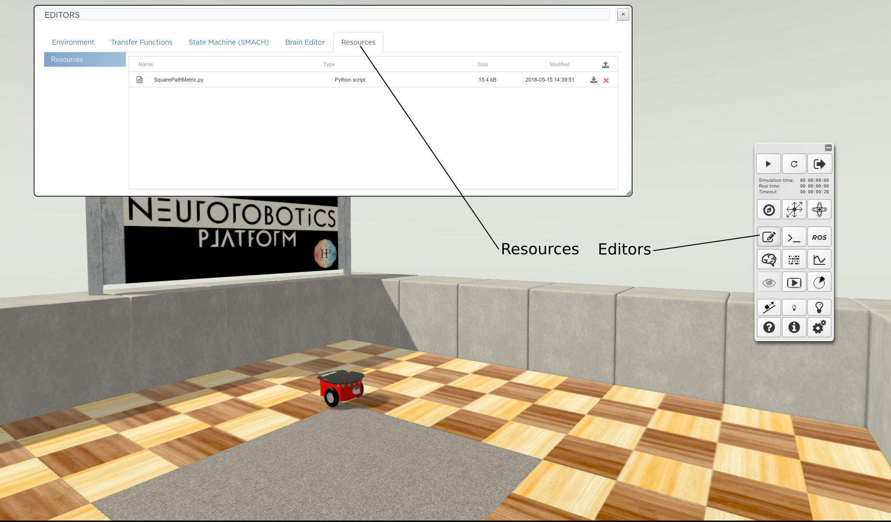
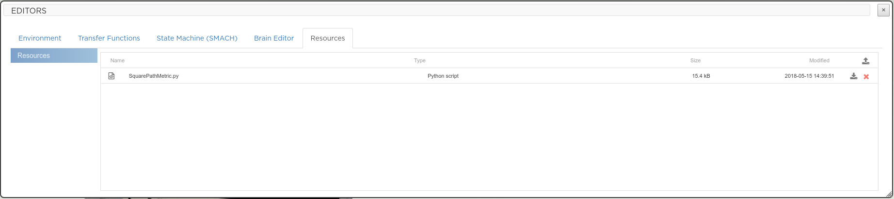
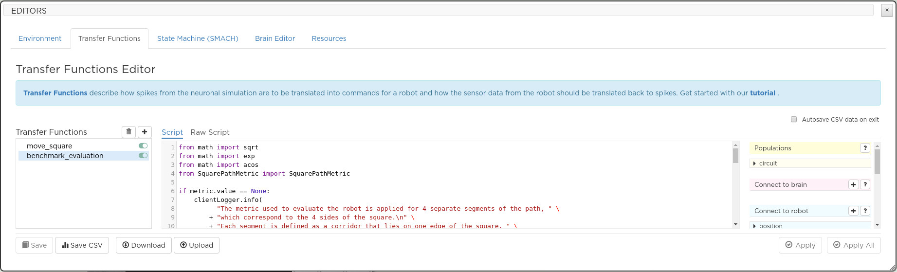
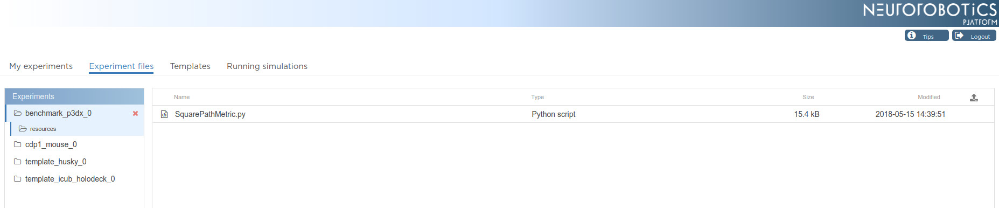

=================================
Manage python and other resources
=================================

When designing `transfer functions`_ or `SMACH state machines`_, you may want to import functions and classes 
that are not defined in the body of these specific scripts.
Managing the python sources of an experiment is eased off by the **Resources** tab of the simulation **Editors**.

|

|

  The **Resources** tab gives you access to the **resources** subfolder of your experiment folder.
  From this view, you can upload the files with which you want to build transfer functions and
  SMACH scripts. 

|

|

|

  In this example, a file named SquarePathMetric.py has been uploaded. It defines a python class, namely 
  SquarePathMetric, that will be imported by a transfer function. Below is an excerpt of the file 
  SquarePathMetric.py.

.. code-block:: python

  class SquarePathMetric(object):
    """Class used to handle the metric of the square path benchmark."""
    class PathSegment(object):
        """
        Class used to represent one side of the square.
        It handles the performance of the robot for this segment.
        """
        # Map between pairs of quarters and the vertex in between.
        # This is used to detect when the robot has reached the
        # next segment.
        QUARTERS2VERTEX = [
            [None, 1, 0, 0],
            [1, None, 2, 1],
            [2, 2, None, 3],
            [0, 3, 3, None]
        ]
        initialized = False
        def getQuarter(self, point):
        ...

  
In the transfer function named *benchmark_evaluation*, we add the import statement enabling us to use
the class SquarePathMetric.

|

|

  As soon as the change is applied, the import statement *from SquarePathMetric import SquarePathMetric* will be handled
  by the simulation.

Note that the files uploaded to the **resources** folder can also be managed from **Experiment files** tab, see `Clone
an experiment and start a simulation`_.

|

|

.. _SMACH state machines: 7-gz3d-edit-simulation.html
.. _transfer functions: 7-gz3d-tf-editor.html
.. _Clone an experiment and start a simulation: ../1-esv-main.html
