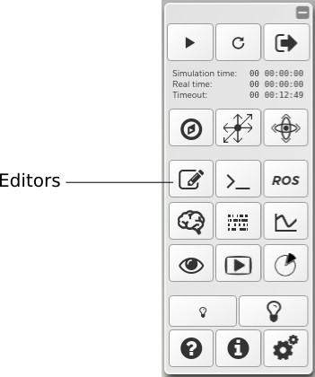

===================
Edit the experiment
===================

|

Users can edit experiment configurations and make persistent changes in their private storage.
To open the editors, once the simulation is properly loaded, click on the **Editors** button in the toolbar.

|

|

This opens up a tabbed editor pane. To edit a specific aspect of the simulation, just click on the corresponding tab.
Click on **Save** to make changes persistent.

This chapter is divided in two sections:

.. toctree::
    :maxdepth: 2
    
    7-gz3d-edit-environment
    7-gz3d-edit-simulation
    7-gz3d-tf-editor
    gz3d-resources-tab
    
|

