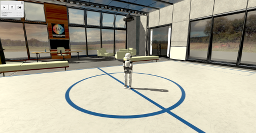
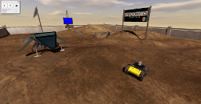
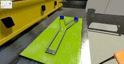

============
Introduction
============

Experiments and simulations
---------------------------

First, and *most importantly*, we need to give definitions of some terms.

An **experiment** is a use case, combining a brain, a robot and an environment. 

A **simulation** is an instance of an experiment, launched by a particular user, at a certain time, with a predefined timeout.

Thus, you could say that you can *define*, *choose* or *design* an **experiment**, while you *run* a **simulation** of this experiment.

Template experiments
----------------------------------------------

We propose a series of template experiments to introduce the user to the features of the platform. 
Editors enable them to customize their experiments in depth.

Among others, we included an experiment featuring the Husky robot acting as a `Braitenberg Vehicle`_.
The purpose of these experiments is to observe how a virtual robot connected to a brain reacts to colour stimuli.
The brain model is trained to send particular commands to the robot when detecting red pixels.
So, on the user view, the Husky robot will turn around itself in the virtual room, and move towards one of the two screens whenever the user sets it to red.

The brain model is derived from a simple Braitenberg vehicle 6-neuron model (:numref:`braitenberg-network`). It has been designed to react to red colour input provided by the image analyzing transfer functions.
It is running on the Nest_ point-neuron simulator. Below you can see a schema of the model.

The robots have classical controllers, so the brain does not control *how* they move on the low level, but outputs high-level decisions such as "move right", "move left", based on stimuli perception.
The robots are equipped with a virtual camera that grabs an image from the scene in front of the robot.
This image is sent to the brain through so-called "transfer functions" that pre-process it and turn it into usable input for Nest_.
In return, Nest_ output spikes go through other transfer functions to be translated into high-level movement commands and sent to the robot controller. The physics engine then updates the scene according to the new robot position. Our world simulation engine is based on the largely adopted Gazebo_ simulator. Our robots have hardware counterparts that will enable us in the future to switch between hardware and software robots and observe the behavioural differences.

There follows a list of the environments available in the platform in which to carry out virtual experiments.

Virtual room
------------

..  figure:: images/virtual_room.png
    :align: center
    :width: 25%

This environment has been inspired by actual HBP office spaces.

Holodeck
--------

The Holodeck is a virtual lab in which to carry out experiments.

SpaceBotCup
-----------

This environment is based on the SpaceBotCup terrain that FZI uses to train its robots.

Virtual biology lab
-------------------

This environment provides a high graphical quality environment that can be used in combination with various robots

.. _Nest: http://www.nest-initiative.org
.. _Gazebo: http://www.gazebosim.org
.. _`Braitenberg Vehicle`: https://en.wikipedia.org/wiki/Braitenberg_vehicle
