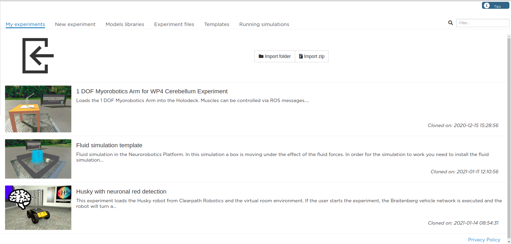

Introduction
============

After logging into NRP (read :ref:`here<access-nrp>` for available options) you find yourself in our Web Cockpit. 

Here you can find the following spaces.

#. **My experiments** shows you the list of your experiments, that are already created. You can manipulate and edit them here (launch, rename, delete, etc.). You can also import previously saved experiments here. 
#. **New experiment** is a space for creating a new experiment from the scratch, following the guide.
#. **Model libraries** provides you information on the available experiment library components: environments, robots and brains. You can use provided components in your experiments, as well as you can upload your own components.
#. **Experiment files** allows you to browse the files for each individual experiment that you have prepared. 
#. **Templates** is our library of ready-to-use experiments. These templates can be cloned into your experiments for the following usage and modifications. 
#. **Running simulations**, obviously, shows you the list of the simulations that you are currently running.

.. note:: Distinguish between :term:`simulation` and :term:`experiment`.
