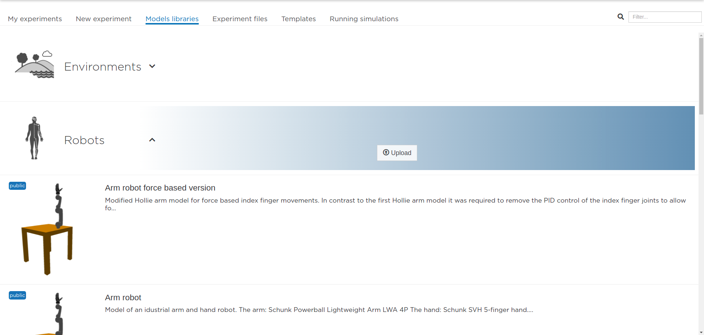
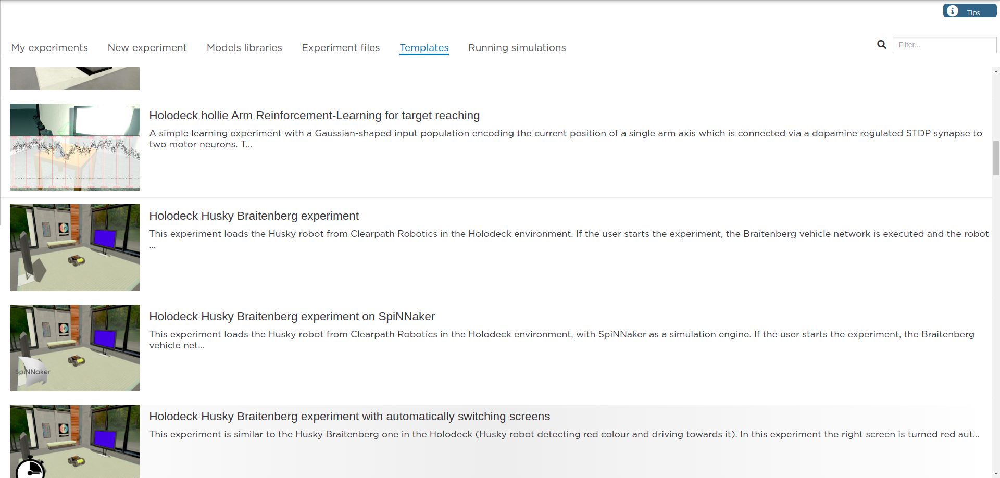

.. _web-cockpit-library:

Models library and template experiments
=======================================

.. seealso::
    Developers might refer to ``Models`` and ``Experiments`` in :ref:`nrp-repos`

For your convenience, we provide a library with default robots, brains and environments models, that can be found in **Models libraries** tab of the interface. On the basis of these libraries, we also provide several experiment templates for you comfortable start with NRP, they can be found in **Templates** tab.

Models libraries
------------------------------------------

Here you can browse the public model of robots, brains and environments and upload you own models with the corresponding button. 

Template experiments
----------------------------------------------

We also propose a series of template experiments to introduce the user to the features of the platform. 
UI editors enable them to customize their experiments in depth.

For example, among others, we included an experiment featuring the :term:`Husky robot` acting as a :term:`Braitenberg Vehicle`.
The purpose of these experiments is to observe how a virtual robot connected to a brain reacts to color stimuli.
The brain model is trained to send particular commands to the robot when detecting red pixels.
So, on the user view, the Husky robot will turn around itself in the virtual room, and move towards one of the two screens whenever the user sets it to red.

The brain model is derived from a simple Braitenberg vehicle 6-neuron model (:numref:`braitenberg-network`). It has been designed to react to red color input provided by the image analyzing transfer functions.
It is running on the :term:`NEST` point-neuron simulator. Below you can see a schema of the model.

The robots have classical controllers, so the brain does not control *how* they move on the low level, but outputs high-level decisions such as "move right", "move left", based on stimuli perception.
The robots are equipped with a virtual camera that grabs an image from the scene in front of the robot.
This image is sent to the brain through so-called "transfer functions" that pre-process it and turn it into usable input for :term:`NEST`.
In return, :term:`NEST` output spikes go through other transfer functions to be translated into high-level movement commands and sent to the robot controller. The physics engine then updates the scene according to the new robot position. Our world simulation engine is based on the largely adopted :term:`Gazebo` simulator. Our robots have hardware counterparts that will enable us in the future to switch between hardware and software robots and observe the behavioral differences.

.. seealso::

    :ref:`Manual on cloning templates in UI <web-cockpit-clone>`
    